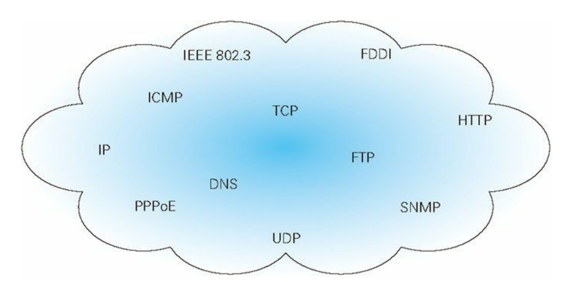
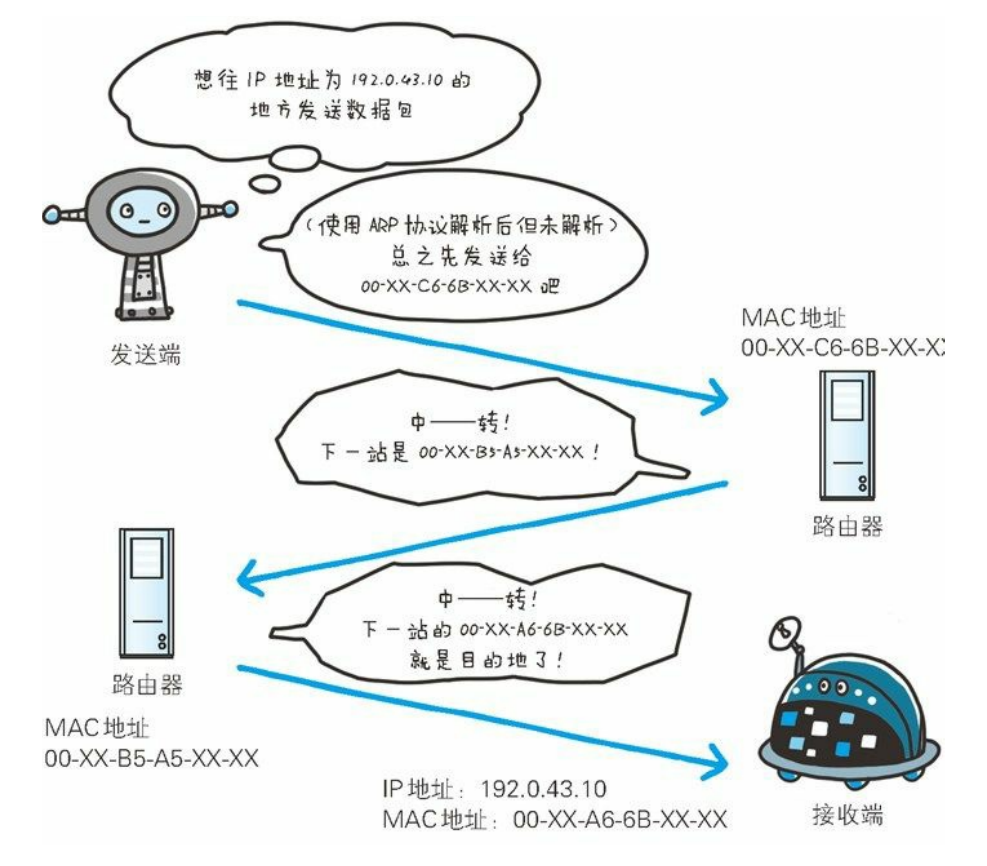
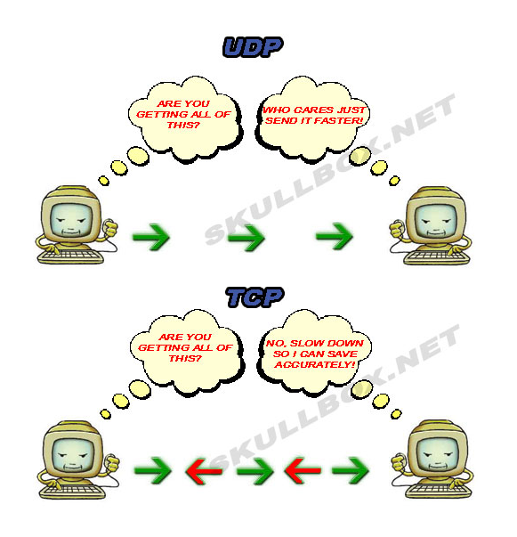
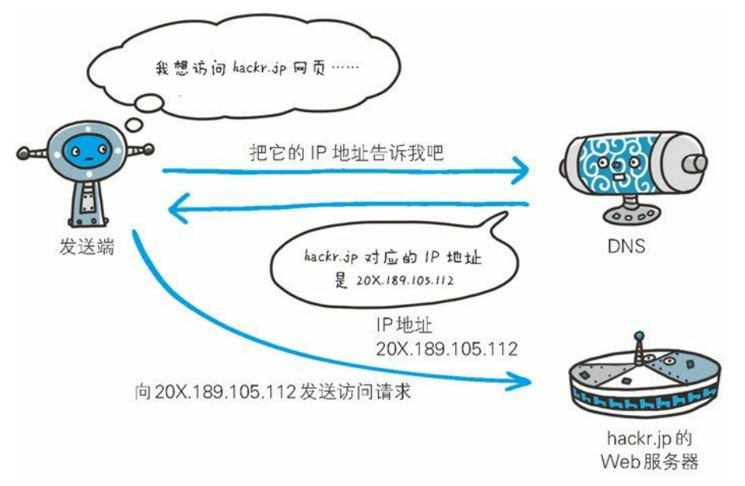
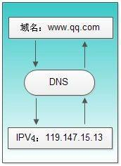
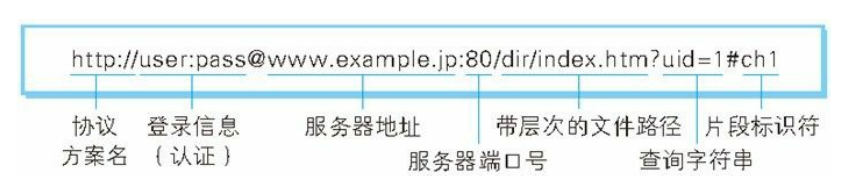
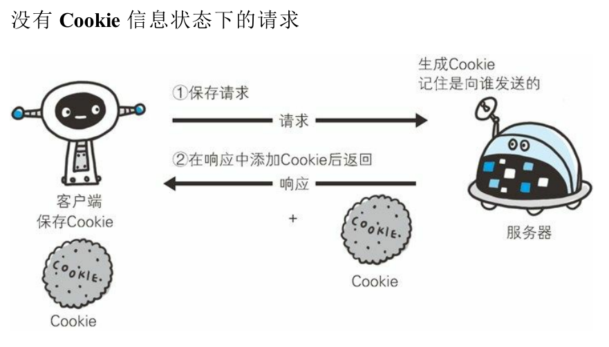
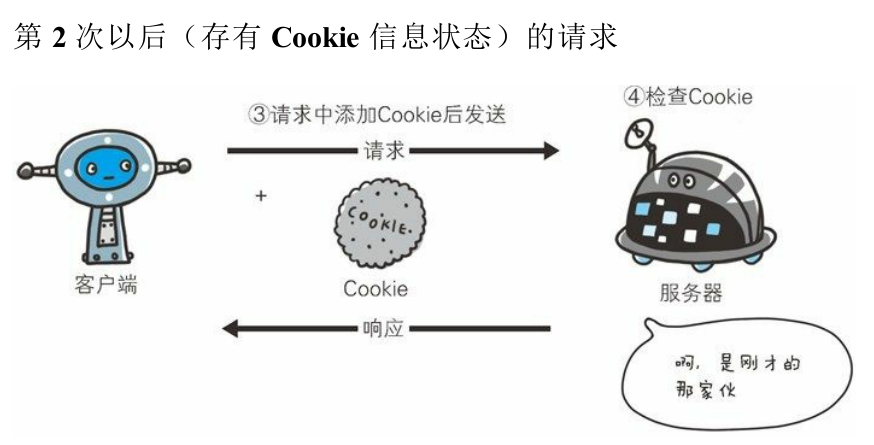

<!-- TOC -->

- [HTTP](#http)
  - [参考资料](#参考资料)
  - [一、了解Web及网络知识](#一了解web及网络知识)
    - [页面是如何显示出来的？](#页面是如何显示出来的)
    - [什么是客户端和服务器？](#什么是客户端和服务器)
    - [HTTP协议是干什么的？](#http协议是干什么的)
    - [TCP/IP](#tcpip)
    - [负责传输的 IP（Internet Protocol）协议](#负责传输的-ipinternet-protocol协议)
    - [确保可靠性的 TCP 协议](#确保可靠性的-tcp-协议)
      - [TCP 3 次握手建立连接](#tcp-3-次握手建立连接)
      - [TCP 4 次挥手关闭连接](#tcp-4-次挥手关闭连接)
      - [为什么要“3次握手，4次挥手”](#为什么要3次握手4次挥手)
    - [负责域名解析的 DNS 服务](#负责域名解析的-dns-服务)
    - [各种协议与 HTTP 协议的关系](#各种协议与-http-协议的关系)
    - [URI 和 URL](#uri-和-url)
  - [二、简单的 HTTP 协议](#二简单的-http-协议)
  - [三、HTTP 报文内的 HTTP信息](#三http-报文内的-http信息)
    - [HTTP 报文](#http-报文)
    - [报文首部](#报文首部)
  - [四、返回结果的 HTTP 状态码](#四返回结果的-http-状态码)
    - [1 XX 临时响应](#1-xx-临时响应)
    - [2 XX 成功](#2-xx-成功)
    - [3 XX 重定向](#3-xx-重定向)
    - [4 XX 客户端错误](#4-xx-客户端错误)
    - [5 XX 服务器错误](#5-xx-服务器错误)
  - [五、与 HTTP 协作的 Web 服务器](#五与-http-协作的-web-服务器)
  - [其它](#其它)
    - [HTTPS](#https)
    - [一个页面从输入 URL 到页面加载显示完成，这个过程中都发生了什么？](#一个页面从输入-url-到页面加载显示完成这个过程中都发生了什么)
    - [RESTful API](#restful-api)

<!-- /TOC -->

# HTTP

## 参考资料

- 《图解HTTP》
- [【MDN】HTTP](https://developer.mozilla.org/zh-CN/docs/Web/HTTP)
- [HTTP 的15个常见知识点复习](https://zhuanlan.zhihu.com/p/73409439)
- [【未读】前后端均适用的网络知识点大全](https://mp.weixin.qq.com/s/hOKfbgd-nRn2lboXMCiY8w?)
- [【未读】TCP/IP 和 HTTP 的区别和联系是什么？](https://www.zhihu.com/question/38648948)
- [前端工程师应该对 HTTP 了解到什么程度？从哪些途径去熟悉更好？](https://www.zhihu.com/question/20391668)
- [面试官问了一下这个问题，我甩出这张脑图，他服了！](https://mp.weixin.qq.com/s?__biz=MzUyNDYxNDAyMg==&mid=2247485464&idx=1&sn=0b0682d74f37bfe3208362dcf74989d3&chksm=fa2be8f1cd5c61e7632df4ed8a4694edb7db50902062950bf4f8d9eef651dc87a3997d67ede4&mpshare=1&scene=1&srcid=&sharer_sharetime=1589293356458&sharer_shareid=fe4836100d04d765272ad5873b1cfd78&key=2eb1332298f9996e46f8551018e01352c2255e0f5d9483e3fa8ef006b423fb2084668ae4f63ab2eaf583fdabff7941847f1023324ce77757a09d23b7099e4dc461bd6720d623ab5375d42428b521654b&ascene=1&uin=MjcwNDcxNzQyMQ%3D%3D&devicetype=Windows+10+x64&version=62090070&lang=zh_CN&exportkey=AWOOd%2Fg8bORT9%2FwGOOnOeG4%3D&pass_ticket=1uPG1NJ7RMMfSUjeLGFyTceANDUp4NqPjizTPwpkQF1oZjUkG6oopf%2FTzKeKi35C)
- [HTTP 协议入门](http://www.ruanyifeng.com/blog/2016/08/http.html)
- [作为一个入门前端如何学习HTTP？](https://www.zhihu.com/question/303529182/answer/541010239)
- [炸裂！万字长文拿下HTTP 我在字节跳动等你！](https://mp.weixin.qq.com/s/RCwtQDwIFzDyOjw-L4l7Vw)

## 一、了解Web及网络知识

### 页面是如何显示出来的？

### 什么是客户端和服务器？

- 请求访问文本或图像等资源的一端称为客户端，而提供资源响应的一端称为服务器端。
- 请求必定由客户端发出，而服务器端回复响应
- 用 HTTP 协议能够明确区分哪端是客户端，哪端是服务器端。

### HTTP协议是干什么的？

简单来说就是传输资源规则的约定。

> Web 使用一种名为 HTTP（HyperText Transfer Protocol，超文本传输协
议  1 ）的协议作为规范，完成从客户端到服务器端等一系列运作流
程。而协议是指规则的约定。可以说，Web 是建立在 HTTP 协议上通信的。

> HTTP就是一个用文本格式描述报文头并用双换行分隔报文头和内容，在TCP基础上实现的请求-响应模式的双向通信协议。 ——来之知乎用户 Ivony

### TCP/IP

- HTTP是 TCP/IP 的子集。
- TCP/IP 是互联网相关的各类协议族的总称。

- 计算机设备相互通信，双方就必须基于相同的方法。而制定的规则我们称之为**协议**（protocol）。
- TCP/IP 的分层管理:
    1. 应用层
    2. 传输层（数据传输）
    3. 网络层（传输路线）
    4. 数据链路层（处理硬件）

> 对网络应用层协议的学习来说，最重要的往往就是**连接建立过程**、**数据交换教程**。当然，数据的格式是逃不掉的，因为它直接决定了协议本身的能力。好的数据格式能让协议更高效、扩展性更好。

### 负责传输的 IP（Internet Protocol）协议

- “IP”其实是一种协议的名称。
- **IP 协议**的作用是把各种数据包传送给对方。而要保证确实传送到对方那里，则需要满足各类条件。其中两个重要的条件是 IP 地址和 MAC
地址（Media Access Control Address）。
- **IP 地址**指明了节点被分配到的地址，**MAC 地址**是指网卡所属的固定地址。
    - IP 地址可以和 MAC 地址进行配对。
    - IP 地址可变换，但 MAC 地址基本上不会更改。
- ARP（Address
Resolution Protocol）是一种用以解析地址的协议，根据通信方的 IP 地址就可以反查出对应的 MAC 地址。
    - 参考资料：[网络基础之ARP地址解析协议（为什么IP地址和MAC地址都要有，又是如何通过IP地址解析到MAC地址的）](https://blog.csdn.net/Perfect11_1/article/details/82017101)

### 确保可靠性的 TCP 协议

参考资料：[TCP与UDP区别](http://blog.sina.com.cn/s/blog_493309600100clrw.html)

TCP（Transmission Control Protocol）传输控制协议，提供面向连接、可靠的字节流服务。
- 字节流：把大数据切割成小片段。
- 准确可靠的送达目的地。

UDP （User Datagram Protocol）用户数据报协议，是一个简单的面向数据报的运输层协议。

- 不提供可靠性。
- 速度快。

建立 TCP 需要 3 次握手才能建立，而断开连接则需要 4 次挥手。

在连接的建立过程中，双方需要交换一些连接的参数。

一个TCP连接通常分为三个阶段：启动、数据传输、退出（关闭）。

#### TCP 3 次握手建立连接

1. 客户端 – 发送带有 SYN 标志的数据包 – 一次握手–服务端
2. 服务端 – 发送带有 SYN/ACK 标志的数据包 – 二次握手–客户端
3. 客户端 – 发送带有带有 ACK 标志的数据包 – 三次握手–服务端

**为什么不是2次握手或者4次握手**

参考资料：[TCP 为什么是三次握手，而不是两次或四次？ - 车小胖的回答 - 知乎](https://www.zhihu.com/question/24853633/answer/115173386)

#### TCP 4 次挥手关闭连接

> 关闭 TCP 的连接需要发送四个包，客户端或者服务器端均可主动发起挥手动作。

1. 客户端 - 发送一个 FIN，用来关闭客户端到服务器的数据传送
2. 服务器 - 收到这个 FIN，它发回一个 ACK，确认序号为收到的序号加 1。（和 SYN 一样，一个 FIN 将占用一个序号）
3. 服务器 - 关闭与客户端的连接，发送一个 FIN 给客户端
4. 客户端 - 发回ACK报文确认，并将确认序号设置为收到序号加1

#### 为什么要“3次握手，4次挥手”

**3 次握手**

> 1、“三次握手”的目的是“为了防止已失效的连接请求报文段突然又传送到了服务端，因而产生错误”。 ——谢希仁著《计算机网络》 
> 2、“3次握手”的目的就是让双方（客户端、服务器）都能明确自己和对方的收、发能力是正常的。

> “已失效的连接请求报文段”的产生在这样一种情况下：client发出的第一个连接请求报文段并没有丢失，而是在某个网络结点长时间的滞留了，以致延误到连接释放以后的某个时间才到达server。本来这是一个早已失效的报文段。但server收到此失效的连接请求报文段后，就误认为是client再次发出的一个新的连接请求。于是就向client发出确认报文段，同意建立连接。假设不采用“三次握手”，那么只要server发出确认，新的连接就建立了。由于现在client并没有发出建立连接的请求，因此不会理睬server的确认，也不会向server发送数据。但server却以为新的运输连接已经建立，并一直等待client发来数据。这样，server的很多资源就白白浪费掉了。采用“三次握手”的办法可以防止上述现象发生。例如刚才那种情况，client不会向server的确认发出确认。server由于收不到确认，就知道client并没有要求建立连接。”

- 第1次握手，客户端发包。服务器端知道：客户端的**发送**能力正常，服务器端的**接收**能力正常。（你听得到我说话吗）
- 第2次握手，服务器端发包。客户端知道：客户端**收发**能力正常，服务器端**收发**能力正常。（我听到了，你能听得到我说话吗）
- 第3次握手，客户端发包。服务器知道：客户端**收发**能力正常，服务器**收发**能力正常。（我听到了）

最终客户端和服务器端都能得出结论：双方的收发能力都正常，我们来愉快交换数据吧。

**4 次挥手**

参考资料：[TCP为什么是四次挥手，而不是三次？](https://www.zhihu.com/question/63264012)

1. 主动方说：我准备断开连接了（还没有断开）。
2. 被动方说：好的，我知道啦（目的是让主动方闭嘴）！但是我这里还有最后一批货要送到你那里去，等送到后我再断开。
3. 被动方说：最后一批货处理玩啦！按照你的要求，我准备断开链接了（还没有断开）。
4. 主动方说：好的，我知道啦（目的是让被动方闭嘴）！**被动方收到后断开连接，然后主动方断开连接**。

快递方式描述：

1. A发快递给B：快递上备注“我不再给你发快递了，你也不要给我发快递啦”。（快递里面可能没有物品）
2. B发快递给A：快递上备注“我收到了你的快递，但是我还有个快递正在打包呢，你稍等，发给你后，我就不发了”。（这是个空包裹）
3. B发快递给A：快递上备注“这是最后一个快递了”。
4. A发快递给B：快递上备注“收到你的快递啦，这也是我最后一个快递啦”。

最后结论：因为主动方发送断开连接的请求后，还能接收数据，并且被动方可能还有为发送完的数据，所以比3次握手多了一步。

**参考链接**：

- [小哥哥,小姐姐,我有一份tcp、http面试指南你要吗？](https://juejin.im/post/5ad4094e6fb9a028d7011069)
- [【这个写的特别详细】通俗大白话来理解TCP协议的三次握手和四次分手](https://github.com/jawil/blog/issues/14)
- [“三次握手，四次挥手”你真的懂吗？](https://zhuanlan.zhihu.com/p/53374516)

### 负责域名解析的 DNS 服务

- DNS（Domain Name System）服务是和 HTTP 协议一样位于**应用层**的协议。它提供域名到 IP 地址之间的解析服务。
- DNS 协议提供通过域名查找 IP 地址，或逆向从 IP 地址反查域名的服务。
- DNS 相当于翻译官的角色。我们通常记不住很多 IP 地址，但是可以记住很多像 taobao.com 这样的域名。

### 各种协议与 HTTP 协议的关系

### URI 和 URL

- URI（Uniform Resource Identifier），统一资源标识符。
    - 用人类比的话。URI相当于身份证号码，用表示的方式来确定一个人。
    - URI 用字符串标识某一互联网资源。
    - 绝对 URI 的格式。如下图。

- URL（Uniform Resource Locator），统一资源定位符。
    - 用人类比的话。URL相当于详细住址，用位置的方式来确定一个人。
    - URL 表示资源的地点（互联网上所处的位置）
    - URL 是 URI 的子集。
- 参考链接：[HTTP 协议中 URI 和 URL 有什么区别？](https://www.zhihu.com/question/21950864/answer/154309494)

host是主机名+端口名。ip+port。

## 二、简单的 HTTP 协议

- HTTP 协议用于客户端和服务器端之间的通信。
- 通过请求和响应的交换达成通信。
- **请求报文**是由请求方法、请求 URI、协议版本、可选的请求首部字段和内容实体构成的。

- **响应报文**基本上由协议版本、状态码（表示请求成功或失败的数字代
码）、用以解释状态码的原因短语、可选的响应首部字段以及实体主
体构成。

- HTTP 是一种不保存状态，即无状态（stateless）协议。
    - HTTP 协议自身不对请求和响应之间的通信状态进行保存。
    - 也就是说在 HTTP 这个级别，协议对于发送过的请求或响应都不做持久化处理。
- 使用 cookie 来保存状态。Cookie 技术通过在请求和响应报文中写入 Cookie 信息来控制客户端的状态。

- HTTP 协议使用 URI 让客户端定位到资源。
- 告知服务器意图的 HTTP 方法
    - GET ：获取资源
    - POST：传输实体主体。
    - HEAD：获得报文首部。

- **持久连接**只要任意一端没有明确提出断开连接，则保持 TCP 连接状态。
    - 持久连接旨在建立 1 次 TCP 连接后进行多次请求和响应的交互。
    - 在 HTTP/1.1 中，所有的连接默认都是持久连接。

## 三、HTTP 报文内的 HTTP信息

### HTTP 报文

- 用于 HTTP 协议交互的信息被称为 HTTP 报文。
- HTTP 报文本身是由多行（用 CR+LF 作换行符）数据构成的字符串文本。
- HTTP 报文大致可分为**报文首部 header** 和 **报文主体 entity-body**两块。

- 报文主体和实体主体的差异
    - 报文是箱子(订单信息)，实体是货物（商品）
    - 参考资料：
        - [报文与实体](https://blog.csdn.net/gogzf/article/details/78393315)
        - [HTTP报文和实体的区别](https://segmentfault.com/q/1010000011002604)
    - 

### 报文首部

**首部分类：**

- 通用首部。既可以出现在请求报文中，也可以出现在响应报文中。
- 请求首部。
- 响应首部。
- 实体首部。描述主体的长度和内容，或者资源自身。
- 扩展首部。规范中没有定义的新首部。

> 实体首部指的是用于应对实体主体部分的首部。比如，可以用实体首部来说明实体主体部分的数据类型。例如，可以通过下列Content-Type首部告知应用程序，数据是以iso-latin-1字符集表示的HTML文档 
>`Content-Type: text/html; charset=ios-latin-1` ——《HTTP权威指南》

- Authorization
- Vary

## 四、返回结果的 HTTP 状态码

- [HTTP 请求和脱单过程很像，不信你看这个漫画…](https://zhuanlan.zhihu.com/p/33821692)
- 状态码告知从服务器端返回的请求结果

状态码 | 类别 | 原因短语
:--|:--|:--
1XX | Informational（信息性状态码） | 接收的请求正在处理
2XX | Success（成功状态码） | 请求正常处理完毕
3XX | Redirection（重定向状态码） | 需要进行附加操作以完成请求
4XX | Client Error（客户端错误状态码） | 服务器无法处理请求
5XX | Server Error（服务器错误状态码） | 服务器处理请求出错

### 1XX 临时响应

表示临时响应并需要请求者继续执行操作。

**100 （继续）**：请求者应当继续提出请求。 服务器返回此代码表示已收到请求的第一部分，正在等待其余部分。

**101（切换协议）**：请求者已要求服务器切换协议，服务器已确认并准备切换。

### 2XX 成功

表示成功处理了请求。

**200 OK （请求被正常处理）**

**204 No Content （请求被正常处理，但响应不返回实体主体）**

- 一般在只需要从客户端往服务器发送信息，而对客户端不需要发送新信息内容的情况下使用。

**206 Partial Content（范围请求，只返回部分内容）**

-  Content-Range 指定范围的实体内容

### 3XX 重定向

参考资料: [搞懂 HTTP 重定向 - 如何优雅地使用 301](https://mp.weixin.qq.com/s/sy5AVy-QdgtvsFsowW99dw)

**301 Moved Permanently（永久性重定向）**：请求的资源已被分配了新的 URI，以后应使用资源现在所指的 URI。

**302 Found（临时性重定向）**：只是临时性质的。

**303 See Other（查看其他位置）**

- 该状态码表示由于请求对应的资源存在着另一个 URI，应使用 GET方法定向获取请求的资源。
- 303 状态码和 302 Found 状态码有着相同的功能，但 303 状态码明确
表示客户端应当采用 GET 方法获取资源，这点与 302 状态码有区
别。

**304 Not Modified（未修改）** 表示服务器允许访问资源，但因发生请求未满足条件的情况

**307 Temporary Redirect（临时重定向）** 

- 和302含义相同
- 服务器目前从不同位置的网页响应请求，但请求者应继续使用原有位置来进行以后的请求。

重定向的使用场景：

- **网站别名**：
    1. 提高网站的可达率：比如 www.example.com 和 example.com 都可以访问到指定网站。
    2. 迁移到新的站点：因为某些原因旧站点被废弃，但仍然希望之前已经存在的连接和收藏书签能够生效，这是可以使用重定向。
    3. 强制跳转 HTTPS：当我们的网站支持 HTTPS 时，通常会强制使用 HTTPS，所以访问 HTTP 时需要做重定向跳转。
- **保证已有链接可用**：站点的维护是一个长时间的过程，有时，我们在进行重构时，会对一些链接或路由进行调整，这时候我们内部的 URL 可以修改，但是对于已在被外部引用了的链接却无法修改。为了保证这部分的链接可用，我们通常需要设置重定向。
- **对于危险操作进行重定向**：类似编辑删除等危险操作，为了避免用户刷新时重复触发危险操作，我们可以将其重定向到临时的进度展示页，比如使用 303。对于耗时较长的请求也可以这么处理。

### 4XX 客户端错误

**400 Bad Request（错误请求）**：该状态码表示请求报文中存在语法错误。

**401 Unauthorized（未授权）** 通常出现在没有权限操作。

**403 Forbidden（禁止）** 通常用在验证是否登录。

**404 Not Found（未找到）**：服务器找不到请求的网页。

### 5XX 服务器错误

**500 Internal Server Error（服务器内部错误）**：服务器遇到错误，无法完成请求。

**503 Service Unavailable（服务不可用）**：服务器目前无法使用（由于超载或停机维护）。 通常，这只是暂时状态。

参考资料：[【完整的状态码看这里】HTTP状态码（HTTP Status Code）](https://blog.csdn.net/w6990548/article/details/72731211)

## 五、与 HTTP 协作的 Web 服务器

## 其它

### HTTPS

- [破玩意 | 用 HTTPS 传纸条](https://mp.weixin.qq.com/s/M6y37BeiPHM0cy-fl6S8mg)

### 一个页面从输入 URL 到页面加载显示完成，这个过程中都发生了什么？

**参考资料**

- [从输入 URL 到页面展示到底发生了什么？看完吊打面试官！](https://zhuanlan.zhihu.com/p/133906695)
- [前端经典面试题: 从输入URL到页面加载发生了什么？](https://segmentfault.com/a/1190000006879700)

### RESTful API

**参考资料**

- [path、body、query](http://wahlnetwork.com/2017/09/25/working-with-restful-api-query-body-and-path-parameters/)

**metheds**

- GET - 获取：从服务器取出资源（一项或多项）。
- POST - 新建：在服务器新建一个资源。
- PUT - 修改/更新：在服务器更新资源（客户端提供完整资源数据）。
- PATCH：在服务器更新资源（客户端提供需要修改的资源数据）。
- DELETE - 删除：从服务器删除资源。
