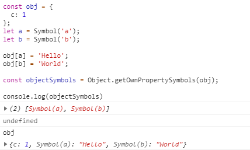
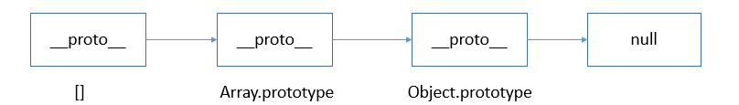

<!-- TOC -->

- [JavaScript 变量](#javascript-变量)
  - [基本类型和引用类型的值](#基本类型和引用类型的值)
  - [Symbol](#symbol)
  - [Set](#set)
  - [WeakSet](#weakset)
  - [Map](#map)
  - [WeakMap](#weakmap)
  - [判断JS数据类型的四种方法](#判断js数据类型的四种方法)
    - [1. typeof](#1-typeof)
    - [2. instanceof](#2-instanceof)
    - [3. Object.prototype.toString](#3-objectprototypetostring)
    - [4. construcor](#4-construcor)
  - [执行环境及作用域](#执行环境及作用域)
  - [垃圾收集](#垃圾收集)
  - [内存问题](#内存问题)

<!-- /TOC -->
# JavaScript 变量

1. 变量只不过是值的另一种表现形式。
2. 定义变量时候用`var`操作符（关键字），后面跟变量名（标识符）。
3. 变量是松散类型。可以保存任意类型的数据。
4. 保存值的占位符而已。


## 基本类型和引用类型的值 

**5种基本类型，1种引用类型：**

> - 基本类型：String、Number、Boolean、Undefined、Null、Symbol
> - 引用类型：Object
>    - Object、Array、Date、RegExp、Function、单体内置对象（Global、Math）、基本包装类型（String、Number、Boolean）


- 基本类型值在内存中占据固定大小的空间，因此被保存在 **栈** 内存中。
    - 从一个变量向另一个变量复制基本类型的值，会创建这个值的一个副本。
    - 由于其占据空间固定，是简单的数据段，为了便于提升变量查询速度，将其存储在栈中，即按值访问。
- 引用类型的值是对象，保存在 **堆** 内存中。
    - 包含引用类型值的变量实际上包含的并不是对象本身，而是一个指向该对象的指针。
    - 从一个变量向另一个变量复制引用类型的值，复制的其实是指针，因此两个变量最终都指向同一个对象。
    - 当我们需要访问引用类型（如对象，数组，函数等）的值时，首先从栈中获得该对象的地址指针，然后再从堆内存中取得所需的数据。

**栈（stack）堆（heap）**

- stack为自动分配的内存空间，它由系统自动释放；
- heap则是动态分配的内存，大小不定也不会自动释放。

## Symbol

Symbol 生成一个全局唯一的值。

`Symbol('a')` 中的 `a` 是对symbol的描述，起到注释的作用。

```js
Symbol('a') === Symbol('a') // false
```

可以通过 `Symbol.prototype.description` 获取到 Symbol 的描述

> 上面使用Symbol() 函数的语法，不会在你的整个代码库中创建一个可用的全局的symbol类型。 要创建跨文件可用的symbol，甚至跨域（每个都有它自己的全局作用域） , 使用 `Symbol.for()` 方法和  `Symbol.keyFor()` 方法从全局的symbol注册表设置和取得symbol。——《MDN》

**Symbol.for()**

```js
Symbol.for("bar") === Symbol.for("bar"); // true

var sym = Symbol.for("mario");
sym.toString();
// "Symbol(mario)"，mario 既是该 symbol 在 symbol 注册表中的键名，又是该 symbol 自身的描述字符串
```

**Symbol.keyFor()**

`Symbol.keyFor(sym)` 方法用来获取全局symbol 注册表中与某个 symbol 关联的键。

**使用场景**

- 作为对象中唯一的键。
- 消除魔术字符串。

```js
const shapeType = {
  triangle: 'Triangle'
};

// 修改后
const shapeType = {
  triangle: Symbol()
};
// shapeType.triangle等于哪个值并不重要，只要确保不会跟其他shapeType属性的值冲突即可。
// 因此，这里就很适合改用 Symbol 值。
```

**Object.getOwnPropertySymbols()**

使用 `Object.getOwnPropertySymbols()` 遍历 Symbol 作为键的对象的属性名。



**Reflect.ownKeys()**

`Reflect.ownKeys()` 返回所有类型的键名。

```js
const a = 1,
let obj = {
  [a]: 1,
  [Symbol('my_key')]: 1,
  enum: 2,
  nonEnum: 3
};

Reflect.ownKeys(obj)
//  ["1", enum", "nonEnum", Symbol(my_key)]
```


## Set

- Set 是 ES6 新的数据结构;
- 类似于数组，但是成员的值都是唯一的，没有重复的值。
- Set 本身是一个构造函数，用来生成 Set 数据结构。
- Set 结构没有键名，只有键值（或者说键名和键值是同一个值）

**一些用法：**

```js
const s = new Set();

[2, 3, 5, 4, 5, 2, 2].forEach(x => s.add(x));

for (let i of s) {
  console.log(i);
}
```

```js
/**
 * 数组去重
 */

// 方法1
[...new Set(array)]

// 方法2
function dedupe(array) {
  return Array.from(new Set(array));
}

dedupe([1, 1, 2, 3]) // [1, 2, 3]
```

**Set 实例的属性**

- `Set.prototype.constructor`：构造函数，默认就是 Set 函数。
- `Set.prototype.size`：返回 Set 实例的成员总数。

**Set 实例的方法**

操作方法（用于操作数据）

- `add(value)`：添加某个值，返回 Set 结构本身。
- `delete(value)`：删除某个值，返回一个布尔值，表示删除是否成功。
- `has(value)`：返回一个布尔值，表示该值是否为 Set 的成员。
- `clear()`：清除所有成员，没有返回值。

遍历操作（用于遍历成员）

- `keys()`：返回键名的遍历器
- `values()`：返回键值的遍历器
- `entries()`：返回键值对的遍历器
- `forEach()`：使用回调函数遍历每个成员

因为 Set 没有键名，所以 `keys()` 和 `values()` 是相等的。

可以省略values方法，直接用 `for...of` 循环遍历 Set。

所以 keys()，values()，entries() 好像没什么鸟用。

```js
let set = new Set(['red', 'green', 'blue']);

for (let x of set) {
  console.log(x);
}
// red
// green
// blue
```

**遍历的应用**

- 扩展运算符（...）内部使用for...of循环，所以也可以用于 Set 结构。
- 数组去重
- 数组的map和filter方法也可以间接用于 Set
- Set 可以很容易地实现并集（Union）、交集（Intersect）和差集（Difference）。

## WeakSet

WeakSet 结构与 Set 类似，也是不重复的值的集合。但是，它与 Set 有两个区别。

- WeakSet 的成员只能是对象。
- WeakSet 中的对象都是弱引用，即垃圾回收机制不考虑 WeakSet 对该对象的引用，也就是说，如果其他对象都不再引用该对象，那么垃圾回收机制会自动回收该对象所占用的内存，不考虑该对象还存在于 WeakSet 之中。
- WeakSet **没有 size** 属性，**没有办法遍历它的成员**。

**适用场景**

WeakSet 适合临时存放一组对象，以及存放跟对象绑定的信息。只要这些对象在外部消失，它在 WeakSet 里面的引用就会自动消失。

- [【未读】ES6核心特性](https://github.com/ljianshu/Blog/issues/10)

## Map

参考资料：

- [「 Map最佳实践」什么时候适合使用 Map 而不是 Object](https://mp.weixin.qq.com/s?__biz=Mzg4MTYwMzY1Mw==&mid=2247496434&idx=1&sn=59657a196de713a5fc412a701aa7a2ff&source=41)
- [JavaScript 复杂判断的更优雅写法](https://mp.weixin.qq.com/s?__biz=MzAwNzQ2ODEyMQ==&mid=2247484997&idx=1&sn=e03a05eb82fb1f8a191e58ae307a5113&chksm=9b7ce373ac0b6a65ef63089da11566a740e247f324518839f07541c4bbe18508db06c235f4ad&scene=21#wechat_redirect) 

Map 特性

- 类似于对象，也是键值对的集合
- “键”的范围不限于字符串，各种类型的值（包括对象）都可以当作键。
- Object 结构提供了“字符串—值”的对应，Map 结构提供了“值—值”的对应，是一种更完善的 Hash 结构实现。
- Map 的键实际上是跟内存地址绑定的，只要内存地址不一样，就视为两个键。这就解决了同名属性碰撞（clash）的问题，我们扩展别人的库的时候，如果使用对象作为键名，就不用担心自己的属性与原作者的属性同名。

```js
const map = new Map([
  ['name', '张三'],
  ['title', 'Author']
]);

map.size // 2
map.has('name') // true
map.get('name') // "张三"
map.has('title') // true
map.get('title') // "Author"
```

**Map 实例的属性：**

- `size` 属性
- `set(key, value)`
- `get(key)`
- `has(key)`
- `delete(key)`
- `clear()`

**Map 实例的遍历方法：**

- `keys()`：返回键名的遍历器。
- `values()`：返回键值的遍历器。
- `entries()`：返回所有成员的遍历器。
- `forEach()`：遍历 Map 的所有成员。


**与其他数据结构的互相转换**

- Map 转为数组
- 数组 转为 Map
- Map 转为对象
- 对象转为 Map
- Map 转为 JSON
- JSON 转为 Map

## WeakMap

- WeakMap 结构与 Map 结构类似，也是用于生成键值对的集合。
- WeakMap 与 Map 的区别有两点。
    - WeakMap 只接受对象作为键名（null 除外）。
    - WeakMap 的键名所指向的对象，不计入垃圾回收机制。

WeakMap 与 Map 在 API 上的区别主要是两个：

1. 没有遍历操作（即没有 `keys()`、`values()` 和 `entries()` 方法），也没有 `size` 属性。
2. 无法清空，即不支持 `clear` 方法。

因此，WeakMap只有四个方法可用：`get()`、`set()`、`has()`、`delete()`。

[ES2015 WeakMap的学习和使用](https://zhuanlan.zhihu.com/p/25454328)

## 判断JS数据类型的四种方法

- 基本类型的值应该使用 `typeof` 来检测
- 而对象的值则应该使用 `instanceof` 来检测。

其实这四种方式归根结底就是两种思路：

- 根据数据类型判断（1，2）
- 根据构造函数判断（3，4）

### 1. typeof

- `typeof` 是解释器内部实现，返回类型名称。
- 只能判断出来使用**字面量方式**赋值的**基本数据类型**。
- 对于引用类型，除 function 以外，一律返回 object 类型。
- 不能判断 `null` 的数据类型。返回的类型名称为object。

```js
typeof '';              // string 有效
typeof 1;               // number 有效
typeof Symbol();        // symbol 有效
typeof true;            // boolean 有效
typeof undefined;       // undefined 有效
typeof null;            // object 无效
typeof [] ;             // object 无效
typeof new Function();  // function 有效
typeof new Date();      // object 无效
typeof new RegExp();    // object 无效
```

### 2. instanceof

- instance 是“例子，实例”的意思，所以 instanceof 意思是用于判断变量是否是某一个对象的实例。 
- `instanceof` 的局限性应该也就是不能检测基本数据类型。
- `instanceof` 右边必须是对象或构造函数，否则会抛出 TypeError 的错误。
- `instanceof` 只能用来判断两个对象是否属于实例关系， 而不能判断一个对象实例具体属于哪种类型。
- `instanceof` 操作符的问题在于，它假定只有一个全局执行环境。如果网页中包含多个框架，那实际上就存在两个以上不同的全局执行环境，从而存在两个以上不同版本的构造函数。如果你从一个框架向另一个框架传入一个数组，那么传入的数组与在第二个框架中原生创建的数组分别具有各自不同的构造函数。



### 3. Object.prototype.toString

- 所有的数据类型都可以用 `Object.prototype.toString` 来检测,而且非常的精准。
- toString() 是 Object 的原型方法，调用该方法，默认返回当前对象的 [[Class]] 。
- 这是一个内部属性，其格式为 [object Xxx] ，其中 Xxx 就是对象的类型。

```js
Object.prototype.toString.call('')            // [object String]
Object.prototype.toString.call(1)             // [object Number]
Object.prototype.toString.call(true)          // [object Boolean]
Object.prototype.toString.call(Symbol())      // [object Symbol]
Object.prototype.toString.call(undefined)     // [object Undefined]
Object.prototype.toString.call(null)          // [object Null]
Object.prototype.toString.call(new Function())// [object Function]
Object.prototype.toString.call(new Date())    // [object Date]
Object.prototype.toString.call([])            // [object Array]
Object.prototype.toString.call(new RegExp())  // [object RegExp]
Object.prototype.toString.call(new Error())   // [object Error]
Object.prototype.toString.call(document)      // [object HTMLDocument]
Object.prototype.toString.call(window)        // [object global] window 是全局对象 global 的引用

// 对于 Object 对象，直接调用 toString()  就能返回 [object Object] 
Object.prototype.toString({})                 // [object Object]
```

### 4. construcor

- `constructor` 属性返回对创建此对象的数组函数的引用。
- 不管是**字面量**还是**构造函数**创建的基本类型，都可以检测。
- 可以检测出 Array、Object、Function引用类型。
- 不能检测出 `Null` 和 `Undefined`。
- 函数的 constructor 是不稳定的，这个主要体现在自定义对象上，当开发者重写 prototype 后，原有的 constructor 引用会丢失，constructor 会默认为 Object。
    - 为了规范开发，在重写对象原型时一般都需要重新给 constructor 赋值，以保证对象实例的类型不被篡改。

```js
console.log(''.constructor === String)
console.log(new Number(1).constructor === Number)
console.log(true.constructor === Boolean)
console.log(new Function().constructor === Function)
console.log(new Date().constructor === Date)
console.log(new Error().constructor === Error)
console.log([].constructor === Array)
console.log(document.constructor === HTMLDocument)
console.log(window.constructor === Window)

var f =  null;
console.log( f.constructor == Null);    //  TypeError: Cannot read property 'constructor' of null

var g;
console.log( g.constructor == Undefined);    // Uncaught TypeError: Cannot read property 'constructor' of

```

```js
function F(){}
F.prototype = {
  aa: 'txt'
}
let f = new F()
console.log(f.constructor === F) // false
console.log(f.constructor) // Object() { [native code] }

F.prototype = {
  constructor: F,
  aa: 'txt'
}
let d = new F()
console.log(d.constructor === F) // true
```

**参考资料:**

- [判断JS数据类型的四种方法](https://www.cnblogs.com/onepixel/p/5126046.html)
- [【掘金】JS类型检测](https://juejin.im/post/59b5540c5188257e8769e95d)
- [constructor 和 instanceof](https://www.cnblogs.com/haodawang/articles/5820032.html)
	

## 执行环境及作用域

所有变量（包括基本类型和引用类型）都存在于一个执行环境（也称为作用域）当中，这个执行环境决定了变量的生命周期，以及哪一部分代码可以访问其中的变量。以下是关于执行环境的几点总结：

- context 中文是“上下文”、“环境”。
- **执行环境，又称为执行上下文（execution context）**。
    - ctx 是 context 的缩写中文一般叫成上下文。
- 执行环境有**全局执行环境（也称为全局环境）**和**函数执行环境**之分；
- 每次进入一个新执行环境，都会创建一个用于搜索变量和函数的**作用域链**；
- 函数的局部环境不仅有权访问函数作用域中的变量，而且有权访问其包含（父）环境，乃至全局环境；
- 全局环境只能访问在全局环境中定义的变量和函数，而不能直接访问局部环境中的任何数据；
- **变量的执行环境有助于确定应该何时释放内存**。
- 每个执行环境都有一个与之关联的变量对象（variable object），环境中定义的所有变量和函数都保存在这个对象中。
- 在 Web 浏览器中，全局执行环境被认为是 window 对象。
- **某个执行环境中的所有代码执行完毕后，该环境被销毁，保存在其中的所有变量和函数定义也随之销毁（全局执行环境直到应用程序退出——例如关闭网页或浏览器——时才会被销毁）**。
- 函数参数也被当作变量来对待，因此其访问规则与执行环境中的其他变量相同。

**作用域（scope）是指什么？**

- 在JavaScript中，每个函数都有自己的作用域。作用域基本上是变量以及如何通过名称访问这些变量的规则的集合。只有函数中的代码才能访问函数作用域内的变量。
- 同一个作用域中的变量名必须是唯一的。一个作用域可以嵌套在另一个作用域内。如果一个作用域嵌套在另一个作用域内，最内部作用域内的代码可以访问另一个作用域的变量。


## 垃圾收集


JavaScript 是一门具有自动垃圾收集机制的编程语言，开发人员不必关心内存分配和回收问题。可以对 JavaScript 的垃圾收集例程作如下总结。

- 离开作用域的值将被自动标记为可以回收，因此将在垃圾收集期间被删除。
- “标记清除”是目前主流的垃圾收集算法，这种算法的思想是给当前不使用的值加上标记，然后再回收其内存。
- 另一种垃圾收集算法是“引用计数”，这种算法的思想是跟踪记录所有值被引用的次数。JavaScript引擎目前都不再使用这种算法；但在 IE 中访问非原生 JavaScript 对象（如 DOM 元素）时，这种算法仍然可能会导致问题。
- 当代码中存在循环引用现象时，“引用计数”算法就会导致问题。
- 解除变量的引用不仅有助于消除循环引用现象，而且对垃圾收集也有好处。为了确保有效地回收内存，应该及时解除不再使用的全局对象、全局对象属性以及循环引用变量的引用。
- JavaScript 具有自动垃圾收集机制。
- 自动垃圾回收原理：找出那些不再继续使用的变量，然后释放其占用的内存。
- 局部变量只在函数执行的过程中存在。

## 内存问题

- 一旦数据不再有用，最好通过将其值设置为 null 来释放其引用——这个做法叫做解除引用（dereferencing）。
- 这一做法适用于大多数全局变量和全局对象的属性。局部变量会在它们离开执行环境时自动被解除引用。
- 解除一个值的引用并不意味着自动回收该值所占用的内存。解除引用的真正作用是让值脱离执行环境，以便垃圾收集器下次运行时将其回收。


