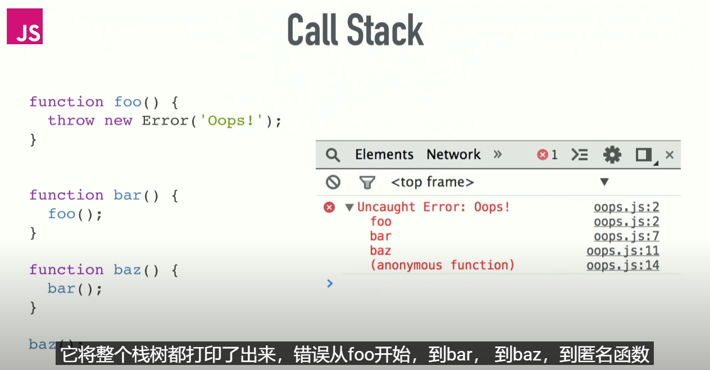
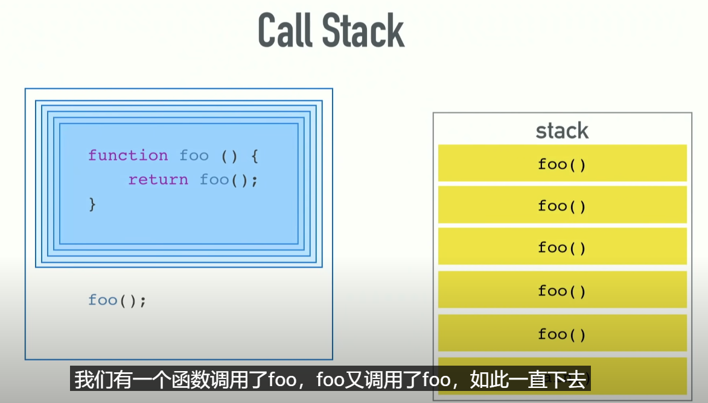
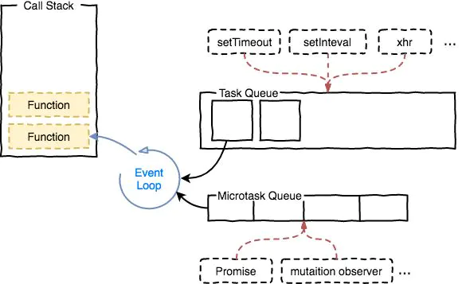
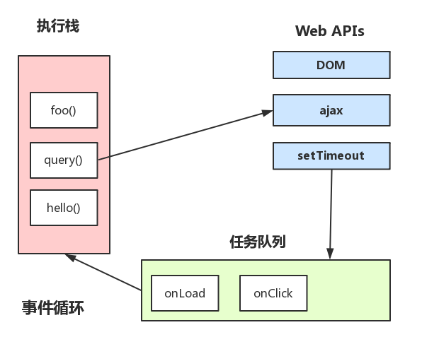

<!-- TOC -->

- [Event Loop 异步编程](#event-loop-异步编程)
  - [一些概念](#一些概念)
    - [cpu、进程、线程](#cpu进程线程)
    - [调用栈 （call stack）](#调用栈-call-stack)
    - [任务队列 （task queue）](#任务队列-task-queue)
    - [同步和异步](#同步和异步)
    - [宏任务、微任务、UI渲染](#宏任务微任务ui渲染)
  - [事件循环图示](#事件循环图示)
  - [Vue 中的 $nextTick](#vue-中的-nexttick)
  - [测试题](#测试题)
  - [参考资料](#参考资料)

<!-- /TOC -->
# Event Loop 异步编程

## 一些概念

### cpu、进程、线程

**通俗理解**：

> cpu看做是一个工厂，进程就是工厂里面的车间，线程就是车间里面的工人。
> —— [进程和线程](http://www.ruanyifeng.com/blog/2013/04/processes_and_threads.html)

工厂的供电能力有限，只能让一个车间工作（单进程），车间为了提高生产效率，让多个工人共享车间资源同时来干活（多线程）。

**浏览器中的进程和线程：**


从上图可以看出：

- 浏览器是多进程的
- 每一个 Tab 页，就是一个独立的进程。（空白页在优化后会合为一个进程）

从逻辑角度来看，多线程的意义在于一个应用程序中，有多个执行部分可以同时执行。但操作系统并没有将多个线程看做多个独立的应用，来实现进程的调度和管理以及资源分配。这就是进程和线程的重要区别。

> 单线程的运行环境，它有且只有一个调用栈，它每次只能够做一件事。这就是单线程的意思，程序每次只可以运行一段代码。

### 调用栈 （call stack）

- 又称“执行栈”。
- 特点：后进先出。



一个内存泄漏的例子，如下图：



但是还有一个更严重的问题，阻塞！

> 比如说，console.log不慢，遍历从1到10亿很慢，网络请求很慢，下载图片也很慢。反正在栈里表现很慢的东西都叫阻塞。

### 任务队列 （task queue）

- 又称“事件队列”或者 callback queue。
- 特点：先进先出。

### 同步和异步

**同步**

- setTimeout/setInterval 和 XHR/fetch 本身都是同步的，回调函数才是异步任务。
- promise 中的任务也是同步的，then 中的才是异步微任务。

**异步**

> JS 是单线程的，JS 是通过事件队列(Event Loop)的方式来实现异步回调的。

### 宏任务、微任务、UI渲染

**宏任务** （macro-task）

宏任务有：`主代码块`、`setTimeout`、`setInterval`、`requestAnimationFrame`、`setImmediate`, I/O, UI rendering 等

- 我们可以将每次执行栈执行的代码当做是一个宏任务（包括每次从事件队列中获取一个事件回调并放到执行栈中执行），
- 每一个宏任务会从头到尾执行完毕，不会执行其他。

**微任务** （micro-task）

微任务有：`Promise`、`MutationObserver`、nodjs `process.nextTick`。

当宏任务执行完，会在渲染前，将执行期间所产生的所有微任务都执行完。

**UI渲染的时机**

```js
function main() {
  document.body.style = 'background:black';
  document.body.style = 'background:red';
  console.log('global1');

  setTimeout(function () {
    // 应该是这里执行前开始渲染ui，试试用alert阻塞下。
    alert(' ui 已经渲染完毕了吗？ ');
    document.body.style = 'background:grey';
    console.log('timeout1');
  })

  new Promise(function (resolve) {
    console.log('promise1');
    for (var i = 0; i < 1000; i++) {
      i == 99 && resolve();
    }
    console.log('promise2');
    document.body.style = 'background:blue';
  }).then(function () {
    // 微任务
    console.log('then1');
    alert(' ui 开始渲染 '); // alert 之前页面没有开始渲染
  })
}
main();
```

**执行流程**

1. JavaScript 内核加载代码到 `执行栈`；
2. `执行栈` 依次执行主线程的 `同步任务`。在执行的过程中如果遇到异步 API 则把事件回调添加到 `回调队列` 中。 `微任务` 事件添加到 `微任务队列`中，`宏任务` 事件添加到 `宏任务队列` 中。直到当前 `执行栈` 中的代码执行完毕。
3. 开始执行当前 `微任务队列` 中所有的微任务事件回调（也就是清空队列）。
4. 取出 `宏任务队列`中的第一条（先进先出）宏任务，放到 `执行栈` 中执行。
5. 执行当前 `执行栈` 中的宏任务，如果此时遇到 `微任务` 或者 `宏任务`，继续把他们放到各自的队伍中，然后本轮的 `宏任务` 执行完后，又把本轮产生的 `微任务` 全部取出执行。
6. `宏任务`执行完后，继续执行（如果有）所有`微任务`，然后进行 `UI渲染`。
7. 以上操作反复执行，就是我们所说的 `EventLoop`。

## 事件循环图示





解释一下上面这张图：

- JS引擎线程只执行执行栈中的事件
- 执行栈中的代码执行完毕，就会读取任务队列中的事件
- 任务队列中的事件回调，是由 WebAPIs 插入到事件队列中的。
- 如此循环

##  Vue 中的 $nextTick

Vue2 中的 `$nextTick` 的就是使用 EventLoop 的特点来实现的。在宏任务和微任务结束后，下一轮宏任务开始执行前进行 UI 渲染。

[从 Event Loop 角度解读 Vue NextTick 源码](https://mp.weixin.qq.com/s/8Sirsx1ZgQWNKxcoLGX8kg)

##  测试题

```js
async function async1(){
  console.log('async1 start')
  await async2()
  console.log('async1 end')
}

async function async2(){
  console.log('async2')
}

console.log('script start')

setTimeout(function(){
  console.log('setTimeOut')
}, 0)

async1()

new Promise(function(resolve){
  console.log('promise1')
  resolve()
}).then(function(){
  console.log('promise2')
})

console.log('script end')
```

```js
console.log('script start')

async function async1() {
    await async2()
    console.log('async1 end')
}
async function async2() {
    console.log('async2 end')
    return Promise.resolve().then(()=>{
        console.log('async2 end1')
    })
}
async1()

setTimeout(function() {
    console.log('setTimeout')
}, 0)

new Promise(resolve => {
    console.log('Promise')
    resolve()
})
.then(function() {
    console.log('promise1')
})
.then(function() {
    console.log('promise2')
})

console.log('script end')
```

## 参考资料

- [js 宏任务和微任务](https://www.cnblogs.com/ckAng/p/11133643.html)
- [微任务、宏任务与Event-Loop](https://www.cnblogs.com/jiasm/p/9482443.html)
- [面试问到 Event Loop，这样回答最完美](https://mp.weixin.qq.com/s?__biz=MzUyNDYxNDAyMg==&mid=2247484694&idx=1&sn=af8a8f569082ec95256b793645bbff5e&chksm=fa2be5ffcd5c6ce9c2d975170e0eaff0a35263400529117a1fa3bffb2a62b9f28606310b9bc5&mpshare=1&scene=1&srcid=1125Ng1bwibIFc8X3rkxNbwu&sharer_sharetime=1574663539040&sharer_shareid=f2871d48d5c5e6ea7b28232a00b72175&key=7d0280d7310dde40c8a505da54b554c26997ff5f9739a2c1750d67a4f6d9a1dee6515cc013a1d95d3d4a38b57150cd1a6cb3d1c706d008eeb2121f75b27a2b7640b578b4da48a18d17c6e0da48ea17e0&ascene=1&uin=MjcwNDcxNzQyMQ%3D%3D&devicetype=Windows+10&version=62070158&lang=zh_CN&pass_ticket=ygGxEmAnqWv2hM8UVp7K8f5IfsTddkZYk8hUObyHwbw0I%2Fki%2FhFp1L5z0GeSK728)
- [JS浏览器事件循环机制](http://www.cnblogs.com/yqx0605xi/p/9267827.html)
- [【youtube视频】菲利普·罗伯茨：到底什么是Event Loop呢？](http://latentflip.com/loupe/?code=JC5vbignYnV0dG9uJywgJ2NsaWNrJywgZnVuY3Rpb24gb25DbGljaygpIHsKICAgIHNldFRpbWVvdXQoZnVuY3Rpb24gdGltZXIoKSB7CiAgICAgICAgY29uc29sZS5sb2coJ1lvdSBjbGlja2VkIHRoZSBidXR0b24hJyk7ICAgIAogICAgfSwgMjAwMCk7Cn0pOwoKY29uc29sZS5sb2coIkhpISIpOwoKc2V0VGltZW91dChmdW5jdGlvbiB0aW1lb3V0KCkgewogICAgY29uc29sZS5sb2coIkNsaWNrIHRoZSBidXR0b24hIik7Cn0sIDUwMDApOwoKY29uc29sZS5sb2coIldlbGNvbWUgdG8gbG91cGUuIik7!!!PGJ1dHRvbj5DbGljayBtZSE8L2J1dHRvbj4%3D)
- [【youtube视频】【未读】Jake Archibald: 在循环 - JSConf.Asia](https://www.youtube.com/watch?v=cCOL7MC4Pl0&vl=zh)
- [【未读】通杀 Event Loop 面试题](https://juejin.im/post/5d50d2e3e51d4561ea1a941f)


