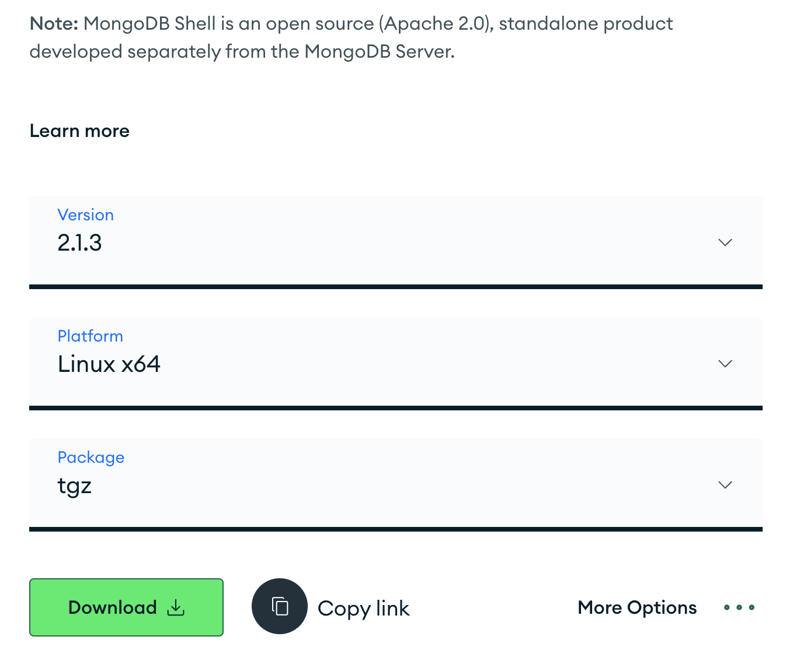

- [linux 安装 node、nongodb、nginx，走一遍服务器部署主流程](#linux-安装-nodenongodbnginx走一遍服务器部署主流程)
  - [系统安装](#系统安装)
  - [安装 nodejs](#安装-nodejs)
  - [安装 mongodb](#安装-mongodb)
  - [将开发环境数据导入生产环境](#将开发环境数据导入生产环境)
  - [安装 nginx](#安装-nginx)

# linux 安装 node、nongodb、nginx，走一遍服务器部署主流程

前段时间用 nuxt、mongodb、express 开发了一个网站。工作这么多年没有接触过后端和服务器，趁这个机会了解一下。

新用户可以免费试用一个月腾讯云服务器，就用腾讯云来试试。今天之前在 centos stream 8 上安装了 node、mongodb、nginx，以及前后端代码部署，外网能够成功访问。

今天在 centos stream 9 上重装一遍用来加深影响，流程走通后把本系统制作成镜像以便后续使用。

## 系统安装


> CentOS Stream 9 是一款基于 Red Hat Enterprise Linux（RHEL）9 的 Linux 发行版，由 CentOS 社区开发和维护。它是 CentOS Stream 系列中的最新版本，也是一个自由、开源、稳定的操作系统，适用于企业、服务器、开发者以及个人用户等不同场景。


## 安装 nodejs

`su root` 切换到 root 用户，使用 [nvm](https://github.com/nvm-sh/nvm) 来管理 nodejs ，先装 nvm

`ping https://raw.githubusercontent.com` 看一下是否能 ping 通，
如果提示 `ping: https://raw.githubusercontent.com: Name or service not known`，则说明网络有问题，会导致安装失败进度条一直是 0。

```bash
curl -o- https://raw.githubusercontent.com/nvm-sh/nvm/v0.39.7/install.sh | bash
```

通过修改 dns 和 hosts 还有 vpn 都没办法 ping 通。所以采用 [yum](https://cloud.tencent.com/developer/article/1626800) 方式来安装 nodejs。

首先使用 `yum module list nodejs` 来查看可用流，显示下面的结果，每个系统不一样。

```
CentOS Stream 9 - AppStream
Name                              Stream                            Profiles                                                         Summary                                     
nodejs                            18                                common [d], development, minimal, s2i                            Javascript runtime                          
nodejs                            20                                common [d], development, minimal, s2i                            Javascript runtime   
```

使用 `sudo yum module install nodejs` 来安装时发现没选择认默认安装版本会报错。如果我们想使用 20 版本，可以使用
[`sudo dnf module enable nodejs:20`](https://www.digitalocean.com/community/tutorials/how-to-install-node-js-on-centos-8) 选择 20 版本即可，然后使用上面的 install 来安装。

```
Installed:
  nodejs-1:20.9.0-1.module_el9+743+ad38546c.x86_64         nodejs-docs-1:20.9.0-1.module_el9+743+ad38546c.noarch   nodejs-full-i18n-1:20.9.0-1.module_el9+743+ad38546c.x86_64  
  npm-1:10.1.0-1.20.9.0.1.module_el9+743+ad38546c.x86_64  

Complete!
```
显示上面信息则安装成功

设置 npm 镜像

```
npm config set registry https://registry.npmmirror.com
```

由于前端项目使用 pnpm ，所以要使用 `npm install pnpm -g` 安装 pnpm ，如果有新版本就根据提示更新一下

```
added 1 package in 1s
npm notice 
npm notice New minor version of npm available! 10.1.0 -> 10.3.0
npm notice Changelog: https://github.com/npm/cli/releases/tag/v10.3.0
npm notice Run npm install -g npm@10.3.0 to update!
npm notice 
```

## 安装 mongodb

使用 `wget https://fastdl.mongodb.org/linux/mongodb-linux-x86_64-rhel80-5.0.4.tgz` 下载压缩包到当前目录

解压文件到当前目录 `tar -zxvf mongodb-linux-x86_64-rhel80-5.0.4.tgz`

创建 mongodb 的必要目录

```bash
cd /usr/local/
mkdir mongodb
cd mongodb
mkdir data
mkdir logs
cd logs
touch mongodb.log
```

将解压的文件移动到刚才创建的 mongodb 目录下

```bash
mv mongodb-linux-x86_64-rhel80-5.0.4 /usr/local/mongodb/
```

接下来配置环境变量

`vim /etc/profile` 打开 profile，加上下面这段配置代码

```bash
export MONGODB_HOME=/usr/local/mongodb
export PATH=$MONGODB_HOME/bin:$PATH
```

然后执行 `source /etc/profile`

创建配置文件 `touch /usr/local/mongodb/etc/mongodb.conf`

vim 打开 mongodb.conf，添加下面这些配置

```bash
dbpath=/usr/local/mongodb/data
logpath=/usr/local/mongodb/logs/mongodb.log
logappend=true
port=27017
bind_ip=0.0.0.0
fork=true
```

启动 mongodb 服务

```bash
cd /usr/local/mongodb/mongodb-linux-x86_64-rhel80-5.0.4/bin/
./mongod --config /usr/local/mongodb/etc/mongodb.conf
```

```bash
# 关闭服务
mongod --config /usr/local/mongodb/etc/mongodb.conf --shutdown

# 或者
killall mongod

# 查看 mongod 服务是否启动
ps aux | grep -v grep | grep mongod
```

正常情况下就 ok 了，如果有下面这种[提示](https://stackoverflow.com/questions/33693635/mongod-error-while-loading-shared-libraries-libssl-so-10-libcrypto-so-10)，就去[官网下载](https://www.mongodb.com/try/download/community)正确版本的压缩包（RedHat / CentOS 9.0 x64）。

```
./mongod: error while loading shared libraries: libcrypto.so.1.1: cannot open shared object file: No such file or directory
```


使用 `wget https://fastdl.mongodb.org/linux/mongodb-linux-x86_64-rhel90-6.0.13.tgz`

显示下面内容则安装成功

```bash
about to fork child process, waiting until server is ready for connections.
forked process: 44012
child process started successfully, parent exiting
```

安装过程中遇到下载速度只有几 kb 的问题，还老是下错安装包。

## 将开发环境数据导入生产环境

查看 `ls bin` 目录下有哪些文件，`install_compass  mongod  mongos` 只有这三个，我们来安装一些[工具](https://www.mongodb.com/try/download/database-tools)。


```bash
#下载
wget https://fastdl.mongodb.org/tools/db/mongodb-database-tools-rhel90-x86_64-100.9.4.tgz
#解压
tar -zxvf mongodb-database-tools-rhel90-x86_64-100.9.4.tgz
# 进入 bin
cd mongodb-database-tools-rhel90-x86_64-100.9.4/bin
# 复制所有工具命令到MongoDB的bin目录下
cp * /usr/local/mongodb/mongodb-linux-x86_64-rhel90-6.0.13/bin/
```

在开发环境开启 mongodb 服务，使用 `mongodump` 备份数据。然后把备份的数据库文件上传到腾讯云服务器

```bash
#开发环境
mongod #启动服务
mongodump --host --port --out /path/to/backup/directory #备份到指定文件
```

```bash
#服务器环境
./mongod --config /usr/local/mongodb/etc/mongodb.conf#启动服务
./mongorestore --host 'localhost:27017' /dump #将备份的数据放到指定的服务器
```

提示以下信息导入成功

```bash 
2024-01-19T16:52:02.392+0800    88032 document(s) restored successfully. 0 document(s) failed to restore.
```

高版本的 mongodb 安装后不会自带MongoDB Shell，所以需要去官网下载 [mongosh](https://www.mongodb.com/try/download/shell)



## 安装 nginx

```bash
# 安装依赖，否则执行配置 ./configure 会失败
yum install -y gcc-c++ pcre pcre-devel zlib zlib-devel openssl openssl-devel
# [下载](http://nginx.org/en/download.html)
wget http://nginx.org/download/nginx-1.25.1.tar.gz
# 解压
tar -zxvf nginx-1.25.1.tar.gz
# 更换目录
mv nginx-1.25.1 /usr
cd /usr/nginx-1.25.1/
./configure
```

出现下面的提示则配置成功
```bash
Configuration summary
  + using system PCRE library
  + OpenSSL library is not used
  + using system zlib library
```

接着编译安装 nginx
```bash
make&&make install
```

出现下面的提示则安装成功
```bash
make[1]: Leaving directory '/usr/nginx-1.25.1'
```

```bash
# 运行 nginx
/usr/local/nginx/sbin/nginx
curl http://localhost:80
#显示下面这段代码则运行成功
```
```html
<!DOCTYPE html>
<html>
<head>
<title>Welcome to nginx!</title>
<style>
html { color-scheme: light dark; }
body { width: 35em; margin: 0 auto;
font-family: Tahoma, Verdana, Arial, sans-serif; }
</style>
</head>
<body>
<h1>Welcome to nginx!</h1>
<p>If you see this page, the nginx web server is successfully installed and
working. Further configuration is required.</p>

<p>For online documentation and support please refer to
<a href="http://nginx.org/">nginx.org</a>.<br/>
Commercial support is available at
<a href="http://nginx.com/">nginx.com</a>.</p>

<p><em>Thank you for using nginx.</em></p>
</body>
</html>
```

```bash
# 创建 nginx 配置文件
touch /usr/local/nginx/nginx.conf

# 编辑
vim /usr/local/nginx/nginx.conf

# 如何发现 nginx.conf 有 vim 进程
killall -9 vim

# 配置如下
events {
  worker_connections 1024;
}
http {
  server {
    listen 80;
    server_name localhost;

    location / {
      proxy_pass http://localhost:3200;  # 这是 nuxt 启动后的访问地址
    }
  }
}

# 由于刚才已经启动了 nginx，查看进程
ps -ef|grep nginx

# kill 进程
kill -QUIT 2072

#运行 nginx
nginx -c /usr/local/nginx/nginx.conf
```

因为没有域名，所以没有配置域名，使用公网 ip 即可访问。

服务器需要的软件和配置都已经弄好了，把前后端上传到服务器安装依赖，使用 pm2 把前后端都跑起来即可。

目前的配置都很粗糙，只能跑通主流程让用户可以在公网通过 ip 访问网站。网站开发的也很粗糙，等前后端开发完成后在进一步完善不熟流程。