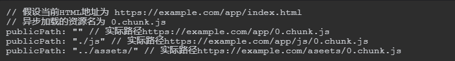
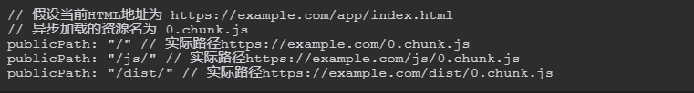
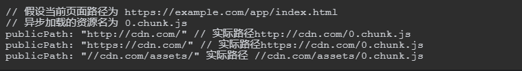
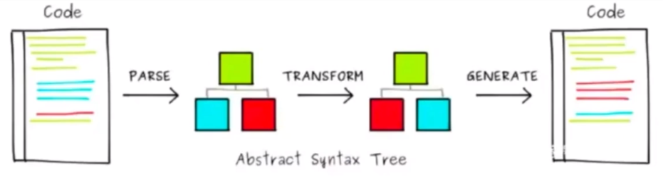

<!-- TOC -->

- [Webpack](#webpack)
  - [参考链接](#参考链接)
  - [一些图](#一些图)
  - [一些专业词汇](#一些专业词汇)
  - [一些概念](#一些概念)
  - [基础概念](#基础概念)
    - [entry](#entry)
    - [context](#context)
    - [output](#output)
    - [loader](#loader)
    - [resolve（解析）](#resolve解析)
    - [plugins（插件）](#plugins插件)
    - [mode（模式）](#mode模式)
    - [optimization（优化）](#optimization优化)
    - [devServer（开发服务器）](#devserver开发服务器)
  - [常用方法/属性](#常用方法属性)
    - [require.context](#requirecontext)
  - [webpack 优化](#webpack-优化)
    - [缩小文件搜索范围](#缩小文件搜索范围)
    - [HappyPack 开启多进程](#happypack-开启多进程)
    - [ParallelUglifyPlugin](#paralleluglifyplugin)
    - [代码压缩](#代码压缩)
    - [CDN 加速](#cdn-加速)
    - [开发环境](#开发环境)
      - [HMR（优化打包速度）](#hmr优化打包速度)
      - [source-map（优化代码调试）](#source-map优化代码调试)
    - [生产环境](#生产环境)
      - [优化打包构建速度](#优化打包构建速度)
        - [oneOf](#oneof)
        - [babel 缓存和文件资源缓存](#babel-缓存和文件资源缓存)
        - [多进程打包](#多进程打包)
        - [externals](#externals)
        - [DllPlugin](#dllplugin)
      - [优化代码运行的性能](#优化代码运行的性能)
        - [缓存（hash、chunk-hash、content-hash）](#缓存hashchunk-hashcontent-hash)
        - [tree shaking](#tree-shaking)
        - [code split （提取公用代码、拆分代码按需加载）](#code-split-提取公用代码拆分代码按需加载)
        - [懒加载/预加载](#懒加载预加载)
        - [PWA](#pwa)
  - [webpack 原理](#webpack-原理)
    - [webpack 热更新 (HMR)](#webpack-热更新-hmr)
    - [实现一个简易的 webpack](#实现一个简易的-webpack)
    - [抽象语法树（AST）](#抽象语法树ast)
    - [loader 原理](#loader-原理)
    - [plugin 原理](#plugin-原理)
      - [tapable](#tapable)
  - [问题](#问题)
    - [iview 自定义皮肤时 `.bezierEasingMixin();` 报错](#iview-自定义皮肤时-beziereasingmixin-报错)
    - [css-loader中路径中 `~` 的作用](#css-loader中路径中--的作用)
    - [npx](#npx)
    - [npm link](#npm-link)
- [vue-cli](#vue-cli)

<!-- /TOC -->

# Webpack

## 参考链接

- 【已读】[webpack4-用之初体验，一起敲它十一遍](https://juejin.im/post/5adea0106fb9a07a9d6ff6de)
- 【已读】这篇写的更详细 [webpack4.x最详细入门讲解](https://juejin.im/post/5bd66efcf265da0a8a6af2d2)
- 【书】[《深入浅出 Webpack》](http://webpack.wuhaolin.cn/)
- 【视频】[尚硅谷最新版Webpack5实战教程(从入门到精通)](https://www.bilibili.com/video/BV1e7411j7T5)
- [Webpack阮一峰demo](https://github.com/ruanyf/webpack-demos)
- 【中英文都有】[webpack官网](https://webpack.docschina.org/concepts/)
- 【webpack5的变化】【英文】[webpack5 changelog](https://github.com/webpack/changelog-v5)
- [【未读】打包工具的配置教程见的多了，但它们的运行原理你知道吗？](https://segmentfault.com/a/1190000015291911)
- [【未读】vue-cli 脚手架中 webpack 配置基础文件详解](https://mp.weixin.qq.com/s?__biz=MzAxODE2MjM1MA==&mid=2651554200&idx=1&sn=c6fe3770c42f9bcf69adc520ff290234&chksm=80255659b752df4fc54550feda8b130ed679d8fc9e50be11734a4116488cb85f2b74f9d063c5&scene=0&key=2ab8a62e312555a1106d82b2d899fbe1bda7eb439f44c5b8bcd4401e925dcef1c34616df6ac998d4aa9ef39d8979e2519e26856b2a9fc98cd69c55c1f09f6ce2446422f3136dc5630dcaba0d1716c82e&ascene=14&uin=MjcwNDcxNzQyMQ%3D%3D&devicetype=Windows+10&version=62060833&lang=zh_CN&pass_ticket=ZoqXnMgi0AAEna540iG5qPugeLgO5W7T7qkyPIntCT9Pu1xlW6JZWbtLnqd%2FcXea)
- [【未读】前端处理小图标的那些解决方案（图文实操）](https://mp.weixin.qq.com/s?__biz=MzAxODE2MjM1MA==&mid=2651551414&idx=2&sn=a44ef8abd9611adf49761902deaf085a&chksm=8025a177b7522861c66bfc0c1a48439205e2cf0c0eac31b8eec6f68580d89c65b7d40a1fa3ce&scene=0&key=cc7d6364edc5eb3e57ef56c92f6e382fe87ba8f4b14c1313499e720b9b494138e44286bc2be91adb7270a845c4515e53a50795b304cc41d2cff8aaee7f39e0ec2d716da535a3dbe5a24754576bad1658&ascene=14&uin=MjcwNDcxNzQyMQ%3D%3D&devicetype=Windows+10&version=62060833&lang=zh_CN&pass_ticket=ZoqXnMgi0AAEna540iG5qPugeLgO5W7T7qkyPIntCT9Pu1xlW6JZWbtLnqd%2FcXea)
- [【未读】超详细的webpack原理解读](https://segmentfault.com/a/1190000017890529)
- [【未读】理解webpack原理，手写一个100行的webpack - dykily的文章 - 知乎](https://zhuanlan.zhihu.com/p/58151131)
- [【未读】「吐血整理」再来一打Webpack面试题](https://zhuanlan.zhihu.com/p/113661886)
- [【未读】当面试官问Webpack的时候他想知道什么](https://mp.weixin.qq.com/s/2-zNlGrKUngWdQNvlcgESw)
- [这个webpack思维导图做的挺好](./images/webpack%E7%9F%A5%E8%AF%86%E7%82%B9.png)

## 一些图

依赖关系图


entry、chunk、bundle的关系


可以定义多入口，entry与bundle的对应关系


## 一些专业词汇

- module bundler 模块打包工具 
    - Webpack、Parcel、Rollup
    - 万物皆模块
- code splitting 代码分割
    - 按需加载。首屏只加载必要的部分
- package.json，它相当于npm项目的说明书。
- webpack 是核心模块，webpack-cli 则是命令行工具
- chunk 字面的意思是代码块，在Webpack中可以理解成被抽象和包装过后的一些模块。它就像一个装着很多文件的文件袋，里面的文件就是各个模块，Webpack在外面加了一层包裹，从而形成了chunk。根据具体配置不同，一个工程打包时可能会产生一个或多个chunk。
    - 代码块，一个 Chunk 由多个模块组合而成，用于代码合并与分割。
- bundle。Webpack会从入口文件开始检索，并将具有依赖关系的模块生成一棵依赖树，最终得到一个chunk。由这个chunk得到的打包产物我们一般称之为bundle。
- vendor 的意思是“供应商”，在Webpack中vendor一般指的是工程所使用的库、框架等第三方模块集中打包而产生的bundle。

## 一些概念

- Webpack 是一个开源的JavaScript模块打包工具，其最核心的功能是解决模块之间的依赖，把各个模块按照特定的规则和顺序组织在一起，最终合并为一个JS文件（有时会有多个，这里讨论的只是最基本的情况）。这个过程就叫作模块打包。
- 为什么要用webpack？自动化工具，不需要人工手动维护。
- 何为模块。在设计程序结构时，把所有代码都堆到一起是非常糟糕的做法。更好的组织方式是按照特定的功能将其拆分为多个代码段，每个代码段实现一个特定的目的。你可以对其进行独立的设计、开发和测试，最终通过接口来将它们组合在一起。这就是基本的模块化思想。
- 假如工程上线时要进行依赖安装，就可以通过 `npm install--production` 过滤掉 devDependencies 中的冗余模块，从而加快安装和发布的速度。
- webpack-dev-server 只是将打包结果放在内存中。webpack-dev-server 的作用是启动一个本地服务，可以处理打包资源与静态文件的请求。它的 live-reloading 功能可以监听文件变化，自动刷新页面来提升开发效率。
- CommonJS 和 ES6 Module的区别。
    - CommonJS 的 `require` 可以动态指定模块的加载路径。在CommonJS模块被执行前，并没有办法确定明确的依赖关系，模块的导入、导出发生在代码的运行阶段。
    - CommonJS与ES6 Module最本质的区别在于前者对模块依赖的解决是“动态的”，而后者是“静态的”。在这里“动态”的含义是，模块依赖关系的建立发生在代码运行阶段；而“静态”则是模块依赖关系的建立发生在代码编译阶段。
    - ES6 Module是一种静态的模块结构，在ES6代码的编译阶段就可以分析出模块的依赖关系。
    - ES6 Module 相对 CommonJS 的优点。
        - 死代码检测和排除。
        - 模块变量类型检查。
        - 编译器优化。
    - CommonJS 值拷贝，ES6 Module 动态映射
        - 我们不可以对ES6 Module导入的变量进行更改，可以将这种映射关系理解为一面镜子，从镜子里我们可以实时观察到原有的事物，但是并不可以操纵镜子中的影像。

## 基础概念

```js
module.exports = {
    entry: '',               // 入口文件
    output: {},              // 出口文件
    module: {},              // 处理对应模块
    plugins: [],             // 对应的插件
    devServer: {},           // 开发服务器配置
    mode: 'development'      // 模式配置
}
```

npm run dev命令下（开发环境），打包的文件存在于**内存中**，并不会产生在dist目录下

### entry

- 告诉 webpack 以哪个文件作为内部依赖图的起点作为开始。
- 每一个依赖项被处理后，输出到 bundles 文件中。
- 可以使用多个 entry 来配置多文件项目。
- entry的配置可以有多种形式：字符串、数组、对象、函数。
    - 字符串：单入口，一个chunk，输出一个bundle。
    - 数组：多入口，最终形成一个chunk，输出一个bundle。
    - 对象：多入口，对应多个chunk，输出对应多个chunk。
    - 还有一些特殊的用图，参考官网。

### context

- context 可以理解为资源入口的路径前缀，在配置时要求必须使用绝对路径的形式。
- 配置 context 的主要目的是让 entry 的编写更加简洁，尤其是在多入口的情况下。context 可以省略，默认值为当前工程的根目录。

### output

告诉 webpack 在哪里输出它所创建的 bundles 文件，以及如何命名这些文件。

- filename 文件名称（名称+目录）
- path 用来指定资源的输出位置
- publicPath 则用来指定资源的请求位置
- 其他参数参考官网

**输出位置和请求位置**

- 输出位置：打包完成后资源产生的目录，一般将其指定为工程中的 dist 目录。
- 请求位置：由 JS 或 CSS 所请求的间接资源路径。页面中的资源分为两种，一种是由 HTML 页面直接请求的，比如通过 script 标签加载的 JS；另一种是由 JS 或 CSS 请求的，如异步加载的 JS、从 CSS 请求的图片字体等。publicPath 的作用就是指定这部分间接资源的请求位置。

**publicPath有3种形式**
1. HTML 相关
    - 与HTML相关，也就是说我们可以将publicPath指定为HTML的相对路径，在请求这些资源时会以当前页面HTML所在路径加上相对路径，构成实际请求的URL。
    - 
2. Host 相关
    - 若publicPath的值以“/”开始，则代表此时publicPath是以当前页面的host name为基础路径的。
    - 
3. CDN 相关
    - 

**webpack-dev-server 中的 publicPath**

publicPath 指定 webpack-dev-server 的静态资源服务路径。

> 为了避免开发环境和生产环境产生不一致而造成开发者的疑惑，我们可以将webpack-dev-server的publicPath与Webpack中的output.path保持一致，这样在任何环境下资源输出的目录都是相同的。
### loader

- 让 webpack 能够去处理那些非 JavaScript 文件（webpack 自身只理解 JavaScript 和 json）。
- loader 可以在 `import` 或 `require()` 模块时预处理文件。例如把 ts 转成 js，把 sass 转化成 css。
- 处理一个文件可以使用多个loader，loader的执行顺序和配置中的顺序是相反的，即最后一个loader最先执行，第一个loader最后执行（loader 从右到左（或从下到上）地取值(evaluate)/执行(execute)）。
- loader 的配置属性：
    - `test` 属性用来识别应该被处理的文件；
    - `use` 属性用来用什么 loader 来多页面项目；
    - `execude` 排除
    - `include` 包含
    - `enforce`
    - `options`
    - `oneOf`
- loader 支持链式调用。
- loader 可以是同步的，也可以是异步的。

> 在 webpack 配置中定义 loader 时，要定义在 `module.rules` 中，而不是 `rules`。
```js
module.exports = {
  module: {
    rules: [
      {
        test: /\.css$/,
        exclude: /node_modules/, // 排除 node_modules 下的文件
        include: resolve(__dirname, 'src'), // 只检查src下的文件
        enforce: 'pre', // pre post
        use: [
          { loader: 'style-loader' },
          {
            loader: 'css-loader',
            options: {
              modules: true
            }
          }
        ]
      },
      {
        // 以下配置只会生效一个
        oneOf: []
      }
    ]
  }
};
```

**css样式**
- style-loader 将 css 插入到页面的style标签
- css-loader 是将 @import 和 url() 转换成 import/require() 的写法

```js
{
    test: /\.css$/,
    use: ['style-loader', 'css-loader'],
},
```

**预加载器（less、scss）**

- less-loader 将 less 文件编译成 css
- 并且需要使用 style-loader css-loader less-loader

```js
  {
    test: /\.less$/,
    use: ['style-loader', 'css-loader', 'less-loader'],
  },
```

**css 兼容性处理**

使用 postcss 来解决 css兼容性问题

- 安装 `postcss`
- 安装 `postcss-loader`
- 安装 `postcss-preaset-env`。 帮 postcss 找到 package.json 中 browserslist 里面的配置，通过配置加载指定的 css 兼容性样式。
- 如果只使用了 `postcss-loader` 没有进行配置，则还需要配置 postcss.config.js 文件才能生效，所以可以将 loader 跟配置分开。

使用 `browserslist` 来配置目标浏览器配置表：

```js
// package.json 文件
"browserslist": {
  // 开发环境 --> 设置node环境变量：process.env.NODE_ENV = development
  "development": [
    "last 1 chrome version",
    "last 1 firefox version",
    "last 1 safari version"
  ],
  // 生产环境：默认是看生产环境
  "production": [
    ">0.2%",
    "not dead",
    "not op_mini all"
  ]
}
```

browserslist 是数组 `npx browserslist` 命令可以打印出所有浏览器版本配置情况。
browserslist 是对象配置了开发环境和生产环境，则需要使用 `npx browserslist --env=development` 命令来查看。

参考资料：

- [【github】browserslist](https://github.com/browserslist/browserslist)
- [browserl.ist](https://browserl.ist/)

**图片**

- 使用 url-loader 可以后可以在样式中引入图片，但是html中的img标签还是无法引入图片。
- url-loader 依赖 file-loader，所以要安装这两个loader。
- 通过 `options` 可以对图片进行配置，例如使用 `limit: 8 * 1024` 将小于 8k 的图片转化成base64字符串放在文件中。

```js
{
    test: /\.(jpg|png|gif)$/,
    loader: 'url-loader',
    options: {
      limit: 8 * 1024,
      name: '[hash:8].[ext]',
    }
},
```

**html img 标签引入图片**

> 默认情况下，每个本地的 `` 都需要通过 require （`require('./image.png')`）来进行加载。
在 img 标检引入图片，需要使用 html-loader。提示 `Error: Automatic publicPath is not supported in this browser` 这个错误， 说明没有配置 `publicPath`。

```js
{
  test: /\.html$/,
  // 处理html文件的img图片（负责引入img，从而能被url-loader进行处理）
  loader: 'html-loader',
},
```

**字体**
- svg图片的使用 `{ test: /\.(woff|svg|eot|ttf)?$/, loader: "url-loader" }` 。

**js 兼容性处理**

使用 `babel-loader` 可以处理 js 兼容性问题。

> babel 在转译的时候，会将源代码分成 syntax 和 api 两部分来处理：
> 
> - syntax：类似于展开对象、optional chain、let、const 等语法
> - api：类似于 [1,2,3].includes 等函数、方法
对 syntax 的处理可能会使用到 helper 函数，对 api 的处理会引入 polyfill。这样会有个问题：

1. 默认情况下，babel 在每个需要使用 helper 的地方都会定义一个 helper，导致最终的产物里有大量重复的 helper；
2. 引入 polyfill 时会直接修改全局变量及其原型，造成原型污染。

解决方案：

需要安装 `babel-loader`，`@babel/core`。

- `@babel/preset-env`
    - 问题：只能对 syntax 转换，不能转换 api。
- `@babel/polyfill`
    - 问题1：我只要解决部分兼容性问题，但是将所有兼容性代码全部引入，体积太大了~
    - 问题2：引入 polyfill 时会直接修改全局变量及其原型，造成原型污染。
- 按需加载 `core-js`
    - 按需加载后，只解决了问题1，问题2依然存在。
- `@babel/plugin-transform-runtime`
    - 需要安装 `@babel/runtime-corejs3`
    - 将 helper 和 polyfill 都改为从一个统一的地方引入，并且引入的对象和全局变量是完全隔离的，这样解决了上面的两个问题。

```js
// 1.只使用 @babel/preset-env 的配置
// 然后发现 const 跟箭头函数并没有被转换，因为前面解决 css 兼容性问题的时候
// 在 package.json 中加入 browserslist 并且兼容的浏览器版本都很高，所以没有转换
// 加入 IE 9 配置后可以被转换了，并且 includes 方法没有被转换 
// 所以 babel-loader 是会去找 browserslist 的配置，这里需要注意一下
{
    test: /\.m?js$/,
    exclude: /node_modules/,
    use: {
      loader: 'babel-loader',
      options: {
        presets: ['@babel/preset-env']
      }
    }
}
```

```js
// 2.@babel/polyfill
// 在 js 直接 import 就行
// 但是这里会有上面说的两个问题
import "@babel/polyfill";
```

```js
// 3.core-js
// 只需要这样配置即可，polyfill 会按需加载 
presets: [
  [
    '@babel/preset-env',
    {
      // 设置按需加载
      useBuiltIns: 'usage',
      // 设置core-js版本
      corejs: {
        version: 3
      }
    }
  ],
]
```

```js
// @babel/plugin-transform-runtime
use: {
  loader: 'babel-loader',
  options: {
    presets: [
      [
        '@babel/preset-env', 
        {
          // 开启按需加载
          useBuiltIns: 'usage',
          // 指定 runtime-corejs 的版本，目前有 2 3 两个版本
          corejs: 3,
          debug: false,
        }
      ]
    ],
    plugins: ['@babel/plugin-transform-runtime']
  }
}
```

参考资料：

- [【中文】babel-loader](https://webpack.docschina.org/loaders/babel-loader/)
- [@babel/plugin-transform-runtime 到底是什么？](https://zhuanlan.zhihu.com/p/147083132)

### resolve（解析）

一句话概括：配置 Webpack 寻找模块的默认规则（也就是路径，包括文件名）。

> Resolve 配置 Webpack 如何寻找模块所对应的文件。Webpack 内置 JavaScript 模块化语法解析功能，默认会采用模块化标准里约定好的规则去寻找，但你也可以根据自己的需要修改默认的规则。
```js
resolve: {
  // 配置路径别名
  alias: {
    @: './src',
    $css: resolve(__dirname, 'src/css')
  },
  // 导入语句没有带扩展名时，会自动尝试西面配置的扩展名
  extensions: ['.js', '.json', '.jsx', '.css'],
  // 配置 Webpack 去哪些目录下寻找第三方模块，默认是只会去 node_modules 目录下寻找。
  modules: [resolve(__dirname, '../../node_modules'), 'node_modules']
  // ...当然还有一些其他配置，用到的时候再看看
}
```

### plugins（插件）

所有的 plugin 本质就是一个构造函数。

> Plugin 的配置很简单，plugins 配置项接受一个数组，数组里每一项都是一个要使用的 Plugin 的实例，Plugin 需要的参数通过构造函数传入。
> 插件目的在于解决 loader 无法实现的其他事。
> 在webpack运行的生命周期中会广播出许多事件，plugin可以监听这些事件，在合适的时机通过webpack提供的API改变输出结果。
**常用的一些场景**

- 打包优化
- 文件压缩
- 重新定义环境中的变量

**loader 跟 plugin 的区别**

> loader，它是一个转换器，将A文件进行编译成B文件，比如：将A.less转换为A.css，单纯的文件转换过程。
> plugin是一个扩展器，它丰富了webpack本身，针对是loader结束后，webpack打包的整个过程，它并不直接操作文件，而是基于事件机制工作，会监听webpack打包过程中的某些节点，执行广泛的任务
- [webpack 中 loader 和 plugin 的区别是什么](https://github.com/Advanced-Frontend/Daily-Interview-Question/issues/308)

**mini-css-extract-plugin**

使用 [`mini-css-extract-plugin`](https://www.npmjs.com/package/mini-css-extract-plugin) 把css提取成一个单独的文件。具体用法参考官网。需要注意的是，如果使用预处理器（less，scss），需要要在预处理器的loader中加入 `MiniCssExtractPlugin.loader`，否则不会提取为单独的css文件。

所以使用 `MiniCssExtractPlugin.loader` 后，就不要使用 `style-loader` 了。

### mode（模式）

提供 mode 配置选项，告知 webpack 使用相应模式的内置优化。

- 会将 DefinePlugin 中 process.env.NODE_ENV 的值设置为 development。
- **请注意，设置 `NODE_ENV` 并不会自动地设置 `mode` 。**

### optimization（优化）

从 webpack 4 开始，会根据你选择的 `mode` 来执行不同的优化， 不过所有的优化还是可以手动配置和重写。

### devServer（开发服务器）

```js
devServer: {
  // 运行代码的目录
  contentBase: resolve(__dirname, 'build'),
  // 监视 contentBase 目录下的所有文件，一旦文件变化就会 reload
  watchContentBase: true,
  watchOptions: {
    // 忽略文件
    ignored: /node_modules/
  },
  // 启动gzip压缩
  compress: true,
  // 端口号
  port: 5000,
  // 域名
  host: 'localhost',
  // 自动打开浏览器
  open: true,
  // 开启HMR功能
  hot: true,
  // 不要显示启动服务器日志信息
  clientLogLevel: 'none',
  // 除了一些基本启动信息以外，其他内容都不要显示
  quiet: true,
  // 如果出错了，不要全屏提示~
  overlay: false,
  // 服务器代理 --> 解决开发环境跨域问题
  proxy: {
    // 一旦devServer(5000)服务器接受到 /api/xxx 的请求，就会把请求转发到另外一个服务器(3000)
    '/api': {
      target: 'http://localhost:3000',
      // 发送请求时，请求路径重写：将 /api/xxx --> /xxx （去掉/api）
      pathRewrite: {
        '^/api': ''
      }
    }
  }
}
```

~~需要安装 `webpack-dev-server` 插件并且运行 `npx webpack-dev-server` 命令~~

新版本 webpack 不需要 `webpack-dev-server`，因为自带了 [`@webpack-cli/serve`](https://github.com/webpack/webpack-dev-server/issues/2759)，所以直接使用 `webpack serve` 即可

## 常用方法/属性

### require.context

- 加载路由
- 加载组件

优化目录结构，避免项目所有路由都写在一个文件里。

`require.context("../modules", true, /route\.js/);`

## webpack 优化


参考资料： [第 122 题：webpack 打包 vue 速度太慢怎么办？](https://github.com/Advanced-Frontend/Daily-Interview-Question/issues/238)

- 升级 webpack、loader、nodejs。新版本会做优化。
- 处理 loader 时，配置 include，exclude，缩小 loader 检查范围
- eslint 不检测或者缩小检测范围
- webpack-parallel-uglify-plugin 插件, 减少的构建时间

### 缩小文件搜索范围


### HappyPack 开启多进程

> 运行在 Node.js 之上的 Webpack 是单线程模型的，也就是说 Webpack 需要处理的任务需要一件件挨着做，不能多个事情一起做。
> HappyPack 就能让 Webpack 做到这点，它把任务分解给多个子进程去并发的执行，子进程处理完后再把结果发送给主进程。
> 由于 JavaScript 是单线程模型，要想发挥多核 CPU 的能力，只能通过多进程去实现，而无法通过多线程实现。
### ParallelUglifyPlugin

用过 UglifyJS 的你一定会发现在构建用于开发环境的代码时很快就能完成，但在构建用于线上的代码时构建一直卡在一个时间点迟迟没有反应，其实卡住的这个时候就是在进行代码压缩。

> 当 Webpack 有多个 JavaScript 文件需要输出和压缩时，原本会使用 UglifyJS 去一个个挨着压缩再输出， 但是 ParallelUglifyPlugin 则会开启多个子进程，把对多个文件的压缩工作分配给多个子进程去完成，每个子进程其实还是通过 UglifyJS 去压缩代码，但是变成了并行执行。 所以 ParallelUglifyPlugin 能更快的完成对多个文件的压缩工作。
> 把原来 Webpack 配置文件中内置的 UglifyJsPlugin 去掉后，再替换成 ParallelUglifyPlugin。
### 代码压缩

1. js
2. html
3. css
4. es6

```js
// 1.生产环境就会自动压缩js代码
// 注意：webpack 5 会压缩 html，所以不需要再做额外的配置
mode: production 
```

```js
// 2.压缩 html 代码
// 在 HtmlWebpackPlugin 中配置 minify 选项即可
new HtmlWebpackPlugin({
  template: './index.html',
  hash: true,
  minify: {
    collapseWhitespace: false,
    removeComments: false,
  }
}),
```

```js
// 3.1 使用 CssMinimizerPlugin 压缩 css
// 在 optimization 中使用 CssMinimizerPlugin 插件即可
// https://webpack.docschina.org/plugins/css-minimizer-webpack-plugin/
// 注意：使用 CssMinimizerPlugin 后，js无法压缩了。webpack 5
optimization: {
  minimize: true,
  minimizer: [
    new CssMinimizerPlugin(),
  ],
},

// 3.2 使用 OptimizeCssAssetsWebpackPlugin 压缩 css 不会有上面的问题
plugins: [
    new OptimizeCssAssetsWebpackPlugin(),
],
```

### CDN 加速


> 由于 CDN 服务一般都会给资源开启很长时间的缓存，例如用户从 CDN 上获取到了 index.html 这个文件后， 即使之后的发布操作把 index.html 文件给重新覆盖了，但是用户在很长一段时间内还是运行的之前的版本，这会新的导致发布不能立即生效。
- 针对 HTML 文件：不开启缓存，把 HTML 放到自己的服务器上，而不是 CDN 服务上，同时关闭自己服务器上的缓存。自己的服务器只提供 HTML 文件和数据接口。
- 针对静态的 JavaScript、CSS、图片等文件：开启 CDN 和缓存，上传到 CDN 服务上去，同时给每个文件名带上由文件内容算出的 Hash 值， 例如上面的 app_a6976b6d.css 文件。 带上 Hash 值的原因是文件名会随着文件内容而变化，只要文件发生变化其对应的 URL 就会变化，它就会被重新下载，无论缓存时间有多长。

webpack 如何配置

- 静态资源的导入 URL 需要变成指向 CDN 服务的绝对路径的 URL 而不是相对于 HTML 文件的 URL。
- 静态资源的文件名称需要带上有文件内容算出来的 Hash 值，以防止被缓存。
- 不同类型的资源放到不同域名的 CDN 服务上去，以防止资源的并行加载被阻塞。

### 开发环境

参考资料: [webpack开发环境性能优化篇](https://zhuanlan.zhihu.com/p/126477486)

#### HMR（优化打包速度）

HMR: hot module replacement 热模块替换 / 模块热替换

作用：一个模块发生变化，只会重新打包这一个模块（而不是打包所有模块）极大提升构建速度。

- 样式文件：可以使用HMR功能：因为style-loader内部实现了~
- js文件：默认不能使用HMR功能 --> 需要修改js代码，添加支持HMR功能的代码
    - 注意：HMR功能对js的处理，只能处理非入口js文件的其他文件。
- html文件: 默认不能使用HMR功能.同时会导致问题：html文件不能热更新了~ （不用做HMR功能）
    - 解决：修改entry入口，将html文件引入


#### source-map（优化代码调试）

### 生产环境

#### 优化打包构建速度

##### oneOf

> 优化点：每个不同类型的文件在 loader 转换时，都会被命中，遍历 `module.rules` 中所有 loader。
- 使用oneOf 根据文件类型加载对应的loader，只要能匹配一个即可退出。
- 对于同一类型文件，比如处理js，如果需要多个loader，可以单独抽离js处理，确保oneOf里面一个文件类型对应一个loader。
- 可以配置 enforce: 'pre'，指定优先执行。


##### babel 缓存和文件资源缓存

> babel 缓存优化点：项目中js代码通常是最多的，当修改某个js文件后，会编译所有js文件。开启 `cacheDirectory: true` 后就只会编译修改的文件。
> 文件资源缓存优化点：参考http缓存相关知识点，以及 hash、chunkhash、contenthash
##### 多进程打包

作用：加快打包速度。

消耗时间比较长的动作（JavaScript 语法检测，编译），通常用在 `babel-loader` 中。

多进程启动需要600 ms，所以很快就不需要开启。

##### externals

externals 目的是为了让 webpack 打包时忽略配置的模块，加快打包速度，一般用于 Vue，React，Jquery 等不会变动的文件。

```js
externals: {
  Jquery: 'JQuery'
}
```

使用的场景：

当引入的是 cdn 文件，就可以忽略，然后手动引入。

> 记得要在 index.html 中手动引入忽略的文件。
##### DllPlugin

> 用过 Windows 系统的人应该会经常看到以 .dll 为后缀的文件，这些文件称为动态链接库，在一个**动态链接库**中可以包含给其他模块调用的函数和数据。 ——《深入浅出 webpack》
跟 external 类似，告诉 webpack 哪些文件不需要重新编译，直接去**动态链接库**中读取即可。

> 为什么给 Web 项目构建接入动态链接库的思想后，会大大提升构建速度呢？ 原因在于包含大量复用模块的动态链接库只需要编译一次，在之后的构建过程中被动态链接库包含的模块将不会在重新编译，而是直接使用动态链接库中的代码。 由于动态链接库中大多数包含的是常用的第三方模块，例如 react、react-dom，只要不升级这些模块的版本，动态链接库就不用重新编译。 ——《深入浅出 webpack》
需要在根目录新建一个文件 `webpack.dll.js`, 名字可以自定义，作用是单独打包指定的文件。避免重复打包。

跟 external 的区别是，DLL 还是需要打包，但是 external 是不需要打包的 cdn 内容。

#### 优化代码运行的性能

##### 缓存（hash、chunk-hash、content-hash）

- hash，每次 webpack 构建时会生成一个唯一的 hash 只。
- chunkhash，根据 chunk 生成 hash 值。
- contenthash，根据文件内容生成 hash 值。每个文件的 hash 值不一样。

缓存的原理都差不多，如果文件有变化就重新打包，hash 相同则说明文件没有变化，无需再做其他操作，跟 HTTP 缓存类似。

##### tree shaking

> tree shaking 是一个术语，通常用于描述移除 JavaScript 上下文中的未引用代码(dead-code)。
作用： 减少代码体积

为了学会使用 tree shaking，你必须……

- 使用 ES2015 模块语法（即 import 和 export）。
- 开启 production 环境。
- 在项目 package.json 文件中，添加一个 "sideEffects" 入口。
- 引入一个能够删除未引用代码(dead code)的压缩工具(minifier)（例如 UglifyJSPlugin）

> 你可以将应用程序想象成一棵树。绿色表示实际用到的源码和 library，是树上活的树叶。灰色表示无用的代码，是秋天树上枯萎的树叶。为了除去死去的树叶，你必须摇动这棵树，使它们落下。
```js
"sideEffects": fase, // 所有代码都没有副作用（都可以进行tree shaking）
// 这样就会有问题：可能把 css /@babel/polyfill（副作用）文件删掉。
"sideEffects": ["*.css"] // 标记不需要tree shaking 的文件。这样就会排除css文件
```

> 需要注意的是要让 Tree Shaking 正常工作的前提是交给 Webpack 的 JavaScript 代码必须是采用 ES6 模块化语法的， 因为 ES6 模块化语法是静态的（导入导出语句中的路径必须是静态的字符串，而且不能放入其它代码块中），这让 Webpack 可以简单的分析出哪些 export 的被 import 过了。 如果你采用 ES5 中的模块化，例如 module.export={...}、require(x+y)、if(x){require('./util')}，Webpack 无法分析出哪些代码可以剔除。
> 目前的 Tree Shaking 还有些的局限性，经实验发现：
>
> 1. 不会对entry入口文件做 Tree Shaking。
> 2. 不会对异步分割出去的代码做 Tree Shaking。
**Scope Hoisting**

> Scope Hoisting 的实现原理其实很简单：分析出模块之间的依赖关系，尽可能的把打散的模块合并到一个函数中去，但前提是不能造成代码冗余。 因此只有那些被引用了一次的模块才能被合并。
>
> 由于 Scope Hoisting 需要分析出模块之间的依赖关系，因此源码必须采用 ES6 模块化语句，不然它将无法生效。
具体配置查看《深入浅出webpack》[开启 Scope Hoisting](http://webpack.wuhaolin.cn/4%E4%BC%98%E5%8C%96/4-14%E5%BC%80%E5%90%AFScopeHoisting.html)

##### code split （提取公用代码、拆分代码按需加载）

代码分割：提取多个页面的公共代码、提取首屏不需要执行部分的代码让其异步加载。

三种方式：

1. 多入口
2. 使用 `splitChunks`
    - 可以将 node_modules 中的代码单独打包成一个 chunk 最终输出。
    - 自动分析多入口 chunk中，有没有公用的文件。如果有会打包成单独的文件。
3. import 动态导入语法： 能将摸个文件单独打包。
4. 使用 `CommonsChunkPlugin` 插件。[参考《深入浅出webpack》的提取公共代码这一章节](http://webpack.wuhaolin.cn/4%E4%BC%98%E5%8C%96/4-11%E6%8F%90%E5%8F%96%E5%85%AC%E5%85%B1%E4%BB%A3%E7%A0%81.html)


```js
optimization: {
    splitChunks: {
        chunks: 'all',
    }
}
```

```js
import(/* webpackChunkName: 'test' */'./test')
  .then({count}) => {
    // 文件加载成功
  }
  .catch(() => {
    // 文件加载失败
  })
```

```js
const CommonsChunkPlugin = require('webpack/lib/optimize/CommonsChunkPlugin');

new CommonsChunkPlugin({
  // 从哪些 Chunk 中提取
  chunks: ['a', 'b'],
  // 提取出的公共部分形成一个新的 Chunk，这个新 Chunk 的名称
  name: 'common'
})
```

> /* webpackChunkName: "show" */ 的含义是为动态生成的 Chunk 赋予一个名称，以方便我们追踪和调试代码。 如果不指定动态生成的 Chunk 的名称，默认名称将会是 [id].js。 /* webpackChunkName: "show" */ 是在 Webpack3 中引入的新特性，在 Webpack3 之前是无法为动态生成的 Chunk 赋予名称的。

##### 懒加载/预加载

懒加载
```
document.getElementById('btn').onClick = function() {
    import(/* webpackChunkName: 'test' */'./test').then(() => {
        // 被加载
    })
}
```

预加载

```
/* webpackPrefetch: true */ 等其他资源加载完毕，浏览器空闲了，再偷偷加载资源。
```

##### PWA

渐进式网络开发应用程序（离线也可以访问）。

实现：workbox --> workbox-webpack-plugin

## webpack 原理

### webpack 热更新 (HMR)

> 1. 当修改了一个或多个文件；
> 2. 文件系统接收更改并通知webpack；
> 3. webpack重新编译构建一个或多个模块，并通知HMR服务器进行更新；
> 4. HMR Server 使用webSocket通知HMR runtime 需要更新，HMR运行时通过HTTP请求更新jsonp；
> 5. HMR运行时替换更新中的模块，如果确定这些模块无法更新，则触发整个页面刷新。

参考资料:

- [Webpack HMR 原理解析](https://zhuanlan.zhihu.com/p/30669007)
- [【未读】Webpack 热更新实现原理分析](https://zhuanlan.zhihu.com/p/30623057)

### 实现一个简易的 webpack

参考资料：

- [实现一个简易的模块打包器](https://mp.weixin.qq.com/s/fkz-aFSKkR_O9hC47eic1g)
- [【视频】Webpack从原理到实战完整版-深入浅出，简单易学，前端工程师必学经典内容！](https://www.bilibili.com/video/BV1a741197Hn?t=1033)

简单流程：

1. 读取入口文件
2. 将入口文件编译成 ast 语法树
3. 收集依赖
4. 编译代码。将代码编译成浏览器识别的代码


parser.js 

- 使用 `@babel/parser` 把代码解析成 ast 语法树。
- 使用 `@babel/traverse` 中的 `traverse` 方法遍历语法树，如果是 `import` 语法则会触发 `ImportDeclaration` 方法，通过此方法来手机依赖。（[babel-traverse之常用api](https://segmentfault.com/a/1190000022345699)）
    - `{
./add:'D:\\github\\my-webpack\\src\\add'
./subtract:'D:\\github\\my-webpack\\src\\subtract'}`
- 使用 [`@babel/core`](https://www.babeljs.cn/docs/babel-core) 读取对 loader 的配置将 ast 解析成浏览器可以识别的 code。


### 抽象语法树（AST）

> 就是将一行代码解析成对象的格式，可以使用在线工具生成 ast 语法树 [astexplorer](https://astexplorer.net/) 进行查看

参考资料：

- [前端码农之蜕变 — AST（抽象语法树）](https://mp.weixin.qq.com/s?__biz=MzAxODE2MjM1MA==&mid=2651555424&idx=1&sn=34e31f5002f82e2bf6b24affb3b8a329&chksm=802551a1b752d8b7dd868e5ec762e89911bf155ebf6e49bacd5b1021bb902f86d23cb665f530&mpshare=1&scene=24&srcid=1128Cs9Wacx2nxvkjNvVM2on&key=00a8e91eefd868fc45531219104d82fd827f3a0602b2bd4e342e1460c599a150c9b1616eaae2b3c6cb261d3541077acb56da248841602f8bfe9447b7e0a100b19a098065822c08a27e28c62d4036e90f&ascene=14&uin=MjcwNDcxNzQyMQ%3D%3D&devicetype=Windows+10&version=62060833&lang=zh_CN&pass_ticket=ZoqXnMgi0AAEna540iG5qPugeLgO5W7T7qkyPIntCT9Pu1xlW6JZWbtLnqd%2FcXea)
- [AST抽象语法树](https://juejin.im/post/6844903727451602951)




### loader 原理

loader 本质是一个普通函数

- loader 解析规则配置。
- loader 的执行顺序。
    - `pich` 方法执行顺序恰好相反。
- 同步和异步 loader。
    - 推荐异步方式。`this.async()`
    - 同步方式使用 `this.callback()`
- 使用 `loader-utils` 中的 `getOptions` 方法可以获取到 `options` 配置项。
- 使用 `schema-utils` 中的 `validate` 验证 `options` 的合法性。
- 使用 `schema.json` 文件来配置校验规则。

### plugin 原理

plugin 本质是一个构造函数

- compiler 钩子，扩展自 tapable 类，其中注册了很多钩子（类似于 vue 的生命周期）
- compilation 对象，也有很多钩子、方法和属性。属性中包含了需要打包的资源，所以可以对资源进行一系列的操作。 

#### tapable

> 在webpack内部实现事件流机制的核心就在于 [tapable](https://github.com/webpack/tapable)，有了它就可以通过事件流的形式，将各个插件串联起来，tapable类似于node中的events库，核心原理就是一个订阅发布模式

钩子（hook）分类：

```js
const {
	SyncHook, // 同步
	SyncBailHook,
	SyncWaterfallHook,
	SyncLoopHook,
	AsyncParallelHook, // 异步 - 并行
	AsyncParallelBailHook,
	AsyncSeriesHook,  // 异步 - 串行
	AsyncSeriesBailHook,
	AsyncSeriesWaterfallHook
 } = require("tapable");
```

使用步骤：

1. 初始化 hooks 容器，在容器中放入不同类型的钩子（实例化钩子`new SyncHook([])`，接收一个数组为参数），以便使用。
2. 注册钩子。
3. 触发钩子。

具体代码参考 tapable 的 GitHub 。

## 问题

### iview 自定义皮肤时 `.bezierEasingMixin();` 报错

[解决方法](https://blog.csdn.net/weixin_41652495/article/details/83626651)

### css-loader中路径中 `~` 的作用

需要在alias前面加上一个~号，让css-loader识别出这是一个alias。

参考资料： [css-loader中‘~’的作用](https://juejin.cn/post/6844903840127385614)

### npx

> npx 会自动查找当前依赖包中的可执行文件，如果找不到，就会去 PATH 里找。如果依然找不到，就会帮你安装！

1. 找到路径 `node_modules/.bin` 下是否有可执行的包，没有，下一步
2. 找到环境变量 `$PATH` 里面 下是否有可执行的包，没有，下一步
3. 下载包到临时目录，执行，然后删除。

还可以执行 github 代码，前提条件是：必须包含 `package.json` 和入口脚本。

参考资料：

- [【阮一峰】npx 使用教程](https://www.ruanyifeng.com/blog/2019/02/npx.html)
- [【知乎】npx 是什么](https://zhuanlan.zhihu.com/p/27840803)

### npm link

参考资料：

- [你所不知道的模块调试技巧 - npm link](https://github.com/atian25/blog/issues/17)

# vue-cli

使用下面两个命令生成开发环境和生产环境的 webpack 配置，然后进行研究。

- `vue inspect --mode=development > webpack.dev.js`
- `vue inspect --mode=production > webpack.prod.js`