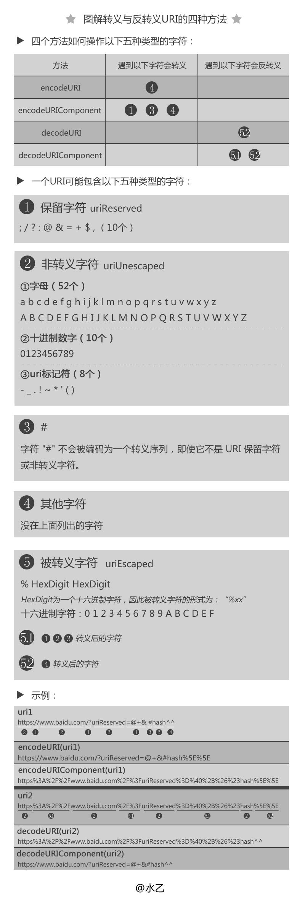

# 基本概念

## 赋值和初始化

赋值
> 根据不同情况改变变量的值。

初始化
> 为变量或常量在设置之时设定值。

LHS查询（操作）和 RHS查询（操作）
> “赋值操作的目标是谁（LHS）”以及“谁是赋值操作的源头（RHS）”——《你不知道Javascript上》

## `null`、`undefined`、not defined

"undefined"变量和"undeclared"变量分别指什么？

```js
// 申明变量 a 但是未初始化
let a; // -> undefined

// 申明变量 b 初始化为 null
let b = null; // -> null

// 未定义（undefined）
// 报语法错误
console.log(y) // -> Uncaught ReferenceError: y is not defined

typeof y // undefined
```

## 字面量 literal

字面量表示如何表达这个值，一般除去表达式，给变量赋值时，等号右边都可以认为是字面量。

**变量提升**

JavaScript 中，函数及变量的声明都将被提升到函数的最顶部。

> 要搞清楚提升的本质，需要理解 JS 变量的「创建create(declare)、初始化initialize 和赋值assign」

**暂时死区**

> ES6 明确规定，如果区块中存在let和const，这个区块就形成块级作用域。凡是在声明之前就使用这些变量，就会报错。<br>
总之，在代码块内，使用let或const命令声明变量之前，该变量都是不可用的。这在语法上，称为“暂时死区”（temporal dead zone，简称 TDZ）。

"暂时死区"的目的是减少运行时错误，防止声明之前就使用变量。

**var**

```js
console.log(a) // undefined
var a = 1;
```

上面的代码相当于

```js
var a; // 变量被提升。申明变量，但是未初始化
console.log(a) // undefined
a = 1;
```

**let**

- let 声明的变量的作用域是块级的；
    - 除了可以在函数级别声明变量之外，ES6还允许你使用let关键字在代码块（{..}）中声明变量。
- let 不能重复声明已存在的变量；
- let 有暂时死区，不会被提升。
    - let 确实存在提升。只不过由于暂时死区的限制，你不能在 `let x` 之前使用 `x`。

```js
// 暂时死区导致报错
var tmp = 123;

if (true) {
  tmp = 'abc'; // 报错，Uncaught ReferenceError: tmp is not defined
  let tmp;
}
```

参考资料：[我用了两个月的时间才理解 let](https://zhuanlan.zhihu.com/p/28140450)

**const**

- const 和 let 只有一个区别，那就是 const 只有「创建」和「初始化」，没有「赋值」过程。
- const 的类型为引用类型时，可以修改内部属性（程序赋值）。

**总结**

- var 的「创建」和「初始化」都被提升了。
- let 的「创建」过程被提升了，但是初始化没有提升。
- const 只有「创建」和「初始化」，没有「赋值」过程。
- function 的「创建」「初始化」和「赋值」都被提升了。


## 表达式 expressions


> 一个表达式会产生一个值，它可以放在任何需要一个值的地方。比如，作为一个函数调用的参数。

```js
// 下面的每行代码都是一个表达式
myvar
3 + x
myfunc("a", "b")
```

参考资料：
- [【译】JavaScript中:表达式和语句的区别](http://www.cnblogs.com/ziyunfei/archive/2012/09/16/2687589.html)
- [【原】JavaScript中:表达式和语句的区别](http://www.2ality.com/2012/09/expressions-vs-statements.html)

## 分号和逗号运算符

**题目1**

```js
// 谁会写这样的代码？？？？
var f = (function f(){ return '1'; }, function g(){ return 2; })();
typeof f;//"number"
```
逗号操作符 对它的每个操作对象求值（从左至右），然后返回最后一个操作对象的值

所以(function f(){ return '1'; }, function g(){ return 2; })的返回值就是函数g，然后执行它，那么结果是2；最后再typeof 2，根据问题一的表格，结果自然是number

## 标识符

> 所谓标识符，就是指变量、函数、属性的名字，或者函数的参数。

1. 第一个字符必须是一个字母、下划线（ \_ ）或一个美元符号（ $ ）。
2. 其他字符可以是字母、下划线、美元符号或数字。
3. 标识符采用驼峰大小写格式。


# 关键字和保留字

关键字是语言保留的，不能用作标识符。

**关键字**

| 1 | 2 | 3 | 4 | 5 | 6 | 7 |
| :--- | :--- | :--- | :--- | :--- | :--- | :--- |
| break | do | instanceof | typeof | case | else | new |
| var | catch | finally | return | void | continue | for |
| switch | while | debugger | function | this | with | default |
| if | throw | delete | in | try | | |

**保留字**

| 1 | 2 | 3 | 4 | 5 | 6 | 7 |
| :--- | :--- | :--- | :--- | :--- | :--- | :--- |
| abstract | enum | int | short | boolean | export | interface |
| static | byte | extends | long | super | char | final |
| native | synchronized | class | float | package | throws | const |
| goto | private | transient | debugger | implements | protected | volatile |
| double | import | public | | | | |


# 操作符


# 语句 statements

- 表达式在 JavaScript 中是短语，那么语句就是整句命令。
- ECMAScript 中的语句以一个分号结尾；如果省略分号，则由解析器确定语句的结尾,不推荐。
    - 语句可以理解成一个行为。for语句和if语句就是典型的语句。一个程序是由一系列语句组成的。
    - JavaScript中某些需要语句的地方，你可以使用一个表达式来代替，这样的语句称之为**表达式语句**。
    - 但反过来不可以。你不能在一个需要表达式的地方放一个语句。比如：一个if语句不能作为一个函数的参数。
- 加 `；`好处：
    - 便于删除空格来压缩代码。
    - 提高性能。因为不需要解析器判断结尾。

## 条件语句 `if-esle` `switch`

**if-esle语句**

好像没有太多说的，用的很多，也很简单，没有什么特例和要注意的地方。

**switch语句**

```js
switch (expression) {
  case value:
    statement
    break;
  case value: 
    statement
    break;
  default:
    statement
    // default 不需要break
}
```

- 如果省略 `break` 关键字，就会导致执行完当前 `break` 后，继续执行下一个 `case`。
- `default` 相当于一个 `else` 语句。
- 可以在 `switch` 语句中使用任何数据类型（在很多其他语言中只能使用数值），无论是字符串，还是对象都没有问题。
- 每个 `case` 的值不一定是常量，可以是变量，甚至是表达式。
- 由于对每个 `case` 的匹配操作实际上是 `===` 恒等运算符比较，表达式和 `case` 的匹配并不会做任何类型转换。
- switch 语句首先计算 switch 关键字后的表达式，然后按照从上到下的顺序计算每个 case 后的表达式，直到执行到 case 的表达式的值与 switch 的表达式的值相等时为止。

```js
switch ("hello world") {
  case "hello" + " world":
    console.log("Greeting was found.");
    break;
  case "goodbye":
    console.log("Closing was found.");
    break;
  default:
    console.log("Unexpected message was found.");
}

var num = 25;
switch (true) {
  case num < 0:
    console.log("Less than 0.");
    break;
  case num >= 0 && num <= 10:
    console.log("Between 0 and 10.");
    break;
  case num > 10 && num <= 20:
    console.log("Between 10 and 20.");
    break;
  default:
    console.log("More than 20.");
}
```

## 循环 `for` `while`

**while 语句**

- `while` 语句属于前测试循环语句。
- 循环体内的代码可能一次都不会执行。
- 跟 `for` 效果一样。

```js
var i = 0;
while (i < 10) {
  i += 2;
}
```

**do-while 语句**

- `do-while` 语句是一种后测试循环语句。
- 循环体内的代码至少执行一次。

```js
var i = 0;
do {
   i += 2;
} while (i < 10);
```

**for 语句**

- for 语句也是一种前测试循环语句

```js
// 无限循环
for (;;) {
    doSomething();
}
```

```js
// statement1 在循环（代码块）开始前执行
// statement2 定义运行循环（代码块）的条件
// statement3 在循环（代码块）已被执行之后执行
for (statement1; statement2; statement3) {
  //被执行的代码块
}
```

**for-in 语句**

- `for-in` 可以用来枚举对象的属性。
- 以任意顺序遍历一个对象的**可枚举属性**（继承的属性也会被遍历，可以通过 `hasOwnProperty` 来筛选）。
- 如果表示要迭代的对象的变量值为 `null` 或 `undefined`，`for-in` 语句会抛出错误。
- 遍历数组时，枚举的是数组的下标。

**for-of 语句**

- 扩展运算符（`...`）内部使用 `for-of` 循环，所以也可以用于 Set 结构。
- 遍历可迭代对象定义要迭代的数据。
- 为什么要用 `for-of`?
    - `forEach` 不能 `break` 和 `return` 。
    - `for-in` 缺点更加明显，它不仅遍历数组中的元素，还会遍历自定义的属性，甚至原型链上的属性都被访问到。而且，遍历数组元素的顺序可能是随机的。
- `for-of` 能做什么？
    - 跟 `forEach` 相比，可以正确响应 `break` , `continue` , `return` 。
    - `for-of` 循环不仅支持数组，还支持大多数类数组对象，例如 DOM nodelist 对象。
    - `for-of` 循环也支持字符串遍历，它将字符串视为一系列 Unicode 字符来进行遍历。
    - `for-of` 也支持 `Map` 和 `Set` （两者均为 ES6 中新增的类型）对象遍历。
- `for-of` 特征总结：
    - 这是最简洁、最直接的遍历数组元素的语法。
    - 这个方法避开了 `for-in` 循环的所有缺陷。
    - 与 `forEach` 不同的是，它可以正确响应 `break` 、`continue` 和 `return` 语句。
    - 其不仅可以遍历数组，还可以遍历类数组对象和其他可迭代对象。
- 但需要注意的是，`for-of` 循环不支持普通对象，但如果你想迭代一个对象的属性，你可以用 `for-in` 循环（这也是它的本职工作）。
- 参考资料：[【掘金】js的四种for循环](https://juejin.im/entry/5a1654e951882554b8373622)

## 跳转 `label` `break` `continue` `return` `throw` `try`

**label 语句**


**break 和 continue 语句**

- `break` 语句会立即退出循环，强制继续执行循环后面的语句。
- `continue` 语句虽然也是立即退出循环，但退出循环后会从循环的顶部继续执行。

**return 语句**

- `return` 语句只能在函数体内出现，如果不是的话会报语法错误。
- 由于 JavaScript 可以自动插入分号，因此在 `return` 关键字和它后面的表达式之间不能有换行。

**throw 语句**

- `throw` 语句的作用是把程序运行时产生的错误显式地抛出异常。
- 可以抛出任意类型的的值。
- 当抛出异常时，JavaScript 解释器会立即停止当前正在执行的逻辑。

**try 语句**

参考资料：[异常处理，"try..catch"](https://github.com/BooheeFE/weekly/issues/7)

- `try-catch-finally` 语句是 JavaScript 中异常处理机制。
- `try` 必须放在异步代码块中，不然捕捉不到异步函数的代码错误。

合理使用 `try-catch`：

- 使用 `try-catch` 最适合处理那些我们无法控制的错误。
- 在明明白白地知道自己的代码会发生错误时，再使用 `try-catch` 语句就不太合适了。

> 说到抛出错误与捕获错误，我们认为只应该捕获那些你确切地知道该如何处理的错误。捕获错误的
目的在于避免浏览器以默认方式处理它们；而抛出错误的目的在于提供错误发生具体原因的消息。  
—— 高程3

致命错误和非致命错误：
<details>
<summary>非致命错误：不用打断用户。</summary>

- 不影响用户的主要任务；
- 只影响页面的一部分；
- 可以恢复；
- 重复相同操作可以消除错误。
</details>

<details>
<summary>致命错误：应该避免出现致命错误。使用 `try-catch` 来消除致命错误。</summary>

- 应用程序根本无法继续运行；
- 错误明显影响到了用户的主要操作；
- 会导致其他连带错误。
</details>

```js
try {
    // 通常来讲，这里的代码会从头执行到尾而不会产生任何问题，
    // 但有时会抛出一个异常，要么是由 throw 语句直接抛出异常，
    // 要么是通过调用一个方法间接抛出异常
}
catch(e) {
    // 当且仅当 try 语句块抛出了异常，才会执行这里的代码
    // 这里可以通过局部变量 e 来获得对 Error 对象或者抛出的其他值的引用
    // 这里的代码块可以基于某种原因处理这个异常，也可以忽略这个异常，
    // 还可以通过 throw 语句重新抛出异常
}
finally {
    // 不管 try 语句块是否抛出了异常，这里的逻辑总是会执行，终止 try 语句块的方式有：
    // 1）正常终止，执行完语句块的最后一条语句
    // 2）通过 break、continue 或 return 语句终止
    // 3）抛出一个异常，异常被 catch 从句捕获
    // 4）抛出一个异常，异常未被捕获，继续向上传播
}
```

## 其他 `with` `debugger` `use strict`

**with 语句**

- 由于大量使用 with 语句会导致性能下降，同时也会给调试代码造成困难，因此在开发大型应用程序时，不建议使用 with 语句。
- 严格模式下不允许使用 with 语句，否则将视为语法错误。
- 所以不要用了。

**debugger 语句**

**use strict 语句**

```js
"use strict";
```

严格模式下，JavaScript 的执行结果会有很大不同，因此本书将会随时指出严格模式下的区别。支
持严格模式的浏览器包括 IE10+、Firefox 4+、Safari 5.1+、Opera 12+和 Chrome。

**什么是”use strict”?使用它的好处和坏处分别是什么？**

**参考资料：**
- [《JavaScript 闯关记》之语句](https://juejin.im/post/58162a3e128fe100558fe2fc)
- [JS数组循环的性能和效率分析（for、while、forEach、map、for of）](https://juejin.im/post/5b645f536fb9a04fc9376882)
- 【神】[如何在 JS 代码中消灭 for 循环](https://juejin.im/post/5b5a9451f265da0f6a036346)

# `&&` 和 `||`

在javascript中：

> - 以下内容会被当成false处理："" , false , 0 , null , undefined , NaN。
> - 其他都是true。

所以：

> a || b：
> - 如果a是true，那么b不管是true还是false，都返回true。因此不用判断b了，这个时候刚好判断到a，因此返回a。
> - 如果a是false，那么就要判断b，如果b是true，那么返回true，如果b是false，返回false，其实不就是返回b了吗。

> a && b：
> - 如果a是false，那么b不管是true还是false，都返回false，因此不用判断b了，这个时候刚好判断到a，因此返回a。
> - 如果a是true，那么就要在判断b，和刚刚一样，不管b是true是false，都返回b。

注意一点：在 js 中 `&&` 运算符优先级大于 `||`

**参考资料**

- [【博客园】彻底理解js中的&&和||](https://www.cnblogs.com/sgzs/p/7977208.html)


# 连等赋值 `a=b=c`

```js
a = b = c
A1 = A2 = A3 = A4

// 可以写成
a = (b = c)
A1 = (A2 = (A3 = A4))

// 相当于
b = c
a = b

A3 = A4
A2 = A3
A1 = A2
```

```js
var A = B = C = 3; // A is local variable while B & C are global variables;
var A = 3 , B = 3, C = 3; // A B C are local variables;
```

```js
// 没搞明白
var a = {n: 1};
var b = a;
a.x = a = {n: 2};
alert(a.x); // --> undefined
alert(b.x); // --> {n: 2}
```

参考资料：

- [【stackOverflow】Javascript a=b=c statements](https://stackoverflow.com/questions/7511279/javascript-a-b-c-statements)
- [由ES规范学JavaScript(二)：深入理解“连等赋值”问题](https://segmentfault.com/a/1190000004224719)
- [千万不要在JS中使用连等赋值操作](https://www.cnblogs.com/xxcanghai/p/4998076.html)

# 扩展运算符

- 作用：将数组（类数组）转化成逗号隔开的参数序列。
    - 扩展运算符后面是一个空数组，则不产生任何效果。`[...[], 1] // [1]`
-  ES6的扩展运算符则可以看作是rest参数的逆运算。可以将数组转化为参数列表。
- 使用场景：
    - 替代函数的 apply 方法
    - 复制数组
    - 合并数组

# 变量的解构赋值

**数组的解构赋值**

- 解构赋值允许指定默认值。

```js
let [foo = true] = [];
foo // true
```

- 默认值可以引用解构赋值的其他变量，但该变量必须已经声明。

```js
let [x = 1, y = x] = [];     // x=1; y=1
let [x = 1, y = x] = [2];    // x=2; y=2
let [x = 1, y = x] = [1, 2]; // x=1; y=2
let [x = y, y = 1] = [];     // ReferenceError: y is not defined
```

- 只有当一个数组成员严格等于undefined，默认值才会生效。


**对象的解构赋值**

- 默认值生效的条件是，对象的属性值严格等于undefined。
- 对象的解构赋值，可以很方便地将现有对象的方法，赋值到某个变量。
```js
let { max, sin, cos } = Math;

max(1, 2) // 2
```

**字符串的解构赋值**

- 字符串被转换成了一个类似数组的对象。

**使用场景**

1、有时候你不希望保留某些对象属性，也许是因为它们包含敏感信息或仅仅是太大了（just too big）。你可能会枚举整个对象然后删除它们，但实际上只需要简单的将这些无用属性赋值给变量，然后把想要保留的有用部分作为剩余参数就可以了。

```js
// 下面的代码里，我们希望删除_internal和tooBig参数。
// 我们可以把它们赋值给internal和tooBig变量，然后在cleanObject中存储剩下的属性以备后用。

let {_internal, tooBig, ...cleanObject} = {
    el1: '1', _internal:"secret", tooBig:{}, el2: '2', el3: '3'
};

console.log(cleanObject); // {el1: '1', el2: '2', el3: '3'}
```

2、在函数参数中解构嵌套对象

```js
// 在下面的代码中，engine是对象car中嵌套的一个对象。
// 如果我们对engine的vin属性感兴趣，使用解构赋值可以很轻松地得到它。

var car = {
  model: 'bmw 2018',
  engine: {
    v6: true,
    turbo: true,
    vin: 12345
  }
}

const modelAndVIN = ({model, engine: {vin}}) => {
  console.log(`model: ${model} vin: ${vin}`);
}

modelAndVIN(car); // => model: bmw 2018  vin: 12345
```

# rest参数

- ES6引入了rest参数（形式为“…变量名”）。其中rest参数搭配的变量是一个数组可以使用数组的一切操作。
- rest表示剩下的，它把剩下的任意数量的参数推入数组。
- rest参数之后不能再有其他参数（只能是最后一个参数）否则会报错。 


**参考资料：**

- [ES6 rest参数和扩展运算符](https://blog.csdn.net/zzxboy1/article/details/53691850)


# 命名空间

- 使用命名空间不能杜绝全局变量，但是能够减少全局变量的数量。
- 最简单的方式是使用对象字面量的方式。

```js
var namespace1 = {
    a: function(){
        alert (1);
    },
    b: function(){
        alert (2);
    }
};
```

# 函数注释规范

```js
/**
 * @author 张三 2015/07/21
 * @param name {String} 传入名称
 * @return {Boolean} true:可执行;false:不可执行
 * @example setTitle('测试')
 * @version 1.0.3
 */
```

关键词 | 语法 | 含义
:---|:---|:---
@auhor | @author 作者信息 [附属信息：如邮箱、日期] | 作者 | 
@param | @param 参数名 {参数类型} 描述信息 | 参数 | 
@return | @return {返回类型} 描述信息 | 返回值 | 
@example | @example 示例代码 | 示例 | 
@version | @version XX.XX.XX | 版本号 | 
@link | | 链接
@namespace | | 命名空间
@requires | | 依赖模块

**参考资料**

- [【掘金】JavaScript 开发规范（一）： 命名与注释规范详解](https://juejin.im/entry/599d433cf265da24797b5c66)
- [JSDoc](http://www.css88.com/doc/jsdoc/)
- [Airbnb JavaScript Style Guide()](https://github.com/sivan/javascript-style-guide/blob/master/es5/README.md#comments)

# 命名规范

参考大型开源项目的命名，最重要的是抽象以及常用名称。

[如何摆脱项目命名困难的尴尬局面](https://mp.weixin.qq.com/s?__biz=MzAwNjI5MTYyMw==&mid=2651494198&idx=1&sn=86ae0562b15c5e8d768633f6a17f1ba5&chksm=80f19efeb78617e80cb7c89f7034b24137fbc67bc318f126407bb56a173268b1367ea259c589&scene=0&key=2ab8a62e312555a1a1a682d831559a8acc60f9634718f4aee144e0043fdc30cadfc71048230357cc30a0d91c99abb6387b91a4e02fe1408eed7a0068a53568095418be9501daac6b5d16781308449bf0&ascene=14&uin=MjcwNDcxNzQyMQ%3D%3D&devicetype=Windows+10&version=62060833&lang=zh_CN&pass_ticket=ZoqXnMgi0AAEna540iG5qPugeLgO5W7T7qkyPIntCT9Pu1xlW6JZWbtLnqd%2FcXea)

# 强制类型转换（coercion）

- 两种不同的内置类型间的转换被称为强制转型。
- 强制类型转换分两种：
    - 显式
    - 隐式

显式强制转型例子：

```js
var a = "42";
var b = Number( a );
a;                // "42"
b;                // 42 -- 是个数字!
```

隐式强制转型例子：

```js
var a = "42";
var b = a * 1;    // "42" 隐式转型成 42 
a;                // "42"
b;                // 42 -- 是个数字!
```

最好使用显示转换来增加编码意图。

## 字符串加减数字

字符串与数字有：`被加`、`被减`、`减`、`加`。

在 javascript 里怎么样才能把 int 型转换成 string 型 

```js
var x = 100   
a = x.toString() 
```

```js
var x=100;   
a = x + "";     //JS会自动隐性转换  
// javascript   将string 变成 int
var s = "32" 
var i = new Number(s)
parseInt()
// 例如： 
parseInt("abc") // Returns NaN. 
parseInt("12abc") // Returns 12. 
parseInt("12") //Return 12.  
```

**加与被加**

```js
1+"1" // -> 输出11；
1+"a" // -> 1a;
//翻过来也是同样的
```

**减与被减**

```js
1-"1" // -> 0
1-"a" // -> NaN
//其实js转换为1-number（“a”）;"a"不是number，所以变成NaN；
```

```js
1+"1"+1 // -> "111"
1+"1"-1 // -> "111"10
1-"1"-1 // -> "111"-1
// 以下说明前面的NaN了后面的不做运算；
"a"+1-"1" // -> "111"NaN
"a"-1-"1" // -> "111"NaN
"a"-1-1 // -> "111"NaN
"a"-1+1 // -> "111"NaN
1-"a"+1 // -> "111"NaN
```

**参考资料**

- [JavaScript 字符串加减数字](https://blog.csdn.net/m0_37122369/article/details/78066231)

# 回调函数（callback）

参考资料：[关于js中的回调函数callback，通俗易懂](https://www.cnblogs.com/moxiaowohuwei/p/8438236.html)

> A callback is a function that is passed as an argument to another function and is executed after its parent function has completed. 

- 异步请求回调。
- 点击事件回调。
- 数组中遍历每一项调用的回调函数。
- 同步回调。

> 回调与同步、异步并没有直接的联系，回调只是一种实现方式，既可以有同步回调，也可以有异步回调，还可以有事件处理回调和延迟函数回调，这些在我们工作中有很多的使用场景。

回调函数是可以作为参数传递给另一个函数的函数，并在某些操作完成后执行。

```js
function modifyArray(arr, callback) {
  // 对arr做一些操作
  arr.push(100);
  // 执行传进来的callback函数
  callback();
}

var arr = [1, 2, 3, 4, 5];

modifyArray(arr, function() {
  console.log("array has been modified", arr);
});
```

# 严格模式（`“use strict”`）

> ES6 的模块自动采用严格模式，不管你有没有在模块头部加上`use strict`;。

- use strict出现在JavaScript代码的顶部或函数的顶部。
- 可以帮助你写出更安全的JavaScript代码。如果你错误地创建了全局变量，它会通过抛出错误的方式来警告你。

**严格模式主要有以下限制**

- 变量必须声明后再使用
- 函数的参数不能有同名属性，否则报错
- 不能使用with语句
- 不能对只读属性赋值，否则报错
- 不能使用前缀0表示八进制数，否则报错
- 不能删除不可删除的属性，否则报错
- 不能删除变量delete prop，会报错，只能删除属性delete global[prop]
- eval不会在它的外层作用域引入变量
- eval和arguments不能被重新赋值
- arguments不会自动反映函数参数的变化
- 不能使用arguments.callee
- 不能使用arguments.caller
- 禁止this指向全局对象
- 不能使用fn.caller和fn.arguments获取函数调用的堆栈
- 增加了保留字（比如protected、static和interface）
- 其中，尤其需要注意this的限制。ES6 模块之中，顶层的this指向undefined，即不应该在顶层代码使用this。

# ES5和ES6之间的区别

**参考资料：** 

- [JavaScript 和 ECMAScript 的区别](https://mp.weixin.qq.com/s?__biz=MzAxODE2MjM1MA==&mid=2651553061&idx=1&sn=e778494fe04dcd0442f4c24d1f92954f&chksm=8025aae4b75223f297c5e1f08b4a9ca63704ac8d428c469e9efac2294b3e60b2132731652116&scene=0&key=2ab8a62e312555a195e264161db832fa88e29b36fe0c77d112e2edc4d66f80e1d39b58fa38f0ab4de016480a95d9caf3c612a508ea9d99056b0c63e5aea47bcb92e30d400936cc66f4e2020d87b1d389&ascene=14&uin=MjcwNDcxNzQyMQ%3D%3D&devicetype=Windows+10&version=62060833&lang=zh_CN&pass_ticket=jSgwx%2FwYQSkSNVNN4MvVhHrS3Kv3ix6%2B4FnRjez40%2FCV6mwj3xwywgej8g6ik5bT)

**es5 es6**

- ECMAScript 5（ES5）：ECMAScript的第5版，于2009年标准化。这个标准已在所有现代浏览器中完全实现。
- ECMAScript 6（ES6）或ECMAScript 2015（ES2015）：第6版ECMAScript，于2015年标准化。这个标准已在大多数现代浏览器中部分实现。

**以下是ES5和ES6之间的一些主要区别：**

**1、箭头函数和字符串插值：**

```js
const greetings = (name) => {
    return `hello ${name}`;
}

const greetings = name => `hello ${name}`;
```

> 箭头函数是没有 "arguments"<br>
如果我们在箭头函数中访问 arguments，访问到的 arguments 并不属于箭头函数，而是属于箭头函数外部的“普通”函数。

**2、常量**

- 常量在很多方面与其他语言中的常量一样，但有一些需要注意的地方。
- 常量表示对值的“固定引用”。因此，在使用常量时，你实际上可以改变变量所引用的对象的属性，但无法改变引用本身。

```js
const NAMES = [];
NAMES.push("Jim");
console.log(NAMES.length === 1); // true
NAMES = ["Steve", "John"]; // error
```

**3、块作用域变量。**

新的ES6关键字let允许开发人员声明块级别作用域的变量。let不像var那样可以进行提升。

**4、默认参数值**

默认参数允许我们使用默认值初始化函数。如果省略或未定义参数，则使用默认值，也就是说null是有效值。

```js
// 基本语法
function multiply (a, b = 2) {
   return a * b;
}
multiply(5); // 10
```
**5、类定义和继承**

ES6引入了对类（关键字 `class` ）、构造函数（关键字 `constructor` ）和用于继承的 `extend` 关键字的支持。

**6、`for-of` 操作符**

`for-of`语句将创建一个遍历可迭代对象的循环。

**7、用于对象合并的 `Spread` 操作**

```js
const obj1 = { a: 1, b: 2 }
const obj2 = { a: 2, c: 3, d: 4}
const obj3 = {...obj1, ...obj2}
```

**7、promise**

promise提供了一种机制来处理异步操作结果。你可以使用回调来达到同样的目的，但是promise通过方法链接和简洁的错误处理带来了更高的可读性。

```js
const isGreater = (a, b) => {
return new Promise ((resolve, reject) => {
  if(a > b) {
    resolve(true)
  } else {
    reject(false)
  }
  })
}
isGreater(1, 2)
.then(result => {
  console.log('greater')
})
.catch(result => {
  console.log('smaller')
})
```

**8、模块导出和导入**

```js
const myModule = { x: 1, y: () => { console.log('This is ES5') }}
export default myModule;

import myModule from './myModule';
```

# `|`、`&`、`>>`、`>>>`、`<<`、`<<<` 位操作符

**`|` 位操作符**

1. Math.ceil()用作向上取整。
2. Math.floor()用作向下取整。
3. Math.round() 我们数学中常用到的四舍五入取整。

```js
console.log(0.6|0) // -> 0
console.log(1.1|0) // -> 1
console.log(3.65555|0) // -> 3
console.log(5.99999|0) // -> 5
console.log(-7.777|0) // -> -7
```

看了上面的例子，大体知道单竖杠可以进行取整运算，就是只保留正数部分，小数部分通过拿掉，但是“|0”，又是如何进行运算的呢，为什么能“|0”能达到取整的目的呢？单竖杠不是0有会是多少呢？

- 其实单竖杠“|”就是转换为2进制之后相加得到的结果。

```js
3|4
// 转换为二进制之后011|100  相加得到111=7
```


**参考资料**

- [二进制如何转十进制，十进制如何转二进制](https://jingyan.baidu.com/article/597a0643614568312b5243c0.html)
- [详解js运算符单竖杠“|”与“||”的用法和作用介绍](https://www.jb51.net/article/96521.htm)

# 二进制、八进制、十六进制

# ASCII

参考资料：[AscII码 和 unicode码是什么关系？ - 张雨萌的回答 - 知乎](
https://www.zhihu.com/question/57461614/answer/274634720)

ASCII 是一个标准，把每个字符（26英文字母、空格、回车符、换行符、特殊字符）与一个0-255的数字对应起起来，这样就可以把字符变为数字，而后变为二进制码了。

> 数字到字符的映射。

> 计算机内部在运算的都是数字。但是人不能只看数字，人得看文字，人得看屏幕上输出的文字。所以就得建立一种从数字到文字的映射，在输出的时候根据映射把数字转为文字，这样我们才能看人话。

通常编程需要了解一些常用的ASCII码：

- 空字符：0
- 换行：10
- 回车：13
- 取消：27

# Unicode

> 计算机是无法识别字母和符号的，他只能用数字来做处理，那么此时ASCII码孕育而生，所谓ASCII码，就是将英文字母和常用符号用特定的数字去表达。

# 变量减 0 后在比较是否等于 0

```js
var a ="123.1";

var z = a - 0;
console.log(typeof(z)); // -> number
console.log(z); // -> 123.1


var z1 = Number(a);
console.log(typeof(z1)); // -> number
console.log(z1); // -> 123.1


var z2 = parseInt(a);
console.log(typeof(z2)); // -> number
console.log(z2); // -> 123.1
```

**参考资料**

- [js中变量减0后在比较是否等于0](https://segmentfault.com/q/1010000008565945)
- [javascript 字符串 减0（ -0），实现类型转换](https://blog.csdn.net/isaisai/article/details/39696407)

# rc

后缀 rc 来自 linux 中，使用过 linux 就知道 linux 中很多 rc 结尾的文件，比如 `.bashrc`，rc 是 run command 的缩写，翻译成中文就是运行时的命令，表示程序执行时就会来调用这个文件。

# 什么时候能用 `==`

答案是:永远不要用

> 比起简洁，我们更喜欢意图清晰的代码。
>
> 记住：你的代码只写一次，但可能要读很多次 —— 请尽可能的让你的代码易读。

参考资料：

- [[译]JavaScript:什么时候能用==](https://www.cnblogs.com/ziyunfei/archive/2012/09/22/2696109.html)
- [When is it OK to use == in JavaScript?](http://2ality.com/2011/12/strict-equality-exemptions.html)


# DRY（Don't repeat yourself）

> DRY（Don't repeat yourself）
,字面意思来看："不要重复自己"。强调的意思就是在进行编程时相同的代码不要重复写，最好只写一次，然后可以在其他地方直接引用。如此一来，可以提高代码重用率，缩减代码量，同时也有助于提高代码的可读性和可维护性。当需要做出更改时，只需要更改一个地方即可。


# js 前加分号和感叹号是什么意思？

```
;!function(){}();  // ;!有什么用？
```

从语法上来开，Javascript中分号表示语句结束，在开头加上，可能是为了压缩的时候和别的方法分割一下，表示一个新的语句开始。所以，如果在一个单独的JS文件中，开头的分号是没有任何意义的，可以删掉。

叹号是逻辑运算符，是“非”的意思，常见这种写法 if(!true){}；而将运算符加载函数定义的前面，则是将函数看做一个整体，然后再调用这个函数，并对返回的结构进行逻辑运算。

说白了，此处就是构建了一个立即执行函数，建议楼主知道意思就可以，自己写的时候，可以使用更清晰的格式：

```
(function(){})();
```

这里补充一点：在函数声明 `function (){}` 后面加 `() `，意思是执行这个函数声明。有的叫法是“匿名自动执行函数”，更准确的表示应该为“立即执行函数”。

但立即执行函数，要作为表达式的一部分才行，不然js解释器会报语法错误。一般，成为表达式的最容易理解方式是：在左右两端加一个圆括号，像这样 `(function (){})`。所以，立即执行函数最常见的写法是 `(function (){})() `，这是一个语句，在前面和后面都可以加`; `。

其实立即执行函数还有N种写法，在函数声明前加一元运算符也行：
```js
!function (){}()

~function (){}() 
```

甚至，对一元运算符进行组合也可以：
```js
!!!!function (){}()

~~~function (){}()

!~!function (){}()
```

# 语法糖

语法糖（Syntactic sugar），也译为糖衣语法，是由英国计算机科学家彼得·约翰·兰达（Peter J. Landin）发明的一个术语，指计算机语言中添加的某种语法，这种语法对语言的功能并没有影响，但是更方便程序员使用。通常来说使用语法糖能够增加程序的可读性，从而减少程序代码出错的机会。

- 有益于**更好的编码风格**，**更易读**。编译器会帮我们做转换。
- 可以提高开发效率，在性能上也不会带来损失。

# N/A

n/a（或 N/A），是 not applicable的缩写，意思是“不适用”。

# 路径

- `./` 当前目录。
- `../` 上一层目录。
- `/` 根目录。

**路径分隔符**  (斜杠 `/` 与反斜杠 `\` 的问题)
[参考资料](https://blog.csdn.net/qq_24505269/article/details/85844082)

- 只有windows系统中用 `\` ，其他的项目中，linux中都使用 `/`。
- 在 windows 系统大部分情况下斜杠 `/` 和反斜杠 `\` 可以互用，特殊时候只能用反斜杠 `\`。
- 浏览器地址栏网址使用斜杆 `/`。
- windows文件导航栏上使用反斜杠 `\`。刚试了一下，使用斜杠会自动转化成反斜杠。
- CSS 中 `background` 的 `url()` 必须是用斜杠。
- 出现在普通字符串中的路径，如果代表的是windows文件路径，则使用 斜杆/ 和 反斜杠\ 是一样的；如果代表的是网络文件路径，则必须使用 斜杆/ 。

```html
<!-- 本地文件路径下/ 和 \ 是等效的 -->
 

<!-- 网络文件路径，一定要使用 斜杆/ -->
 
```

# url、href、src

- url。统一资源定位符（或称统一资源定位器/定位地址、URL地址等，英语：Uniform Resource Locator，常缩写为URL），有时也被俗称为网页地址（网址）。如同在网络上的门牌，是因特网上标准的资源的地址（Address）。
- href (Hypertext Reference)指定网络资源的位置，从而在当前元素或者当前文档和由当前属性定义的需要的锚点或资源之间定义一个链接或者关系。
- src。source（缩写），指向外部资源的位置，指向的内容将会应用到文档中当前标签所在位置。

区别：
- href 用于在当前文档和引用资源之间确立联系，src 用于替换当前内容，会下载资源。
- href css文件不会阻塞浏览器，所以可以放在 head 标签中，src 会阻塞浏览器，所以要放在页面最下面。

参考资料：[前端面试题-url、href、src](https://segmentfault.com/a/1190000013845173)

# `escape`、`encodeURI` 和 `encodeURIComponent`

这三个方法都是编码。解码是 `unescape`、`decodeURI`、`decodeURIComponent`。

- `escape` 已经从 Web 标准中删除，所以不推荐使用。使用 `encodeURI` 或 `encodeURIComponent` 代替.
- `encodeURI` 不会转义 `;` `,` `/` `?` `:` `@` `&` `=` `+` $
- `encodeURIComponent` 转义除了字母、数字、`(` `)` `.` `!` `~` `*` `'` `-` 和 `_` 之外的所有字符。
    - `encodeURIComponent` 转义的字符比 `encodeURI` 多。 



**参考资料**

[一张图看懂encodeURI、encodeURIComponent、decodeURI、decodeURIComponent的区别](https://www.cnblogs.com/shuiyi/p/5277233.html)

# alpha、beta、rc 等版本号的意思

很多软件在正式发布前都会发布一些预览版或者测试版，一般都叫“beta版”或者 “rc版”，特别是开源软件，甚至有“alpha版”，下面来解释一下各个版本的意思。

**alpha版：**

内部测试版。α是希腊字母的第一个，表示最早的版本，一般用户不要下载这个版本，这个版本包含很多BUG，功能也不全，主要是给开发人员和 测试人员测试和找BUG用的。

**beta版：**

公开测试版。β是希腊字母的第二个，顾名思义，这个版本比alpha版发布得晚一些，主要是给“部落”用户和忠实用户测试用的，该版本任然存 在很多BUG，但是相对alpha版要稳定一些。这个阶段版本的软件还会不断增加新功能。如果你是发烧友，可以下载这个版本。

**rc版：**

全写：Release Candidate（候选版本），该版本又较beta版更进一步了，该版本功能不再增加，和最终发布版功能一样。这个版本有点像最终发行版之前的一个类似 预览版，这个的发布就标明离最终发行版不远了。作为普通用户，如果你很急着用这个软件的话，也可以下载这个版本。

**stable版：**

稳定版。在开源软件中，都有stable版，这个就是开源软件的最终发行版，用户可以放心大胆的用了。

另外，对于商业软件，还有一下版本：

- **RTM版**：全称为Release to  Manufacture。工厂版。改版程序已经固定，就差工厂包装、光盘印图案等工作了。
- **OEM版**：厂商定制版。
- **EVAL版**：评估版。就是有30或者60天等使用期限的版本。
- **RTL版**：Retail.(零售版)，这个版本就是真正发售的版本，有漂亮的包装、光盘、说明书等东西和高昂的价格。

# Mustache语法

- 数据绑定最常见的形式就是使用 “Mustache” 语法（双大括号）的文本插值
- 模板表达式都被放在沙盒中

# HSLA RGBA

**HSLA** 

> HSL色彩模式是工业界的一种颜色标准，是通过对色相(H)、饱和度(S)、明度(L)三个颜色通道的变化以及它们相互之间的叠加来得到各式各样的颜色的，HSL即是代表色相，饱和度，明度三个通道的颜色，这个标准几乎包括了人类视力所能感知的所有颜色，是迄今运用最广的颜色系统之一。

- H：Hue(色调)。0(或360)表示红色，120表示绿色，240表示蓝色，也可取其他数值来指定颜色。取值为：0 - 360
- S：Saturation(饱和度)。取值为：0.0% - 100.0%
- L：Lightness(亮度)。取值为：0.0% - 100.0%
- A：Alpha透明度。取值0~1之间。

**RGBA**

- R：红色值。正整数 | 百分数
- G：绿色值。正整数 | 百分数
- B：蓝色值。正整数 | 百分数
- A：Alpha透明度,取值0~1之间。

# 钩子函数

# `gt` `gte` `lt` `lte`
 
- gt: greater than 大于
- gte: greater than or equal 大于等于
- lt: less than 小于
- lte: less than or equal 小于等于

# MIME

可以参考[既然有文件后缀名,为何还需要MIME类型?](https://www.zhihu.com/question/60495696/answer/204530120)回答，通俗易懂，并且消除了误解。

**文件扩展名是什么？**

是操作系统用来标注文件格式的一种机制，用一个点号（.）和主文件名分隔开。由于历史原因，多数扩展名是三个字母。注意，这里说的是标注，而非定义，既然是标注，说明不是强制的。比如你用photoshop可以打开一个psd图像文件。把这个文件扩展名改为txt，再拖到photoshop窗口里，还是一样能打开，说明内容完全没有变化，变化的只是双击时的默认打开方式。

**而MIME又是什么？**

它全名叫多用途互联网邮件扩展（Multipurpose Internet Mail Extensions），最初是为了将纯文本格式的电子邮件扩展到可以支持多种信息格式而定制的。后来被应用到多种协议里，包括我们常用的HTTP协议。

MIME的常见形式是一个主类型加一个子类型，用斜线分隔。比如text/html、application/javascript、image/png等。在访问网页时，MIME type帮助浏览器识别一个HTTP请求返回的是什么内容的数据，应该如何打开、如何显示。

两者有共同的用途：用来标注信息的格式。

但应用场景完全不同：一个是操作系统中标注文件的，一个是邮件和HTTP协议中用来标注网络数据的。

# 高阶函数

至少满足以下条件的中的一个，就是高阶函数：
1. 将其他函数作为参数传递
2. 将函数作为返回值

简单来说，就是一个函数可以操作其他函数，将其他函数作为参数或将函数作为返回值。我相信，写过JS代码的同学对这个概念都是很容易理解的，因为在JS中函数就是一个普通的值，可以被传递，可以被返回。

参数可以被传递，可以被返回，对Java等语言开发的同学理解起来可能会稍微麻烦一些，因为Java语言没有那么的灵活，不过Java8的lambda大概就是这意思；

# 高阶组件(HOC)

- 高阶组件就是高阶函数，也就是说一个函数就是一个组件。

> 高阶组件(HOC)是 React 生态系统的常用词汇，React 中代码复用的主要方式就是使用高阶组件，并且这也是官方推荐的做法。而 Vue 中复用代码的主要方式是使用 mixins，并且在 Vue 中很少提到高阶组件的概念，这是因为在 Vue 中实现高阶组件并不像 React 中那样简单，原因在于 React 和 Vue 的设计思想不同，但并不是说在 Vue 中就不能使用高阶组件，只不过在 Vue 中使用高阶组件所带来的收益相对于 mixins 并没有质的变化。本篇文章主要从技术性的角度阐述 Vue 高阶组件的实现，且会从 React 与 Vue 两者的角度进行分析。

参考资料：
- [探索Vue高阶组件](http://hcysun.me/vue-design/more/vue-hoc.html#%E6%8E%A2%E7%B4%A2vue%E9%AB%98%E9%98%B6%E7%BB%84%E4%BB%B6)
- [奇技淫巧 - Vue Mixins 高级组件 与 Vue HOC 高阶组件 实践](https://juejin.im/post/5c08c6ac6fb9a04a0e2cfe0a)
- [组件演进史：从Mixin到HOC，再到Hook](https://mp.weixin.qq.com/s?__biz=MzAxODE2MjM1MA==&mid=2651558113&idx=1&sn=df2defa60c991449f49d9d46ccbc4b35&chksm=80254720b752ce36b972cb88384aa66cc2422fae7039dd0f308072763ca973fe8cc5c0f0e02a&scene=126&sessionid=1585791205&key=f4142cd677ed19471f93a9492f6209600e0f75dc7cfd1fc59b971529e61062bf82dce511d60db77d8864624207e78026d7276f72f3f79ff875f7c3481936b7f29905aac36f6d0553ac2a5c5b9393908e&ascene=1&uin=MjcwNDcxNzQyMQ%3D%3D&devicetype=Windows+10&version=62080079&lang=zh_CN&exportkey=AV%2FNrFbBwPhLL8hjdCSSXSY%3D&pass_ticket=Xva2sAgrlui4J%2BOuf924%2FzuVst0io8Zc57lY91fERmL4UFYdappr7vplV246pnV3)

# 纯函数

纯函数是满足如下条件的函数：

- 相同输入总是会返回相同的输出。
- 不产生副作用。
- 不依赖于外部状态。

> 如果调用一个函数，但是不使用其返回值，这个函数还有意义，那么它毫无疑问是一个非纯函数。对于纯函数，那就是一个空操作。

- 纯函数构成了函数式编程的基础。
- 纯函数也是超级独立的——它容易在代码中移动、重构、重新组织，让程序更灵活，更适应将来的变化。

参考资料：
- [征服 JavaScript 面试：什么是纯函数？](https://zcfy.cc/article/master-the-javascript-interview-what-is-a-pure-function-2186.html)
- [JavaScript函数式编程之深入理解纯函数](https://juejin.im/post/5b1a251e6fb9a01e83146ddf)
- [JavaScript函数式编程之为什么要函数式编程（非严谨技术层面的扯淡）](https://github.com/zhuanyongxigua/blog/issues/20)
- [JavaScript函数式编程之副作用](https://github.com/zhuanyongxigua/blog/issues/17)

# 柯里化 curry

- [Ramda.js](http://ramdajs.com/)
- [【 js 基础 】【 源码学习 】柯里化和箭头函数](https://zhuanlan.zhihu.com/p/33374547)

> curry 的概念很简单：只传递给函数一部分参数来调用它，让它返回一个函数去处
理剩下的参数。

> 所谓"柯里化"，就是把一个多参数的函数，转化为单参数函数。

# 函数式编程

**参考资料**：

- [函数式编程入门教程](http://www.ruanyifeng.com/blog/2017/02/fp-tutorial.html)
- [【神】js 函数式编程指南](https://llh911001.gitbooks.io/mostly-adequate-guide-chinese/content/)

> 如何书写函数式的程序：通过管道把数据在一系列纯函数间传递的程序。

> `this` 就像一块脏尿布，我尽可能地避免使用它，因为在函数式编程
中根本用不到它。然而，在使用其他的类库时，你却不得不向这个疯狂的世界低
头。

> 我最喜欢的名言之一是
Erlang 语言的作者 Joe Armstrong 说的这句话：“面向对象语言的问题是，它们永
远都要随身携带那些隐式的环境。你只需要一个香蕉，但却得到一个拿着香蕉的大
猩猩...以及整个丛林”。

> 我们要开始转变观念了，从本章开始，我们将不再指示计算机如何工作，而是指出我们明确希望得到的结果。我敢保证，这种做法与那种需要时刻关心所有细节的命令式编程相比，会让你轻松许多。

面向过程编程，面向对象编程，函数式编程。

**一些关键字**

- 函数式编程跟数学之间的关系
- 范畴学（category theory）
- 集合论（set theory）
- lambda 运算
- 命令式编程
    - 与命令式不同，声明式意味着我们要写表达式，而不是一步一步的指示。
- 一等公民的函数
- “等式推导”（equational reasoning）的技术来分析代码。
- 柯里化（curry）
- REPL
- 代码组合（compose）
    - 从右向左执行更加能够反映数学上的含义
    - 结合律（associativity）
    - pointfree。函数无须提及将要操作的数据是什么样的。
        - pointfree 模式能够帮助我们减少不必要的命名，让代码保持简洁和通用。
        - 可以使用 pointfree 的时候就使用，不能使用的时候就用普通函数。
    - debug 组合。
    - 范畴学。
        - 范畴学将在应用架构、模拟副作用和保证正确性方面扮演重要角色。
    - 组合是高于其他所有原则的设计原则，这是因为组合让我们的代码简单而
富有可读性。
- 函子（functor）
- 单子（monad）

# 编程原则

- DRY（不要重复自己，don't repeat yourself）
- 高内聚低耦合（loose coupling high cohesion）
- YAGNI （你不会用到它的，ya ain't gonna need it）
- 最小意外原则（Principle of least surprise）
- 单一责任（single responsibility）
- 降低维护和检索代码的成本
- 正确地为参数命名
- [每个程序员都必须遵守的编程原则](http://www.aqee.net/post/principles-of-good-programming.html)

什么是高内聚、低耦合？

起因：模块独立性指每个模块只完成系统要求的独立子功能，并且与其他模块的联系最少且接口简单，两个定性的度量标准――耦合性和内聚性。

耦合性也称块间联系。指软件系统结构中各模块间相互联系紧密程度的一种度量。模块之间联系越紧密，其耦合性就越强，模块的独立性则越差。模块间耦合高低取决于模块间接口的复杂性、调用的方式及传递的信息。

耦合性分类(低――高): 无直接耦合;数据耦合;标记耦合;控制耦合;公共耦合;内容耦合;

1. 无直接耦合:
2. 数据耦合: 指两个模块之间有调用关系，传递的是简单的数据值，相当于高级语言的值传递;
3. 标记耦合: 指两个模块之间传递的是数据结构，如高级语言中的数组名、记录名、文件名等这些名字即标记，其实传递的是这个数据结构的地址;
4. 控制耦合: 指一个模块调用另一个模块时，传递的是控制变量（如开关、标志等），被调模块通过该控制变量的值有选择地执行块内某一功能;
5. 公共耦合: 指通过一个公共数据环境相互作用的那些模块间的耦合。公共耦合的复杂程序随耦合模块的个数增加而增加。
6. 内容耦合: 这是最高程度的耦合，也是最差的耦合。当一个模块直接使用另一个模块的内部数据，或通过非正常入口而转入另一个模块内部。
 
内聚性又称块内联系。指模块的功能强度的度量，即一个模块内部各个元素彼此结合的紧密程度的度量。若一个模块内各元素（语名之间、程序段之间）联系的越紧密，则它的内聚性就越高。

内聚性匪类(低――高): 偶然内聚;逻辑内聚;时间内聚;通信内聚;顺序内聚;功能内聚;

1. 偶然内聚: 指一个模块内的各处理元素之间没有任何联系。
2. 逻辑内聚: 指模块内执行几个逻辑上相似的功能，通过参数确定该模块完成哪一个功能。
3. 时间内聚: 把需要同时执行的动作组合在一起形成的模块为时间内聚模块。
4. 通信内聚: 指模块内所有处理元素都在同一个数据结构上操作（有时称之为信息内聚），或者指各处理使用相同的输入数据或者产生相同的输出数据。
5. 顺序内聚: 指一个模块中各个处理元素都密切相关于同一功能且必须顺序执行，前一功能元素输出就是下一功能元素的输入。
6. 功能内聚: 这是最强的内聚，指模块内所有元素共同完成一个功能，缺一不可。与其他模块的耦合是最弱的。
 
耦合性与内聚性是模块独立性的两个定性标准，将软件系统划分模块时，尽量做到高内聚低耦合，提高模块的独立性，为设计高质量的软件结构奠定基础。
 
> 有个例子很容易明白：一个程序有50个函数，这个程序执行得非常好；然而一旦你修改其中一个函数，其他49个函数都需要做修改，这就是高耦合的后果。
一旦你理解了它，你编写概要设计的时候设计类或者模块自然会考虑到“高内聚，低耦合”。

# uuid 通用唯一识别码

Universally Unique Identifier 的缩写

# AMD、CMD、CommonJS、ES Module、UMD

参考资料：
- [认识AMD、CMD、UMD、CommonJS](https://www.cnblogs.com/humin/p/5389901.html)
- [精读 js 模块化发展](https://zhuanlan.zhihu.com/p/26118022)
- [AMD 规范](https://github.com/amdjs/amdjs-api/wiki/AMD)
- [CMD 规范](https://github.com/seajs/seajs/issues/242)

区别：

- 它们都是一套**模块规范**，目的是为了模块化。
- AMD、CMD 使用在**浏览器端**。
- CommonJS 使用在**服务器端**。
- 对于依赖的模块，AMD 是**提前执行**，CMD 是**延迟执行**。不过 RequireJS 从 2.0 开始，也改成可以延迟执行（根据写法不同，处理方式不同）。CMD 推崇 as lazy as possible.
- AMD 推崇依赖前置，CMD 推崇依赖就近。

|   CommonJS   |   AMD   |   CMD   |
|--------------|---------|---------|
| Node.js 服务器端 | RequireJS | SeaJS |

## AMD

- Asynchromous Module Definition - 异步模块定义
- AMD是RequireJS在推广过程中对模块定义的规范化产出
- AMD是**异步加载模块**，推崇**依赖前置**。
- **异步加载模块**：当要执行下面这段代码的时候，所有的被依赖的模块将被异步加载，模块加载不影响后面语句运行。所有依赖某些模块的语句均放置在回调函数中。

**AMD 默认写法**

```js
define('name', [], function() {
  return 'name'
})
define('age', [], function() {
  return 'age'
})

require(['name', 'age'],function(name, age) {
  console.log(name, age)
})
```

**简单实现1**

下面这段代码只实现了一层模块依赖，假设 a 依赖 b, b 又依赖 c，就需要使用递归来实现

```js
// define 申明模块
// require 使用模块
let factories = {};

/**
 * 
 * @param {模块名} moduleName 
 * @param {依赖} dependencies 
 * @param {函数} factory 
 */
function define(moduleName, dependencies, factory) {
  factories[moduleName] = factory;
}

function require(modules, callback) {
  const result = modules.map(function(module){ // name, age
    const factory = factories[module];
    let exports;
    exports = factory();
    return exports;
  })

  callback.apply(null, result);
}


define('name', [], function() {
  return 'name'
})
define('age', [], function() {
  return 'age'
})

require(['name', 'age'],function(name, age) {
  console.log(name, age)
})
```


**简单实现2**

实现多层级依赖

```js
// define 申明模块
// require 使用模块
let factories = {};

/**
 * 
 * @param {模块名} moduleName 
 * @param {依赖} dependencies 
 * @param {函数} factory 
 */
function define(moduleName, dependencies, factory) {
  // 注意这里 factory 是一个函数，却给函数添加了一个属性，可以参考这个链接 https://www.cnblogs.com/zhangchs/p/11052227.html
  factory.dependencies = dependencies; // 保存依赖模块
  factories[moduleName] = factory;
}

function require(modules, callback) {
  // 拿到依赖模块的执行结果，是一个数组
  const result = modules.map(function(module){ // age
    const factory = factories[module];
    const dependencies = factory.dependencies; // 拿到依赖的模块 ['name']
    let exports;

    // 这里递归获取依赖，并且执行依赖
    // require(['name'], function() {})
    require(dependencies, function() {
      // 把执行的结果保存到父级（使用者）
      exports = factory.apply(null, arguments)
    });

    return exports;
  })

  callback.apply(null, result);
}


define('name', [], function() {
  return 'name'
})
define('age', ['name'], function(name) {
  return name + " " + 'age'
})

require(['age'],function(age) {
  console.log(age)
})
```

## CMD

- Common Module Definition - 公共模块定义
- CMD是SeaJS在推广过程中对模块定义的规范化产出，
- 对于模块的依赖，CMD是**延迟执行**，推崇**依赖就近**。

```js
define(function(require, exports, module) {
    var a = require('./a')
    a.doSomething()
    // 此处略去 100 行
    var b = require('./b') // 依赖可以就近书写
    b.doSomething()
    // ...
})
```

## CommonJS

- CommonJS规范。
- 前端浏览器不支持，Nodejs 中使用的是这个规范。
- CommonJS的核心思想就是通过 `require` 方法来同步加载所要依赖的其他模块，然后通过 `exports` 或者 `module.exports` 来导出需要暴露的接口。

```js
// sum.js
exports.sum = function(){
  // ...
};
 
//calculate.js
var math = require('sum');
exports.add = function(n){
  return math.sum(val,n);
};
```

**简单实现**

假设有两个文件 a 和 b 。 b中引用了a。


```js
// a.js
module.exports = "hello world";
```

```js
// b.js

// const str = require('./a.js');
// console.log(str); 

// 自己写一个 req 方法来实现 require() 
const fs = require('fs');
function req(modulePath) {
  const content = fs.readFileSync(modulePath, 'utf-8');
  // 为什么使用 new Function
  // 因为它的最后一个参数就是方法体的内容。
  const fn = new Function(
    'exports',
    'module',
    'require',
    '__dirname',
    '__filename',
    content + '\n return module.exports'
  )
  /**
   *  上面的 new Function 执行后就是下面的代码
    function(exports, module, require, __dirname, __filename) {
      module.exports = "hello world";
      return module.exports
    }
   */

  const module = {
    exports: {}
  };

  // 从这里可以看出 exports 就是 module.exports
  return fn(module.exports, module, req, __dirname, __filename);
}

const str = req('./a.js');
console.log(str);

// 运行 node b.js 即可输出 hello world
```


## ES module

- 在ES6中，可以使用 `import` 关键字引入模块，通过 `exprot` 关键字导出模块。
- ES6 模块输出的是值的引用，输出接口动态绑定，而 CommonJS 输出的是值的拷贝
- ES6 模块编译时执行，而 CommonJS 模块总是在运行时加载

## UMD

- Universal Module Definition - 通用模块定义
- UMD是AMD和CommonJS的一个糅合。AMD是浏览器优先，异步加载；CommonJS是服务器优先，同步加载。
- 先判断是否支持node.js的模块，存在就使用node.js；再判断是否支持AMD（define是否存在），存在则使用AMD的方式加载。这就是所谓的UMD。

```js
((root, factory) => {
  if (typeof define === 'function' && define.amd) {
    //AMD
    define(['jquery'], factory);
  } else if (typeof exports === 'object') {
    //CommonJS
    var $ = requie('jquery');
    module.exports = factory($);
  } else {
    //都不是，浏览器全局定义
    root.testModule = factory(root.jQuery);
  }
})(this, ($) => {
  //do something...  这里是真正的函数体
});
```

# Shell

参考资料：[Shell编程基础](http://c.biancheng.net/view/706.html)

- Shell 和 QQ、迅雷、Firefox 等其它软件没有什么区别。
- Shell 是一个应用程序，它连接了用户和 Linux 内核，让用户能够更加高效、安全、低成本地使用 Linux 内核，这就是 Shell 的本质。
- 图形界面和命令行要达到的目的是一样的，都是让用户控制计算机。
- 在用户和内核之间增加一层“代理”，既能简化用户的操作，又能保障内核的安全，何乐不为呢？用户界面和命令行就是这个另外开发的程序，就是这层“代理”。在Linux下，这个命令行程序叫做 Shell。

# 前后端正常交互的流程

1. 评审阶段：产品召集前后端进行需求评审，前后端各自捋清楚自己的业务量以及联调之间工作量，从而进行开发时间评估。
2. 开发准备阶段：前后端一起商量需求中需要联调的部分，进行接口的口头协议交流。
3. 接口定义阶段：前后端中的一方根据之前的口头协议拟定出一份详细的接口，并书写API文档，完成后由另一方确认。有疑问的地方重新商量直至双方都没有问题。注意：第一份确认并书写好API的接口基本不会大改。
4. 开发阶段：双方根据协商出来的接口为基础进行开发，如在开发过程中发现需要新增或删除一些字段，重复步骤3。注意：前端在开发过程中记得跟进接口，mock数据进行本地测试。
5. 联调阶段：双方独自的工作完成，开始前后端联调，如在联调过程发现有疑问，重复步骤3，直至联调完成。
6. 产品体验阶段：将完成的需求交给产品，让其体验，直至产品这边没有问题
7. 提测阶段：将完成的需求提给测试人员，让其对该需求进行测试，如发现问题，及时通知开发并让其修改，直至需求没有bug。
8. 评审单发布阶段：前后端中的一人进行评审单的拟定，发送给对应的领导，表明需求发布的程序，包括影响到的页面及业务，发布的流程，发布的回滚方案等。
9. 发布阶段：前后端双方在保证步骤1-8都没有问题了，进行各自的代码发布，完成后由测试人员在线上进行相应的测试，如果有bug，重复步骤7和9，直至需求成功上线。

这里给你提供一个正常接口文档的书写格式（字段名协商拟定）


参考资料：[前后端分离，后台返回的数据前端没法写，怎么办？](https://www.zhihu.com/question/61415974/answer/187589565)

# payload

[代码参数里的 payload 是什么意思？](https://www.jianshu.com/p/1bf3456a396a)  
通俗一点讲，在程序的世界里，payload(有效载荷)就是对于接收者有用的数据

# CI

CI全名Continuous Integration，啥意思？就是我们经常听到的持续集成概念。
当开发每天会提交多次代码到主干上，会做一些重复性的动作时，就可以用持续集成环境来操作。

有集成了，就肯定少不了它的好基友，没错就是CD。

CD全名是Continuous Deployment，是持续部署。

CD还有个小号，交持续交付，英文全称是Continuous delivery，缩写也是CD。

CI/CD优点是，重复的工作用自动化来代替、减少时间成本、版本发布时间减短了。

现在很多公司都有做持续集成，Jenkins就是一个持续集成的工具，开源的，基于 JAVA语言的。

# 图灵完备

图灵完备（Turing Complete），图灵完备是指机器执行任何其他可编程计算机能够执行计算的能力。

图灵完备也意味着你的语言可以做到能够用图灵机能做到的所有事情，可以解决所有的可计算问题。

# 交互式运行环境 —— REPL

Node.js提供了一个交互式运行环境——REPL。在这个交互式环境中可以运行简单的应用程序。

# 类数组

[MDN 中的 Arguments 对象讲解的非常清楚](https://developer.mozilla.org/zh-CN/docs/Web/JavaScript/Reference/Functions/arguments)

> arguments对象是所有（非箭头）函数中都可用的局部变量。

哪些元素是类数组：

- arguments
- NodeList

类数组的特点：

- 无法遍历，不能使用数组的方法。
- 只有 length 属性

将类数组转化为数组的3中方法：

- `Array.from(arguments)`
- `[...arguments]`
- `[].slice.call(arguments)` 或 `Array.prototype.slice.call(arguments)`。

# 前端建立一个本地服务器：browser-sync

1.安装browser-sync:

```bash
npm i browser-sync --save-dev
```

2.在package.json中添加启动代码：

```bash
 "start": "./node_modules/.bin/browser-sync start --server --no-notify --files='index.html,*.css,*.js"
```

3.运行：npm run start ,监听在localhost:3000端口；

# 解释型语言和编译型语言的区别

> 电脑能认得的是二进制数，不能够识别高级语言。所有高级语言在电脑上执行都需要先转变为机器语言。但是高级语言有两种类型：编译型语言和解释型语言。常见的编译型语言语言有C/C++、Pascal/Object 等等。常见的解释性语言有python、JavaScript等等。

> 编译型语言先要进行编译，然后转为特定的可执行文件，这个可执行文件是针对平台的（CPU类型），可以这么理解你在PC上编译一个C源文件，需要经过预处理，编译，汇编等等过程生成一个可执行的二进制文件。当你需要再次运行改代码时，不需要重新编译代码，只需要运行该可执行的二进制文件。优点，编译一次，永久执行。还有一个优点是，你不需要提供你的源代码，你只需要发布你的可执行文件就可以为客户提供服务，从而保证了你的源代码的安全性。但是，如果你的代码需要迁移到linux、ARM下时，这时你的可执行文件就不起作用了，需要根据新的平台编译出一个可执行的文件。这也就是多个平台需要软件的多个版本。缺点是，跨平台能力差。

> 解释型语言需要一个解释器，在源代码执行的时候被解释器翻译为一个与平台无关的中间代码，解释器会把这些代码翻译为及其语言。打个比方，编译型中的编译相当于一个翻译官，它只能翻译英语，而且中文文章翻译一次就不需要重新对文章进行二次翻译了，但是如果需要叫这个翻译官翻译德语就不行了。而解释型语言中的解释器相当于一个会各种语言的机器人，而且这个机器人回一句一句的翻译你的语句。对于不同的国家，翻译成不同的语言，所以，你只需要带着这个机器人就可以。解释型语言的有点是，跨平台，缺点是运行时需要源代码，知识产权保护性差，运行效率低。

参考资料: [解释型语言和编译型语言的区别](https://zhuanlan.zhihu.com/p/32673532)

# 微前端

参考资料：[微前端-最容易看懂的微前端知识](https://juejin.cn/post/6844904162509979662)

**什么是微前端**

将单体的 web 应用聚合为一的应用，所有的单体应用都运行在一个基座上。各个单体应用还是可以独立运行，独立开发，独立部署。

**解决什么问题**

- 拆分和细化
- 整合历史系统

**微前端需要解决什么**

# 数据范式化

- [前端数据范式化](https://www.cnblogs.com/pqjwyn/p/10402060.html)


# 幂等

幂等性：就是用户对于同一操作发起的一次请求或者多次请求的结果是一致的，不会因为多次点击而产生了副作用。

# 编译语言、解释型语言

电脑能认得的是二进制数，不能够识别高级语言。所有高级语言在电脑上执行都需要先转变为机器语言。但是高级语言有两种类型：编译型语言和解释型语言。常见的编译型语言语言有C/C++、Pascal/Object 等等。常见的解释性语言有python、JavaScript等等。

编译型语言先要进行编译，然后转为特定的可执行文件，这个可执行文件是针对平台的（CPU类型），可以这么理解你在PC上编译一个C源文件，需要经过预处理，编译，汇编等等过程生成一个可执行的二进制文件。当你需要再次运行改代码时，不需要重新编译代码，只需要运行该可执行的二进制文件。优点，编译一次，永久执行。还有一个优点是，你不需要提供你的源代码，你只需要发布你的可执行文件就可以为客户提供服务，从而保证了你的源代码的安全性。但是，如果你的代码需要迁移到linux、ARM下时，这时你的可执行文件就不起作用了，需要根据新的平台编译出一个可执行的文件。这也就是多个平台需要软件的多个版本。缺点是，跨平台能力差。

解释型语言需要一个解释器，在源代码执行的时候被解释器翻译为一个与平台无关的中间代码，解释器会把这些代码翻译为及其语言。打个比方，编译型中的编译相当于一个翻译官，它只能翻译英语，而且中文文章翻译一次就不需要重新对文章进行二次翻译了，但是如果需要叫这个翻译官翻译德语就不行了。而解释型语言中的解释器相当于一个会各种语言的机器人，而且这个机器人回一句一句的翻译你的语句。对于不同的国家，翻译成不同的语言，所以，你只需要带着这个机器人就可以。解释型语言的有点是，跨平台，缺点是运行时需要源代码，知识产权保护性差，运行效率低。

[解释型语言和编译型语言的区别](https://zhuanlan.zhihu.com/p/32673532)


# 浏览器调试
- [【神】你不知道的 Chrome DevTools 实用技巧大全！](https://mp.weixin.qq.com/s/WFasAW-G9nqvtF4TMCecSw)
- [如何用浏览器调试器代替 console.log() ？](https://www.infoq.cn/article/aC_CpBCAPT5yNp3vjcOb)
- [玩转Chrome DevTools，前端调试的秘诀](https://juejin.im/post/5cd54ca5e51d45368a619a8b)

# 参考资料

- [2018年，Top 26 JavaScript面试问题和答案](http://www.infoq.com/cn/articles/top-26-javascript-interview-questions-and-answers-in-2019?utm_source=notification_email&utm_campaign=notifications&utm_medium=link&utm_content=content_in_followed_topic&utm_term=daily)