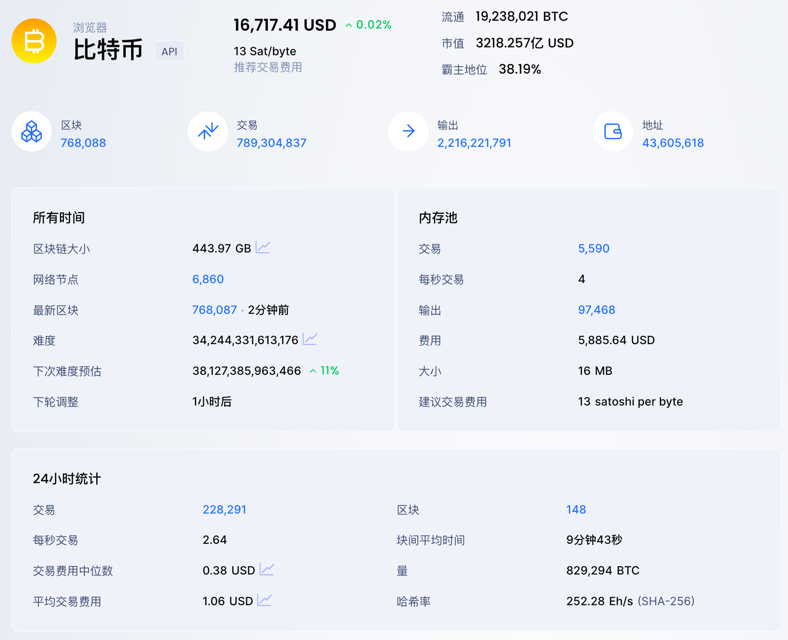
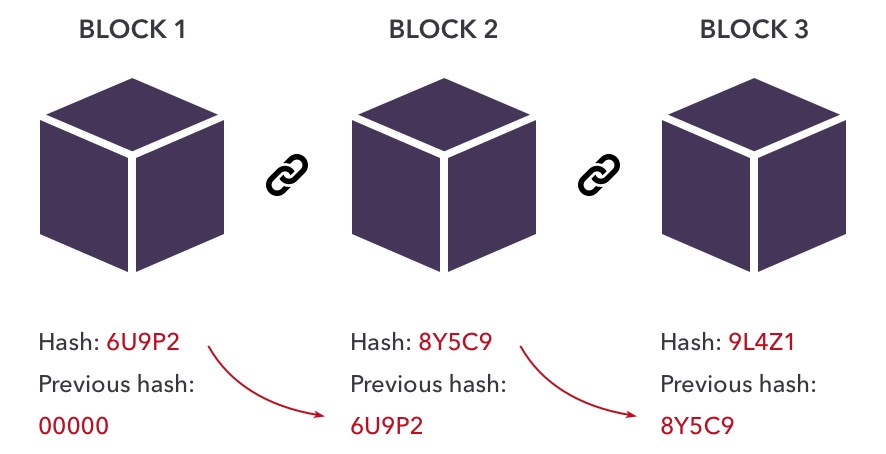
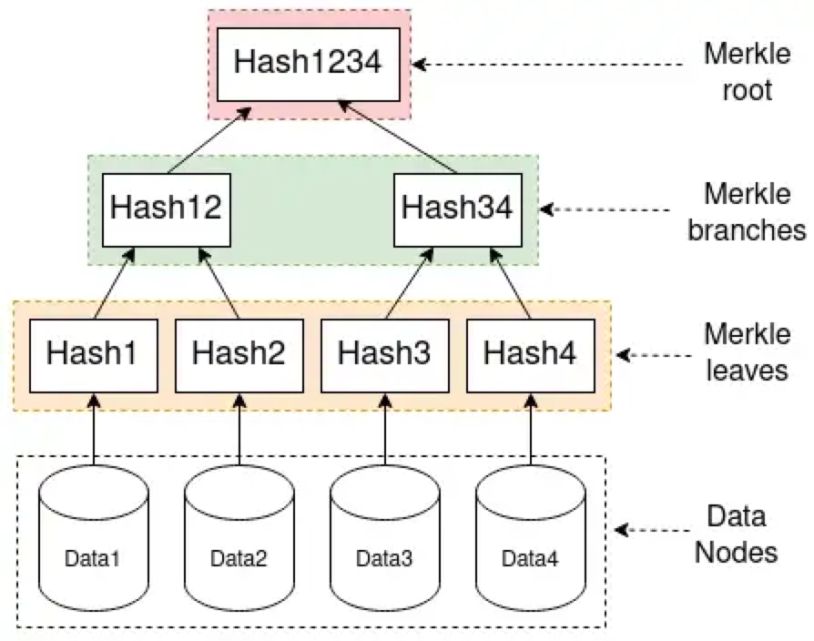
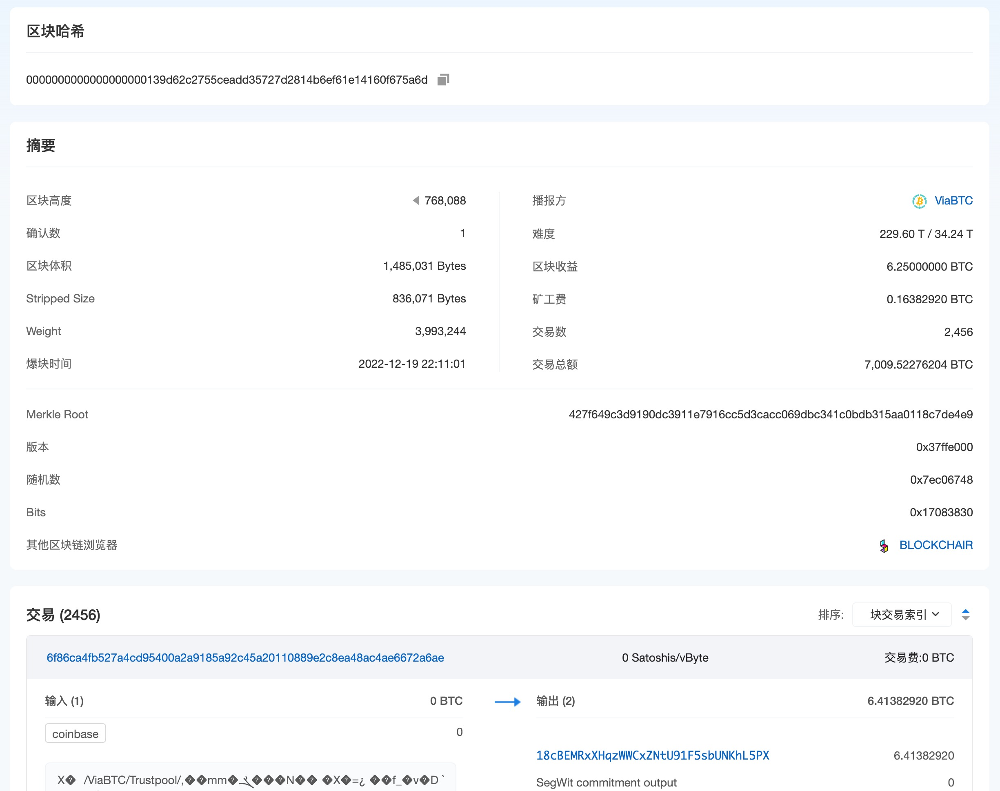
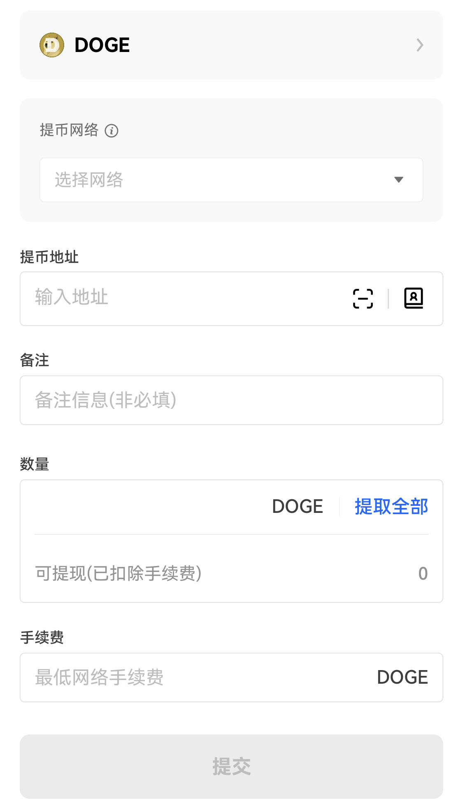

[TOC]

# 大话区块链

## 比特币

比特币（BTC）2009年横空出世，发明者是中本聪，到目前为止我们也不知道这个人是谁。比特币是代币（token）的一种，我们在游戏厅使用的游戏币、腾讯的 Q 币、游戏里面的金币这些都是代币。比特币跟法币（人民币、美元）一样，可以进行交易和支付。2010 年有个程序员用 1 万枚比特币购买了 2 个披萨，现在也就是2022年12月比特币的价格是1.6万美元/枚，2021年比特币曾到达将近7万美元/枚。比特币设计出来的目的就是为了支付。

> [比特币：一种点对点的电子现金系统](http://lixiaolai.com/#/bitcoin-whitepaper-cn-en-translation/Bitcoin-Whitepaper-EN-CN.html)

当我们在网上用网银、支付宝、微信等软件进行转账交易时，都是通过第三方进行支付。在银行开户的时候我们需要给第三方也就是银行提供个人信息（姓名、身份证号、人脸照片、手机号等），所以银行知道我们的所有信息。使用比特币时，在进行点对点比特币交易时无需提供电子邮件、姓名、社会保险号或任何其他标识信息。所以比特币转账有**匿名**的特点，不受第三方的监管。

我们在转账的是时候其实是在**记账**。假设 A 通过银行转账 1000 元人民币给 B，见过存折的人肯定很清楚，A 的存折会新增一条 -1000 元的付款记录，B 的存折会新增一条 +1000 元的收款记录，但是转账会收手续费，A 的账本上会再新增一条 -1 块钱的转账手续费。记账的机构就是银行，如果发生地震银行把账本弄丢，或者银行工作人员把账记错，就会导致我们的钱变多或者变少，甚至变没。银行做为记账的第三方其实可以任意**篡改**账本，我们的钱很难得到保护。

银行的账本是保密的，自己的存折有多少钱只有自己和银行知道，自己也不会知道别人的存折有多少钱。

当我们把钱存银行，10 年以后会发现，这些钱 10 年后的购买力会下降，这就是通胀。通胀的主要原因就是国家印钱。假设我国所有的钱加起来有 1 万亿，物价是 3 块钱一斤大米，当央行新发行了 1 万亿开始撒币，市面上就有 2 万亿。假设其他条件不变，就会出现通胀，购买 一斤大米就需要 6 块钱。

比特币解决了上面所有的问题：

- 点对点（没有第三方赚差价，不需要知道对方是谁就能转账，只需要知道对方的账号）
- 去中心化（多人记账，记账权在每一个用户手里，人手一本账本，不存在账本丢失的情况）
- 公开透明（所有的转账记录都写在区块链上，任何人都可以看到）
- 无法篡改（区块链无法被篡改，准确的说是很难被篡改，所以账一旦写进区块链就很难被篡改）
- 可以追溯（比特币跟传统 Account 记账模型不同，采用的是由中本聪发明的 [UTXO](https://zhuanlan.zhihu.com/p/33793041) 记账模型。）
- 总量2100万枚（2009年，区块链开始运行，创世块发行 50 枚比特币，每十分钟出一个快，每个块产生 50 枚 BTC，每 4 年铸币量减半）

当然比特币也有一些缺陷：

区块链中如果账转错误，交易无法撤回。如果给朋友充 100 话费发现充给了另外一个人，只能打电话给对方让对方给你充回来，但是在区块链世界你可能根本不知道对方是谁。甚至给错误的账号转账后，钱会消失，损失无法挽回。比特币的匿名性也会给不法分子提供充当洗钱的工具。一旦私钥（密码）丢失钱就找不回来了，因为没有任何东西能证明这个账号是你的，想一想我们平时是怎么找回密码的。

区块链归根结底就是代码，是代码就会有bug和漏洞，只是发现时间的早晚和严重程度大小的问题。



BTC 是区块链的第一个应用。对于电脑而言，先有区块链这个技术，然后用区块链技术实现了 BTC。对于人脑而言，先知道了比特币可以当钱用，才去了解了区块链技术，然后出现了 LTC、BCH、DOGE 等虚拟货币，再后来对区块链进行了创新，出现了智能合约、NFT、DeFi、GameFi、Web3、元宇宙。

> 宇宙的尽头是公务员，互联网的尽头是元宇宙。

接下来我们来看一下区块链的实现。

- [听大爷给你接地气的讲解“区块链”“比特币”的字面本质](https://www.bilibili.com/video/BV1pb411U7du/?vd_source=d04d419d0b1f4d9c23aa1498bafb9b87)

## 区块链

顾名思义，区块链就是由区块和链组成。那么区块和链是什么东西？

区块链数据结构是一个一个的区块组成的链表，跟普通的链表区别是，区块链用哈希指针代替普通的指针。第一个区块是[创世区块](https://explorer.btc.com/btc/block/000000000019d6689c085ae165831e934ff763ae46a2a6c172b3f1b60a8ce26f)，最后一个区块是最近产生的区块。每一个区块都包含指向前一个区块的哈希指针。哈希值是对上一个块进行哈希运算所得，所以如果上一个块有变动，这个哈希值就会变，接着就会影响后面所有的块，产生多米诺效应。所以我不需要保存所有块，只需要保存部分块，如果需要验证其他块，可以通过哈希去跟其他人保存的块进行对比。并且只要知道最后一个 hash 值就能知道任何块的修改。



把区块链想象成一本用来记账的笔记本。区块就是每一页纸，这张纸记录的是每十分钟产生的交易信息（谁转账给了谁、转了多少钱、转账时间等等）。链就是页码，跟普通按数字排列的页码不同的是，区块链账本的当前页码由上一页进行哈希运算得到的 hash 值，上一页的信息发生变化，当前页和后面所有的记账的页码都会发生变化。

### 区块的构成

比特币中的另一个数据结构是 merkle tree，它跟 binary tree 的区别是使用哈希指针代替了普通指针。跟哈希链表一样，只要知道 root hash 就能知道任何 hash 的修改。



每一个区块所包含的交易组织成了 merkle tree 的形式。最底下的每一个块就是一笔交易。每一个区块都分为两部分，block header 和 block body。跟 http 协议的报文很相似。

- block header 中只有 root hash 等信息，不包含交易的具体内容。
- block body 包含了交易的具体内容。储存的就是交易信息，实际上就是每十分钟新产生的交易记录。

```
header 组成

verson：版本。当前区块使用的版本
previous block header hash：前一个区块的hash值
timestamp：时间戳。当前区块产生的时间
difficulty：难度
nonce：随机数（找答案）
merkleRoot：当前区块交易信息的哈希值。区块交易信息就是人与人之间的转账交易记录信息
```


比特币的节点分类两类：

- 全节点。保存 block header 和 block body。
- 轻节点。只保存 block header

merkle tree 的一个用途是提供 merkle proof。通过 merkle proof 就可以拿到轻节点中没有的交易信息。

merkle tree 跟 webpack 的模块打包机制很像，在 webpack 中有 hash、content hash、chunk hash。我们可以把每一个区块当成一个需要打包的项目，webapck 打包生成的 hash 就是区块的 root hash。每一笔交易就是一个依赖，都会生成一个 content hash。content hash 之间又会生成 chunk hash。唯一不同的是 webpack 的依赖不是二叉树。

区块链涉及到的学科：

- 密码学（哈希、数字签名）
- 分布式计算（共识协议）
- 博弈论

### 密码学

#### 哈希

在区块链中我们通常会对一段信息进行哈希运算，得到一个哈希值，然后对这个哈希值进行签名。哈希函数的计算过程时单向的，不可逆的。

哈希函 `F(X)=Y`

- X：任意形式的数据，Y：固定长度的值（哈希值）。
- 哈希函数可以通过一个形式的值X（文字、合同、数字、照片、文件），得到一个对应的固定长度的值Y
- 已知Y是不能倒推出X
- 两个不同的X得不到相同的Y。X跟Y是一一对应的关系
- 比特币网络采用的哈希函数 SHA256

哈希函数为什么能使记账不被篡改？

关键在于 previous block header hash 和 merkleRoot。当前区头块保存了上一个区块的 hash，形成了一个链条。如果有人暗中修改了之前的区块，会实时反映到之后的所有区块。

#### 签名

对称加密。开锁和关锁用的是两把相同的钥匙。

非对称加密。开锁和关锁用的是两把不同的钥匙（公钥加密，私钥解密），防止信息在传输的过程中被别人看到。公钥相当于银行账号，私钥相当于银行密码。当我向别人转账时，如何来确认这笔转账是由我个人发起的，而并非别人冒名顶替而发起的，这时可以使用私钥进行签名，而别人可以使用公钥来验证签名。

数字签名使用非对称加密，跟普通纸质签名的区别是数字化。

1.  生成公钥和私钥（generateKeys）。私钥：私密，用于签名，公钥：公开，用于验证签名。
2.  生成数字签名（sign）。数字签名 = SIGN(私钥，message)，message 为被签的内容。
3.  验证签名（verify）。VERIFY(公钥，message，数字签名)

### 钱包

区块链钱包跟普通钱包不一样，它里面存放的是私钥，而非虚拟货币（Token），虚拟货币在区块链上。钱包是存储和管理私钥的工具，提供钱包地址的创建、加密资产转账（接收和发送）、钱包地址交易历史的查询等基础金融功能。

钱包最最最核心的就是那个私钥（或助记词）。

公钥相当于你的银行卡号，同时也是一个转账地址，所以公钥是可以对外公开的，私钥是密码。

私钥长这样：

> 0xa164d4767469de4faf09793ceea07d5a2f5d3cef7f6a9658916c581829ff5584

助记词长这样：

> cruel weekend spike point innocent dizzy alien use evoke shed adjust wrong



### 挖矿

不管是法币还是代币的交易，都不会产生新币，那么 BTC 从哪里来？法币由国家发行，而在区块链世界通过挖矿产生新的代币。

BTC 被称作 digital gold，争夺记账权称为挖矿（mining），争夺记账权的节点被称作矿工。拥有记账权的区块有铸币的特权，从而获得 BTC 奖励，也就产生了新币。挖矿奖励每隔 4 年减半 1 次，50 到 25 到 12.5，越来越少。BTC 的总量是固定的。

所有的交易数据都会传送到矿工那里。矿工负责把这些交易写入区块链。

因为计算有效哈希的难度，好比在全世界的沙子里面，找到一粒符合条件的沙子。计算哈希的机器就叫做矿机，操作矿机的人就叫做矿工。

BTC 一个区块的大小是 1M，每 10 分钟产生一个新区块，保存这 10 分钟新产生的交易记录，计算得出比特币 1 秒钟只能处理 8 笔交易，总量为 2100 万枚，2140 年就发行完了，而信用卡等每秒钟可以处理几千笔交易，这里就涉及到区块扩容。

当矿挖完了，交易就会收取手续费。手续费可以设置，手续费越高交易速度越快。

算力：每单位时间的哈希运算的次数：H/S(hash per second)

全网算力：在当前的难度下找到这个答案，也就是在当前找到 nonce 满足系统规定的哈希值，产生区块平均每秒需要进行的好戏运算的次数。如果超过全网算力50%的算力就能够双花成功。

矿工的三大成本：

- 设备。CPU，GPU，ASIC矿机
- 电费
- 运维

评价挖矿设备的3个重要指标：算力，价格，耗电。是否有现货，是否稳定，几天回本。

矿工出块的可能性：Prob（出块）概率 = 矿工算力/全网算力。

只买一台矿机挖到区块的概率几乎为零，可能好多年都挖不到一块。

矿池就是把大家的算力组织到一起，成为一个组织单元去挖矿，这样出块的概率就会大大增加，获得奖励按照算力的大小进行分配，和按劳分配实际上是一个意思。

### 共识机制

#### POW

刚刚我们了解了挖矿，挖矿的过程就是把全网的交易记录写入区块链的过程。挖矿的人那么多，我们让谁把交易写进账本呢？也就是谁来记账呢？记一次账可以获得几十个比特币的奖励。这里就涉及到工作量证明共识机制（POW）。

每一个区块头中都会有两个值：难度（difficulty）和随机数（nonce）。如果我想得到记账权获得奖励，就需用 CPU、GPU、矿机在当前难度（difficulty）下进行哈希运算找到满足系统规定的随机数（nonce）。找到后就可以把账记到区块中，然后广播给所有人这些账我已经记了，你们记下一页的账吧。

现在涉及到算力问题，理论上算力越大找到答案的概率就越大。如果算力超过了全网算力的 50% 我就能一直记账，这个账本就会变成我一个人记账，我想怎么记就怎么记，超过全网算力 50% 非常难，并且超过全网 50% 算力所付出的成本比记账带来的收益要高。如果算力特别小，可能一辈子都争取不到记账权，理论上手机和个人电脑都可以挖矿，只是算力太小。

挖矿的过程就是不断进行无意义的哈希运算，算的速度越快就有越大的概率能挖到矿，无意义的计算带来的大量消耗一直饱受人们的诟病。谁钱多就能买到更多的的矿机，哪里电费不要钱或者便宜就在哪里放置矿机，最终还是钱的问题，只要有利可图，钱越多获得到记账权的概率就越大。所以后面出现了 POS、DPOS 等共识机制。

#### 分叉

BTC、ETH、LTC 是三条不同的区块链，他们互不干扰，相当于三个国家的货币。他们每一条链都有可能会有分叉。比特币第一次分叉产生了 BCH，这是一次成功的硬分叉，产生了两条链。以太坊区块链由于受到黑客攻击导致紧急分叉，由原来的 ETC 产生了新的分叉 ETH。如果新的分叉没有关注和维护，没有人使用和挖矿就会慢慢消亡，硬分叉就不成功。

另一种分叉类型是软分叉，软分叉没有新链产生，只是在原来的链上进行了升级。

#### 最长链原则

当获得了记账权我们应该把账记到哪里？每一个区块链可能都会有很多硬分叉，相当于出现了多个账本，那如何让人们都来维护同一个账本？也就是如何让所有人都在一条链上挖矿？最长链原则就是用来解决这个问题，哪条链最长就把新区块记到这条链上，并且这条链就会越来越长。

最长链原则就是永远将最长的那个区块链作为主链，这一原则有利于防止造假和区块链篡改。这就解决了双花问题，如果你想双花，就得拥有超过全网 50% 以上的算力。如果你如此大的算力就没必要双花。就好比巴菲特放着伯克希尔平均 20% 的年复合收益率不赚，而要用伯克希尔几千亿美元来挖矿。

越长的区块链工作量就会越大，就越难被推翻。

