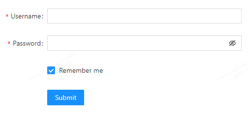
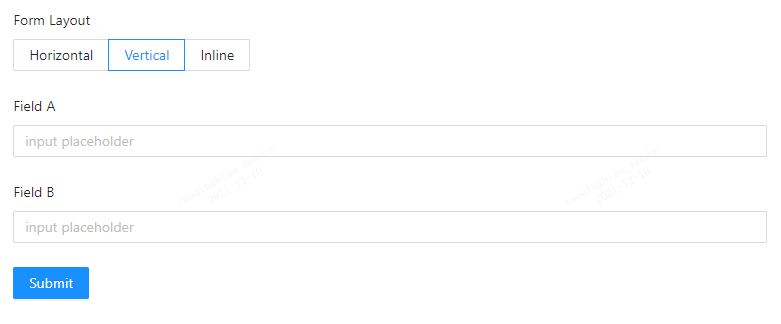
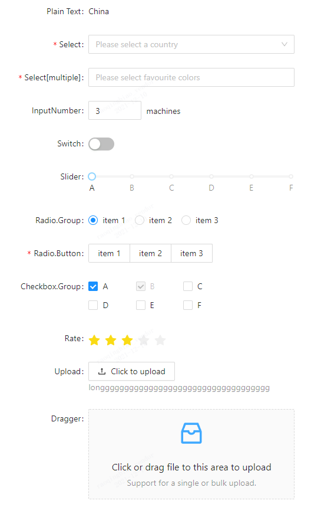
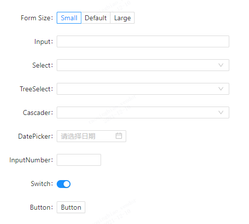

# 当我写 CSS 时我写些什么

时光荏苒，一晃就工作了 10 年啦！记得工作刚满一年的时候心里统计了一下，但是作为一个没有仪式感的人，当然是没有任何行动。时间不经意间就到了现在，是时候写点东西，留下些许微弱的光亮，在下一个 10 年结束后，回头时能看清曾经走过的路。

这篇文章不会涉及到 CSS 技术细节，或许就是一本流水账，记录着曾经的徘徊、失落、坚持和努力。

## 读懂设计图

在写静态页面之前，我会先找设计同学要 UI 图，当然在这之前会有一两轮的交互评审。不同公司不同设计师给出的格式各不相同，PSD、XD、蓝湖、Sketch，甚至是没有图层的 jpg 或者 png，有的设计师会给出标注，但是这些标注通常不全又或者很混乱，总之标注对我来说根本没有什么用，或许是他们给了没有用的标注。

拿到设计图后，大多数时候会倒吸一口气，心里默默叹气，然后一言不发。不说话是因为有太多话要说而不知道从何说起，怕说了之后只有自己懂，就只能内心感叹一下，这图我看不懂啊！！

> 优秀的设计图都千篇一律，难以实现的设计图都各不相同！

优秀的设计师会像拼乐高玩具一样来拼凑他们的界面，乐高零部件的各种规格已经确定，不会因为在拼凑的时候由于长了会拿小刀削一下，或者拿其他玩具的零部件硬凑。糟糕的设计师也是在拼凑设计图，不同的是你永远也不知道下一个零部件会是什么。

上面只是一点点小小抱怨，我们不能因为一直看到的是糟糕的设计图而不去理解什么才是好的设计图，甚至就认为这些糟糕的设计图就是对的。

我们需要从一些优秀的项目和书中学到通用的设计原则、设计模式和价值观，让我们能够看懂那些让我们看不懂的设计图。

### 首页

当我们通过一个域名（例如 taobao.com）打开一个网站的时候，第一眼看到的通常就是这个网站的首页，有的网站需要登录才能使用，所以登陆后才能看到首页。布局通常如下图：


不仅仅是首页，几乎所有的网页都是由上图中的这三部分组成。我们可以把页面中的元素跟人的身体一一对应，人是由头，身体，脚构成。当然身体包含很多东西，我们暂时不讨论。或者可以理解成一本由开头、跌宕起伏的剧情、结尾组成的小说。Header 和 Footer 通常会存在于这个网站的所有页面，可以理解为公共部分。

首页展示的是能够通往展现更多信息页面入口的列表。由于用户翻看第二屏及以下的界面的概率会越来越小，所以在有限的空间里能展现的信息必然不会很多，用户想要看到更多的内容必须进到另一个页面。

有人会说，上面这张图未免也太简单了，不能这样简单的抽象页面的布局，也许 Header 和 Footer 还说的过去，但是 Body 里面的内容千变万化，无法简单的这样划分，至少也要有个侧边栏吧。其实通过上图就可以举一反三加个 Aside 侧边栏，可以参考一下 [Ant Design Layout 布局](https://ant.design/components/layout-cn/)，虽然官网文档解释这个组件的作用是协助进行页面级整体布局，但是我们可以尝试更深层次的套娃。所有的布局可以通过 Aside、Header, Body, Footer 这四个组件来完成。


### 列表页

首页可能也会有一些不完整的列表，通常会有“更多”的入口进入列表页。不管从哪里进入列表页，列表页的布局可以抽象如下图：


**列表**

列表的展现形式可以大概分为以下三类：

- 标准列表。一行一条数据。
- 表格列表。通常使用原生 `table` 标签实现。
- 卡片列表。多列展示，一行有多条数据。

**筛选条件**

筛选条件其实包含 Filters 跟 Pagination，上图把他们分开是因为设计通常是这样，这是很明显的 Hader、Body、Footer 布局。

筛选条件可以很复杂，筛选条件之间可能有联动或依赖关系，UI布局也可能很复杂，筛选条件散落在页面不同位置，交互方式也可以是多种多样，但是我们只需要记住它们最终的目的都是得到列表。

### 表单页

表单是用来干啥的？当我们打开一个表单页时，通常需要填写一些东西，前端做一些处理，然后提交给后端。每个表单都会涉及到以下几个基本要素：

- 标签（提出问题）
- 输入框（回答问题）
- 动作（提交答案）
- 帮助文字（解释问题或答案）
- 错误与成功（及时反馈）

可能有人会说有的表单没有标签，但是这会让回答者绞尽脑汁才能知道问题是什么。通常用在表单元素很少的界面，例如登录页。

上面所说的几点是表单最基本的要素，在实际的使用中会涉及到更多的细节。这里看一下 [Ant Design 的 Form 表单组件设计](https://ant.design/components/form-cn/)，为什么有这么多设计？他们的使用场景是什么？

下图为最基础的用法



下图中 Vertical 和 Inline 的使用场景是什么？



下图包含了一些常用的表单类型:

- `Select` 和 `Radio` 都能单选，使用的时候怎么选择？
- `Checkbox` 和 `Select[multiple]` 都能多选，我们如何选择？
- 所有的组件库 `Checkbox` 的设计都是方形，`Radio` 是圆形，这是为什么？他们之间的样式能不能互换？能都使用圆形或者方形吗？



下图可以设置表单的大小：

- 表单可以设置大小，一般有大中（默认）小三个尺寸，各种尺寸的使用场景是什么呢？这样设计是多余的吗？为什么 Bootstrap 的尺寸更多？
- 为什么按钮的高度跟输入框的高度是保持一致的？如果不保持一致会出现什么问题？
- 为什么不同 size 的 FormItem 间距一样？能不能不一样？



上面的这些问题只是抛砖引玉，只是对 `Form` 组件基础用法的探索，还有很多细节需要了解。复杂表单的使用场景都建立在基础用法的认知上，这样才能设计出通用合理的界面，写出优雅的代码。

### 详情页

详情页的设计通常区别比较大，不同产品的侧重点不太一样。但是所有详情页都会涉及到文字排版，关于排版也需要了解下面[4大基本原则](https://book.douban.com/subject/26664522/)：

- 对齐。
- 对比。
- 重复。
- 亲密性。

AntDesign 通过实践和发展又总结了一些原则。这些原则不仅仅只是适用文字排版，适用于所有设计，用来对设计进行指导。

作为一个前端，需要了解这些吗？如果只是写写代码，当然不用了解，毕竟新建一个文本随便输入点什么，然后把文件后缀改成 `.html`，双击就能运行了。如果想要写出更优雅、更健壮、易阅读、易维护、易扩展的 CSS，完成更复杂的需求，读懂设计图理解设计师的意图最重要不过了。

## 样式的重置和继承

编程中有个很重要的原则，那就是不要重复自己。虽然 HTML\CSS 很大程度上不能算是一门编程语言。但是同样需要遵守这一原则。

当看完设计图后，就能得到一些通用的全局信息。

- 文字的默认大小、颜色、行高、字体。
- link、hover、active、visited、disabled 样式。
- 通用间距。
- 品牌色。
- 表单样式。
- 等等。。。

这时我们有可以选择使用 normalize 和 reset。使用之前我们需要知道他们的区别。normalize 不会重置样式，只是用来统一不同浏览器的样式。reset 用来重置默认样式，需要慎用。

我们还需要知道哪些样式能够被子元素继承。文字的样式只需要写在 `html` 标签上，就能被子元素继承。所以能被继承的样式一旦在 reset 中重置后就不用再写了。

## 组件化

记得2014年刚到一家新公司，从那时起我就不做网页设计了，公司有专职的交互和UI。当时负责的是一个从零到一的新项目，还没有前后端分离，当时的我连 JS 数据类型都还分不清。一次周会上老大问我有没有用什么框架，比如说 bootstrap。我说没有，给出的原因是它不太符合我们的 UI 规范。当时自己心里其实是很不屑使用 UI 框架的，原因有很多就不细说了。现在想想当时是那么无知，不懂其中的精髓。

前段时间有个同事问我，你是不是很喜欢写样式？我一时不知道怎么回答。其实我非常不喜欢写样式。刨除 UI 和交互层面的问题，如果样式写的多则说明写了很多重复的样式，其中一个很大的原因是组件化没有做好。

后来开始了解 Bootstrap 的 api 和使用场景，再后来看源码，于是打开了新的世界。不同于《css禅意花园》 、w3school、MDN、CanIUse 提供基础语法的学习和查阅，Bootstrap 带给我的是思维的转变和组件化的指导。

可能刚开始会为样式的兼容问题而头疼，并且 CSS 跟 JS 不同，他不能 polyfill 也不能 shim，有兼容问题的属性和值就像道路上的坑，最好的方法是绕开这些坑，等时机成熟的时候那条有坑的路就会被抛弃而成为历史，一条坑少的路就在眼前。后来发现 class 命名才是最令人头疼的问题，这时就可看看 Bootstrap 的 API，那些抽象的命名就是想要的解决方案。

自从不做设计之后就慢慢的反感写样式。因为以前交互和 UI 都是自己在做，所以在某种程度上来说是可控的。现在每次都会写很多看似一样但是又不太一样的样式，这种没有组件化思维的 UI 和 交互设计会产生无意义重复，而这种无意义带来的无力感会让人丧失斗志，甚至会陷入深深的怀疑，产生错误的认知。

为什么 `Checkbox` 是圆的，`Select` 下拉选框的样式永远不一样，既然有品牌色为什么改来改去还不统一，表单元素跟按钮的 szie 为什么对不上，按钮的种类和 size 不确定，永远没有 `active` 状态，组件库的 `Tag` 永远用不上，组件库只有一个 size，给出的规范跟本覆盖不了组件库的变量。遇到过很多设计师，有组件化思维的设计师很少，甚至连意识都没有。到后来发现有 UI 组件化思维和能力的前端工程师也不多。那时对 UI 组件化产生了极度的排斥和反感，感觉组件化根本就无法实现，只是空中楼阁。

> 打破规则之前必须清楚规则是什么。 —— 《写给大家看的设计书》

16 年还是 17 年发现了 Material Design 和 Ant Design，由于使用 Vue 技术栈所以没太看 Ant Design 源码，但是看了很多遍文档。给我最大的震撼是原来设计不是天马行空无所拘束的，有很多设计原则和和设计模式进行指导，并且这些东西在很久之前都已经被大佬总结好了，我们只需要站在巨人的肩膀上就好。陆陆续续看了《写给大家看的设计书》、《WEB表单设计》、《设计心理学》、《About Face4》等等这些书。虽然大部分看过的内容早已经忘记，有些内容甚至不理解，但是当时给我的震撼和影响绝对是你无法想象的。就像《黑客帝国》中的 leo 吃了红药丸后终于看清了世界，他透过表象看到了世界本质。

在后来的项目中虽然一次都没有引入过 Bootstrap 和 Ant Design  ，但是他们带给我的影响却是深远的，以后参与的每个项目都有他们的影子。

## 图片

网页中少不了图片的展示，图片的格式有很多，PNG、JPG、GIF这些常用的图片格式，WebP等新出的图片格式、SVG 图形，将图片转换成字体的 iconfont，他们有哪些优势和劣势？ 我们如何选择呢？

一个网站打开速度的快慢，图片的大小是一个很重要的影响因素，所以我们需要在不同场景使用不同的格式。WebP 兼容性不太友好，PNG 支持半透明，GIF 支持动画，JPG有更丰富的色彩存储但是有损压缩，SVG 能够矢量缩放并且支持多色，iconfont 具备字体的特性适用于单色图标。

通常还需要解决一个问题，那就是图片过多时，http 请求需要优化。这个时候就会用到图片 sprite，将图片放在一张图上。当然还有后来才知道的 base64。

再后来移动端视网膜屏的崛起，iconfont、SVG 的流行将图片 sprite 技术慢慢从记忆中抹去。

## 标签语义化

记得 2010 年刚出来工作，入职第一家公司时，面试的时候问我用 `div`还是 `table`，当我回答 `div` 的时候，老大露出了欣慰的笑容。那个时候 `table` 好像是一个怪物，所有人都不喜欢他，也包括我自己。

`p`、`ul`、`li`、`h` 家族、`table` 家族等等都是语义很明显的标签，反而 `div` 其实是最不利于 SEO。并且 `table` 具有很重要的使用场景。

而现在各种封闭的系统，根本就不需要 SEO。如果不需要，其实真的可以一个 `div` 标签走天下啦。
除 `a` 标签的行内元素不能嵌套块级元素，`ul`、`li`等元素的合理嵌套，`h`家族的使用规范等等这些规范都不需要再考虑了。好像什么东西又简单了一些。

易用性、无障碍、可用性，大多数时候会被忽略，很少有人提及。


## 兼容性

记得我还是一个很新的新手时，写了一个页面，同学看到的样子跟我的电脑上的样子不一样，为什么换行了？那个时候我不知道双倍 `margin` 的兼容问题。后来知道了 `_` 的用法，再后来知道了更多 hack 的用法。但是浏览器的版本和厂商那么多，代码写的多不优雅啊，什么时候是个头？

再后来终于顿悟了，既然换不了老板的浏览器，也熬不死浏览器厂商。那为啥不在源头上就让他们消失？可以用 `padding` 来解决双倍 `margin`的问题，caniuse 把坑都展示出来了，我们只需要转换一下思路跳过坑就行，从此以后就再也没有兼容性问题了。

## 新特性

随着移动端崛起，一系列 CSS 新特性不断涌现，曾经的圆角、阴影、复杂边框需要使用图片，常见且简单的补间动画需要使用 JS 来实现，栅格化需要使用百分比，现在统统只需要一段简单的 CSS 代码就能轻松解决。有些新特性其实算不上新，只是兼容性不好一直无法在生产环境使用，只能自娱自乐。CSS 新特性还在不断推陈出新，只有当那些陈旧的浏览器市场份额降到一定的程度才会被项目接纳。

回过头来看看，有了这些新特性我们能更优雅、轻松的实现一些需求，但是本质上即使没有这些新特性大部分也能完成。曾经看到有人说 CSS 不算编程，我其实是认同的，他连最基本的 `if else` 也无法实现，所以出现了像  `less` 、`sass` 这些预处理器。挺有意思的是在项目中我们哪怕使用了这些预处理器，也很少使用 `if else` 等语法，甚至是原生的 CSS 特性又能使用多少呢？更何况组件化之后就更加写不上几行 CSS 样式了。不常用的东西通常容易忘记，但是会在脑海里留下一点映像，需要的时候就翻翻笔记或者交给 baidu 和 google。我们需要知道，最本质的东西是能否理解设计师的意图。

## BEM

```css
.nav .aside p {}
.nav.aside .p {}
div.nav .aside p.p {} 
```

你通常怎样给一个标签设置样式？上面我写了 3 个例子，当然还有更多的写法，无外乎都是设置权重，这跟 JS 中的地狱回调有异曲同工之妙。14年之前我都是这样写的，也没有出现过什么问题，一切都在我的掌控之中，这样说差点把自己逗笑。很多网站也都是这样写的，那为什么不好？这种写法最大的问题是，你可以用一千种这样的方式写样式，他就能有一万种方式来加权重重置样式，最后有一亿种方式来折磨阅读代码的人。

> 代码是写给人看的，只是偶尔让计算机执行。

刚开始写样式时 class 命名以下划线做连字符，后来发现有些大公司的网站使用中划线甚至混用，很长一段时间都在这种无聊的甜咸豆浆之争中挣扎，再后来发现了 BEM。作为一个有代码强迫症的人，当时肯定是拒绝的。但是发现 WeUI 使用的就是这种命名风格，就研究了一下，又一次被震撼到了。我认为 BEM 就是为了组件化而生的，每一个 Block 都能理解为一个组件，通过对交互、UI、BEM 一层一层的抽象和总结，复杂的界面已经被拆解成一个个组件，脑海中早已生成了代码。

BEM 不仅仅是一种命名的规范，他带给我的是意识的转变。

## 栅格化

> 栅格设计的特点是重视比例、秩序、连续感和现代感。 以及对存在于版面上的元素进行规划、组合、保持平衡或者打破平衡，以便让信息可以更快速、更便捷、更系统和更有效率的读取；另外最重要的一点是，负空间的规划（即：留白）也是栅格系统设计当中非常重要的部分。 ——《维基百科》

本来不想说栅格化，但是发现认识的很多前端都不太懂响应式布局。而理解栅格化组件 [`grid`](https://ant.design/components/grid-cn/) 就能理解响应式布局。

响应式布局是什么？简单来说就是同一个界面在不同分辨率下能够灵活的展示。这样说好像也不是很容易理解。我们只需要遵循一个原则即可——不要给你的盒子设置宽高。那宽高在哪里设置呢？在 `grid` 组件中。

`grid` 不仅仅包含了 column 的宽度和 gutter 的大小，还包含了媒体查询，这就是栅格化给出的响应式布局解决方案。我们根本都不需要写媒体查询，只需初始化一下 break point。

## 结束语

不知道从何时起，纯 CSS 重构的岗位越来越少，取而代之的是前端这一职位，或许切图仔根本就没有存在过。前端更加侧重于 JS 和 Node 的开发，CSS 在工作和面试中越来越少提及。最主要的原因是前端能做的事越来越多了，CSS 只是其中一环，并且这一环对于大部分公司显得并没有那么重要。从 bug 等级的定义就能看出一二，界面问题通常是 trivial，但是功能缺失或者错误都是 normal 起。甚至 UI 问题都可以不用解决。核心还是价值体现的问题。

很久以前看到[新来的开发花了四天时间来制作一个简单的 HTML 和 CSS 按钮，我该解雇他么？](https://zhuanlan.zhihu.com/p/36522151)。刚又翻了下评论，把我给看傻眼了，这就是 CSS 的现状。没有多少人看懂了这篇文章。

> 他只想说，这些看起来简单的东西，其实难度蛮大的。至于四天，要看他完成到什么程度了。。。

样式还原度不够，大部分时候是能接受的，能够注意到细节的人很少，如果还原度的要求比较高，哪怕是新手硬写也能还原，无非时间跟代码维护成本的问题。但是 JS 功能上的问题新手可能是摸不上门的。对比之下 CSS 显得好像很简单。

也经常会听到一些 UI 同学[吐槽](https://mp.weixin.qq.com/s/w8MxOykMsiNLvdLiUk2WFQ)还原度太差，身边的网上的都有。解决的办法就是找一个有设计经验的前端。动画不自然？也是一样。node 后端开发？那就找个有后端经验的同学。让「上帝的归上帝，凯撒的归凯撒」。

样式越少越好吗？标签越少越好吗？代码体积越小越好吗？BEM 真的那么好吗？等等这些问题随着时间的推移，答案慢慢发生改变。新技术新环境等任何发展都可能让原本重要的东西变的不那么重要。真正重要的是从表面看到本质，从不断的变化中找到不变的东西。

2021年12月16日

以上